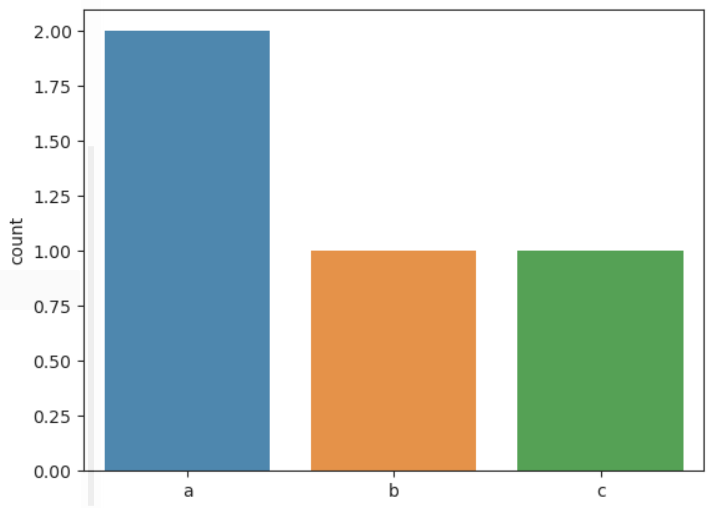

= Programming Language

== Python

* 데이터 처리/분석에는 Python과 R을 많이 사용
* 두 언어 모두 데이터 분석을 위한 다양한 패키지를 제공
* 오픈 소스 

* R
** 통계에 특화된 언어로, 통계 분석에서 많은 기능들을 제공
** 회귀 계수, 결정 계수, 신뢰도, 신뢰 구간, 유의확률 등 복잡한 수치를 자세하고 명료하게 분석하고 제공
** 속도가 느린 단점

* Python
** R보다 많고 다양한 머신 러닝 알고리즘 제공
** 상대적으로 속도가 빠름
** 통계 분석에서는 R에 비해 기능이 약함

* 이 강의에서는 Python을 사용

== 변수(Variable)

* 변하는 수(Variable)
* 변수는 데이터 분석의 대상
** 상수는 고정된 값으로, 분석의 대상이 되지 않음

[source, python]
----
a = 1
b = 2
c = 3

tuple1 = (1,2,3)
list1 = [4,5,6]
dictionary = {1:4, 2:5, 3:6}

str1 = 'abcd'

----

== 함수(Function)

* 데이터 분석은 함수를 이용해서 변수를 조작하는 일

[source, python]
----
def function_name(parameter_list):
    statement1
    statement2
    ...
----

== 패키지(Package)

* 관련있는 모듈의 집합
* Python 모듈을 계층적(디렉토리 구조)로 관리할 수 있게 해줌
* 파이썬에서 모듈은 하나의 .py 파일
* Anaconda에는 데이터 분석이 필요한 주요 패키지가 대부분 들어있음
* PIP 명령 또는 conda 명령을 사용하여 설치

[source, python]
----
import seaborn

list = ['a', 'b', 'c', 'd']
seaborn.countplot(x = list)
----

== 패키지(Package)

* 패키지 약어 사용

[source, python]
----
import seaborn as sns
import pandas as pd

seaborn.countplot(x = list)
----

== 모듈(Module)

* 패키지를 구성하는 꾸러미
* `Package_name.Module_name.function` 형식으로 사용

== 연습 문제

* 아래와 같은 데이터가 있을 때 
+
[source, python]
----
[80,60,70,50,90]
----
아래 질문에 답하세요.
1. 데이터를 담는 변수를 만드세요.
2. 데이터의 합계 점수를 출력하세요.
3. 합계 점수를 변수를 만들어 출력하세요.
