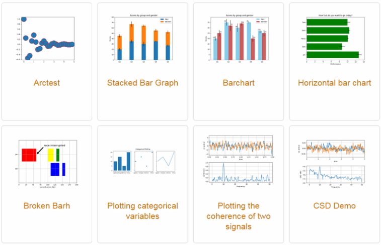

= Draw colcusions (데이터 분석) 단계

* 모델링/표준화가 완료된 데이터를 대상으로 함
* 수학적인 기법을 사용한 통계분석
* 머신러닝 기법을 통한 예측, 분류
* 다양한 형태로 시각화

---

분석 영역은 매우 큰 영역을 아우르는 범위입니다. 모델링까지 완료된 데이터를 수학적인 기법 을 적용해서 통계분석, AI 의 딥러닝 머신러닝 기법들을 통해 예측, 분류 등의 분석 결과를 만들고 다양한 형태로 직관적이면서도 보기 편하게 시각화합니다.