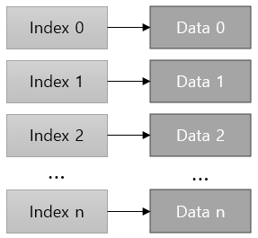
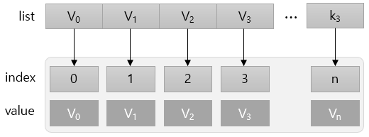
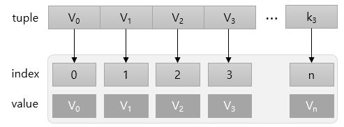
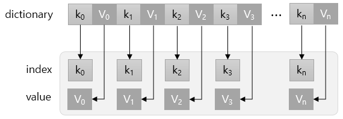
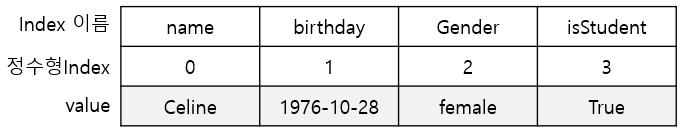
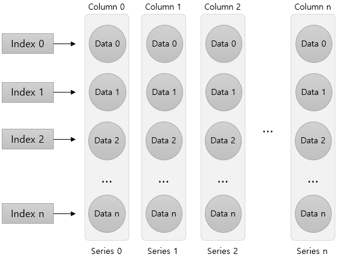
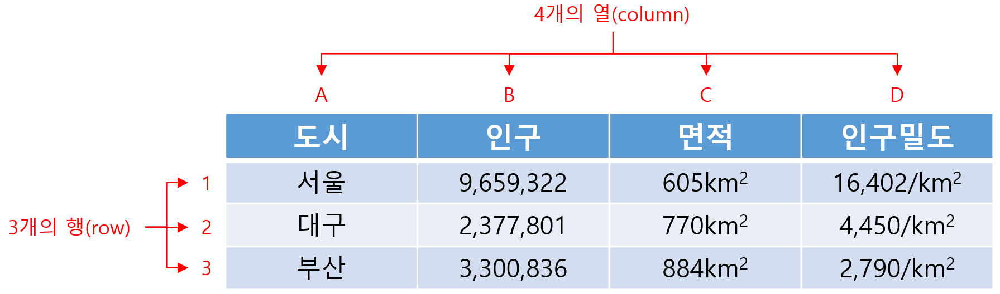
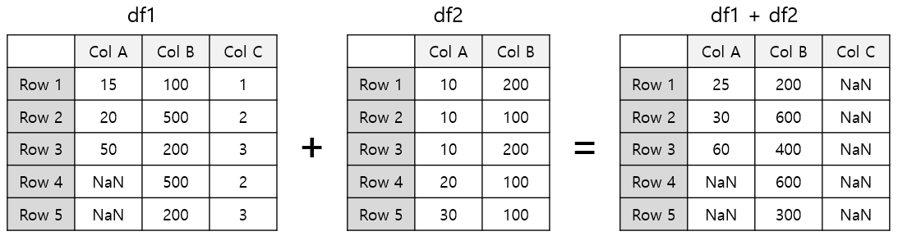

= 데이터 프레임(Data Frame)

== Pandas

* 데이터 분석의 80~90%는 데이터를 수집하고 정리하는 일이 차지함
* 10~20%가 알고리즘을 선택하고, 모델링 결과를 분석하여 데이터로 부터 유용한 정보를 산출하는 분석 프로세스
* Pandas 라이브러리는 데이터를 수집하고 정리하는데 최적화된 도구
* Python을 기반으로 하여 쉬운 사용
* 데이터 분석을 위한 여러 종류의 클래스와 다양한 내장 함수를 제공

== Pandas Data Structure

* 분석을 위한 데이터의 종류는 엄청나게 다양함
* 서로 다른 형식을 갖는 여러 종류의 데이터를 컴퓨터가 이해할 수 있도록 동일한 형식을 갖는 구조로 통합할 필요가 있음
* Pandas는 서로 다른 타입의 데이터를 공통의 포맷으로 정리할 수 있는 자료 구조를 제공
** **Series** 1차원 배열 형태의 자료구조
** **DataFrame** 2차원 매트릭스 형태의 자료구조

== Series

* 데이터가 순차적으로 나열된 1차원 배열의 형태로 데이터를 저장
* Python의 dictionary와 유사한 형태의 자료구조
** Index와 Value로 구성됨
** 열벡터 형태의 자료구조

=== list에서 생성

* list에서 Series생성
+
_pandas.Series(list)_
+
[source, python]
----
list = ['2023-12-30', 3.14, 'Celine', True]
series = pd.Series(list)
----

=== tuple에서 생성

* tuple에서 Series 생성
+
_pandas.Series(tuple)_
+
[source, python]
----
tup = ('Celine', '1976-10-28', 'femail', True)
# 인덱스 옵션 지정
series = pd.Series(tup, index=['name','birthday','gender', "isStudent"])
----

=== Dictionary에서 생성

* Dictionary에서 Series 생성
+
_pandas.Series(dictionary)_
+
[source, python]
----
dict = {'name': 'Celine', 'birthday': '1976-10-28', 'gender': 'female', 'isStudent': True}
series = pd.Series(dict)
series
----

== Series 데이터 액세스

* 인덱스, 인덱스명 사용
** list를 사용하여 여러 데이터에 액세스
+

+
[source, python]
----
series[0]
'Celine'

series[[0, 1]]
name        Celine
birthday    1976-10-28

series[0:4]
name             Celine
birthday     1976-10-28
gender           femail
isStudent          True

series['gender']
'female'

series[['name', 'gender']]
name      Celine
gender    female
----
+
** 인덱스에 액세스
+
_Series_object.index_
+
[source, python]
----
series.index
Index(['name', 'birthday', 'gender', 'isStudent'], dtype='object')
----
+
** 데이터에 액세스
+
_Series_object.values
+
[source, python]
----
series.values
array(['Celine', '1978-10-26', 'female', True], dtype=object)
----

== DataFrame 

* 데이터를 다룰 때 가장 많이 사용하는 데이터 형태
* 열(column)과 행(row)로 구성된 2차원 벡터(Vector) 또는 행렬(Matrix)
** 열은 column, variable로 불리며, 세로로 나열되는 열을 나타냄
** 행은 row, case로 불리며, 각 데이터 객체를 나타냄

== DataFrame 생성
* DataFrame을 만들기 위해서는 같은 길이(원소의 개수가 동일한)dml 1차원 배열 여러 개가 필요함
* DataFrame은 여러 개의 Series(열, column)을 모아놓은 집합과 같음
** Dictionary의 value에 해당하는 각 리스트가 Series 배열로 변환되어 DataFrame의 column이 됨
** Dictionary의 key는 각 시리즈의 이름으로 변환되어 DataFrame의 column 이름이 됨

== DataFrame 생성 (List)

* list 사용
** column 이름이 정수형으로 지정됨
+
_Pandas.DataFrame( list )_
+
[source, python]
----
import pandas as pd

df = pd.DataFrame([ 
    ['Celine', 'France', 90, 100, 100],
    ['James','UK', 80, 40, 30],
    ['Jason','USA',80, 40, 60],
    ['Hans','Germany', 60, 50, 90]
])
----
+
[%header, cols=6, width=50%]
|===
|  | 0      | 1         |2  | 3  | 4
|0 |Celine  |France     |90 |100 |100
|1 |James   |UK         |80 |40  |30
|2 |Jason   |USA        |20 |40  |60
|3 |Hans    |Germany    |40 |50  |90
|===

== DataFrame 생성 (List + columns)

* column 이름 지정
+
[source, python]
----
df = pd.DataFrame([ 
    ['Celine', 'France', 90, 100, 100],
    ['James','UK', 80, 40, 30],
    ['Jason','USA',80, 40, 60],
    ['Hans','Germany', 60, 50, 90]],
    columns = ['name', 'nation', 'english', 'math', 'science']
)
----
+
[%header, cols=6, width=50%]
|===
|  |name    |nation     |english  |math  |science
|0 |Celine  |France     |90 |100 |100
|1 |James   |UK         |80 |40  |30
|2 |Jason   |USA        |20 |40  |60
|3 |Hans    |Germany    |40 |50  |90
|===

== DataFrame 생성 (List + columns + index)

* name을 index로 지정
+
[source, python]
----
df = pd.DataFrame([ 
    ['France', 90, 100, 100],
    ['UK', 80, 40, 30],
    ['USA',80, 40, 60],
    ['Germany', 60, 50, 90]],
    columns = ['nation', 'english', 'math', 'science'],
    index = ['celine', 'James','Jason','Hans']
)
----
+
[%header, cols=4, width=50%]
|===
|nation  |english  |math  |science
|Celine  |France     |90 |100 |100
|James   |UK         |80 |40  |30
|Jason   |USA        |20 |40  |60
|Hans    |Germany    |40 |50  |90
|===

== DataFrame 생성 (Dictionary)

* Dictionary 사용
** column 이름 지정
+
[source, python]
----
import pandas as pd

df2 = pd.DataFrame({
    'name':     ['Celine','James','Jason','Hans'],
    'nation':   ['France','UK','USA','Germany'],
    'english':  [90,80,80,60],
    'math':     [100,40,40,50],
    'science':  [100,30,60,90]
})
----
+
[%header, cols=6, width=50%]
|===
|  |name   |nation  |english    |math   |science
|0 |Celine |France  |90         |100    |100
|1 |James  |UK      |80         |40     |30
|2 |Jason  |USA     |20         |40     |60
|3 |Hans   |Germany |40         |50     |90
|===

== DataFrame 생성 (Dictionary + index)

* dictionary 사용
** 이름을 key로 사용

[source, python]
----
import pandas as pd

df = pd.DataFrame({
    'nation':   ['France','UK','USA','Germany'],
    'english':  [90,80,80,60],
    'math':     [100,40,40,50],
    'science':  [100,30,60,90]
})
df.index = ['Celine','James','Jason','Hans']
----

[%header, cols=5, width=40%]
|===
|       |nation |english    |math   |science
|Celine |France |90         |100    |100
|James  |UK     |80         |40     |30
|Jason  |USA    |20         |40     |60
|Hans   |Germany|40         |50     |90
|===

== 연습문제

* 아래 데이터를 Data Frame으로 작성하세요
* DataFrame 객체 이름은 `df_pop202309` 로 지정합니다
+
[%header, cols="2,1,1,1,1,1", width=80%]
|===
|행정구역	    |총인구수   |세대수	        |세대당인구	|남자인구수	|여자인구수
|서울특별시	    |9,407,540	|4475726	    |2.10	|4552501	|4855039
|부산광역시	    |3,300,836	|1565115	|2.11	|1609650	|1691186
|대구광역시	    |2,377,801	|1092536	|2.18	|1168679	|1209122
|인천광역시	    |2,987,918	|1344029	|2.22	|1494725	|1493193
|광주광역시	    |1,422,999	|656061	|2.17	|702748	|720251
|대전광역시	    |1,444,595	|680653	|2.12	|720520	|724075
|울산광역시	    |1,104,167	|489298	|2.26	|567314	|536853
|세종특별자치시	 |38,5932	|160479	|2.40	|192246	|193686
|경기도	        |13,626,339	|5969573	|2.28	|6855626	|6770713
|강원특별자치도	 |1,530,712	|760903	|2.01	|770130	|760582
|충청북도	    |1,594,326	|779770	|2.04	|810835	|783491
|충청남도	    |2,127,630	|1032336	|2.06	|1089884	|1037746
|전라북도	    |1,758,661	|861647	|2.04	|875353	|883308
|전라남도	    |1,807,295	|912090	|1.98	|910810	|896485
|경상북도	    |2,559,924	|1282575	|2.00	|1292868	|1267056
|경상남도	    |3,257,009	|1524861	|2.14	|1639932	|1617077
|제주특별자치도	|676,317	|313265	|2.16	|338514	|337803
|===

== DataFrame 데이터 액세스

* Column에 액세스 
** 하나의 column에 액세스 할 때는 list 또는 .['column_name'] 사용
+
[source, python]
----
df[0]
df['name']
df['nation']
df.name
df.nation
----
** 하나 이상의 column에 액세스 할 때는 list를 사용
+
[source, python]
----
df[['name', 'nation']]
----
* Row에 액세스 
** 인덱스 이름을 사용할 때는 iloc 인덱서 사용
** 정수형 인덱스를 사용할 때는 loc 인덱서 사용
+
[source, python]
----
# Index로 접근
df.iloc[0]      # list
df2.iloc[1]     # dictionary
df3.iloc[2]     # dictionary - index
----
+
[source, python]
----
# Key로 접근
df.loc[0]           # list
df2.loc[1]          # dictionary
df3.loc['Celine']   # dictionary - index
----
* cell에 액세스
** row index 이름과 column 이름을 [row, column] 형식의 2차원 좌표로 사용
+
[source, python]
----
df.loc['celine', 'nation']
----
** row index 이름과 두 개의 column 이름을 list로 사용
+
[source, python]
----
df.loc['celine', ['nation', 'english']]
----

** 정수형 low index와 column 번호를 [row_number, column_number] 형식의 2차원 좌표로 사용
[source, python]
----
df.iloc[0,0]
----

== 구조 변환 (column)

* Data Frame 복사본 생성: _copy()_ 메소드
+
[source, python]
----
df_pop = df_pop202309.copy()
----
+
* column명 변경
** 하나 혹은 일부 column명 변경: _DataFrame_object.rename()_ 메소드
** 모든 컬럼명 변경: _DataFrame_object.columns = [ list ]_
+
[source, python]
----
df_pop = df_pop.rename(columns= {'행정구역':'district'})
df_pop.rename(columns={'총인구수':'population','세대수':'household'}, inplace=True)
df_pop.columns = 
----
* 컬럼명 변경: 컬럼명 list
+
[source, python]
----
df_pop.columns = ['district','population','household','pop_household','male','female']
----

== 구조 변환 (index)

* 인덱스 변환: _DataFrame_object.index = [ list ]_
+
[source, python]
----
df_pop.index = df_pop['district']
df_pop.drop(columns=['district'], inplace=True)
df_pop.loc['경기도']
----

== 타입 변환

* 컬럼 타입 확인: _dtypes_ 속성
+
[source, python]
----
df_pop.dtypes
----

* 컬럼 타입 변환: _DataFrame_object.column.astype_ 메소드
+
[source, python]
----
df_pop['population'] = df_pop.population.str.replace(',','').astype('int')
----

== 컬럼 추가

* 계산된 컬럼 추가
+
[source, python]
----
df_pop['gender_ratio'] = round(df_pop['male'] / df_pop['female'], 2)
df_pop['male_ratio'] = round(df_pop.male / df_pop.population, 4) * 100
df_pop['female_ratio'] = round(df_pop.female / df_pop.population, 4) * 100
----

== 컬럼 삭제

* 컬럼 삭제
+
[source, python]
----
df_pop.drop(columns = ['gender_ratio'], inplace=True)
df_pop2 = df_pop.drop('gender_ratio', axis=1)
----

== Row 추가

* 추가하려는 행 이름으로 loc 인덱서를 사용하고 데이터 값 또는 list를 값으로 사용 +
+
_#DataFrame_object.loc['새 row 이름'] = 데이터 값 (또는 배열)#_
+
[source, python]
----
df_pop.loc['전국'] = [
    df_pop.population.sum(), 
    df_pop.household.sum(), 
    round(df_pop.pop_household.mean(), 2), 
    df_pop.male.sum(), 
    df_pop.female.sum(),
    0.0,
    0.0]
----
+
[%header, cols="3,1,1,1,1,1,1,1", width=100%]
|===
|district	   |population |household  |pop_household  |male	   |female   |male_ratio   |female_ratio
|서울특별시	    |9407540	|4475726	|2.10	        |4552501	|4855039  |48.39	    |51.61
|부산광역시	    |3300836	|1565115	|2.11	        |1609650	|1691186  |48.76	    |51.24
|대구광역시	    |2377801	|1092536	|2.18	        |1168679	|1209122  |49.15	    |50.85
|인천광역시	    |2987918	|1344029	|2.22	        |1494725	|1493193  |50.03	|49.97
|광주광역시	    |1422999	|656061	|2.17	|702748	|720251     |49.38	|50.62
|대전광역시	    |1444595	|680653	|2.12	|720520	|724075     |49.88	|50.12
|울산광역시	    |1104167	|489298	|2.26	|567314	|536853     |51.38	|48.62
|세종특별자치시 |385932	|160479	|2.40	|192246	|193686     |49.81	|50.19
|경기도	       |13626339	|5969573	|2.28	|6855626	|6770713    |50.31	|49.69
|강원특별자치도 |1530712	|760903	|2.01	|770130	|760582     |50.31	|49.69
|충청북도	   |1594326	|779770	|2.04	|810835	|783491     |50.86	|49.14
|충청남도	   |2127630	|1032336	|2.06	|1089884	|1037746    |51.23	|48.77
|전라북도	   |1758661	|861647	|2.04	|875353	|883308     |49.77	|50.23
|전라남도	   |1807295	|912090	|1.98	|910810	|896485     |50.40	|49.60
|경상북도	   |2559924	|1282575	|2.00	|1292868	|1267056    |50.50	|49.50
|경상남도	   |3257009	|1524861	|2.14	|1639932	|1617077    |50.35	|49.65
|제주특별자치도	|676317	|313265	|2.16	|338514	|337803 |50.05	|49.95
|전국	       |51370001.0	|23900917.0	|2.13	|25592335.0	|25777666.0	|0.00	|0.00
|===

== Row 수정

* cell의 값 수정
+
_DataFrame_object.loc['index','male_ratio'] = value_
+
[source, python]
----
df_pop.loc['전국','male_ratio'] = round(sum(df_pop.male) / sum(df_pop.population), 4) * 100
df_pop.loc['전국','female_ratio'] = round(df_pop.female.mean() / df_pop.population.mean(), 4) * 100
----

== column, row 위치 변경

* DataFrame의 column과 row의 위치를 바꿈
** 선형 대수학의 전치행렬과 같은 개념
** 전치의 결과로 새 DataFrame 객체 반환
+
_DataFrame_object.transpose()_
+
[source, python]
----
df_pop_trans = df_pop.transpose()
df_pop_trans
----

== 정렬

* index를 정수형 index로 초기화
+
_DataFrame_object.reset_index()_
+
[source, python]
----
df_pop.reset_index()
----
+
[%header, cols="1, 3,1,1,1,1,1,1,1", width=100%]
|===
| |district	   |population |household  |pop_household  |male	   |female   |male_ratio   |female_ratio
|0|서울특별시	    |9407540	|4475726	|2.10	        |4552501	|4855039  |48.39	    |51.61
|1|부산광역시	    |3300836	|1565115	|2.11	        |1609650	|1691186  |48.76	    |51.24
|2|대구광역시	    |2377801	|1092536	|2.18	        |1168679	|1209122  |49.15	    |50.85
|3|인천광역시	    |2987918	|1344029	|2.22	        |1494725	|1493193  |50.03	|49.97
|4|광주광역시	    |1422999	|656061	|2.17	|702748	|720251     |49.38	|50.62
|5|대전광역시	    |1444595	|680653	|2.12	|720520	|724075     |49.88	|50.12
|6|울산광역시	    |1104167	|489298	|2.26	|567314	|536853     |51.38	|48.62
|7|세종특별자치시 |385932	|160479	|2.40	|192246	|193686     |49.81	|50.19
|8|경기도	       |13626339	|5969573	|2.28	|6855626	|6770713    |50.31	|49.69
|9|강원특별자치도 |1530712	|760903	|2.01	|770130	|760582     |50.31	|49.69
|10|충청북도	   |1594326	|779770	|2.04	|810835	|783491     |50.86	|49.14
|11|충청남도	   |2127630	|1032336	|2.06	|1089884	|1037746    |51.23	|48.77
|12|전라북도	   |1758661	|861647	|2.04	|875353	|883308     |49.77	|50.23
|13|전라남도	   |1807295	|912090	|1.98	|910810	|896485     |50.40	|49.60
|14|경상북도	   |2559924	|1282575	|2.00	|1292868	|1267056    |50.50	|49.50
|15|경상남도	   |3257009	|1524861	|2.14	|1639932	|1617077    |50.35	|49.65
|16|제주특별자치도	|676317	|313265	|2.16	|338514	|337803 |50.05	|49.95
|17|전국	       |51370001.0	|23900917.0	|2.13	|25592335.0	|25777666.0	|0.00	|0.00
|===

* index를 기준으로 DataFrame 정렬
+
_DataFrame_object.sort_index()_
+
[source, python]
----
df_pop.sort_index(ascending=False, inplace=True)
----

* 값을 기준으로 DataFrame 정렬
+
_DataFrame_object.sort_values()
+
[source, python]
----
df_pop.sort_values(by='population', ascending=False, inplace=True)
----

== 산술 연산 

* Pandas 산술 연산은 내부적으로 3단계 프로세스를 거침
1. column/row 인덱스를 기준으로 모든 원소를 정렬
2. 동일한 위치에 있는 원소끼리 1:1 로 대응
3. 1:1 대응이 되는 원소끼리 연산을 처리 (대응되는 원소가 없으면 NaN 처리)

== Series 산술 연산

* Series와 숫자:
+
_Series_object (+, -. / *) 숫자
+
[source, python]
----
student1 = pd.Series({'국어': 100, '영어': 80, '수학': 90})
----
+
----
국어    100
영어     80
수학     90
dtype: int64
----
+
[source, python]
----
percentage = student1 /200
----
+
----
국어    0.50
영어    0.40
수학    0.45
dtype: float64
----

* Series와 Series
+
[source, python]
----
student2 = pd.Series({'수학': 100, '국어': 80, '영어': 90})
total = student1 + student2
----
+
----
국어    180
수학    190
영어    170
dtype: int64
----

== DataFrame 산술 연산

* 시리즈 연산을 확장
* column/row 인덱스를 기준으로 정렬 후 1:1 대응되는 원소끼리 연산을 처리

=== DataFrame, 숫자

* DataFrame에 어떤 숫자를 연산하면 모든 원소에 대해 연산을 수행
+
[source, python]
----
df = pd.DataFrame({
    'nation':   ['France','UK','USA','Germany'],
    'english':  [90,80,80,60],
    'math':     [100,40,40,50],
    'science':  [100,30,60,90]
})
df.index = ['Celine','James','Jason','Hans']
----
+
[%header, cols=5, width=40%]
|===
|       |nation |english    |math   |science
|Celine |France |90         |100    |100
|James  |UK     |80         |40     |30
|Jason  |USA    |20         |40     |60
|Hans   |Germany|40         |50     |90
|===
+
[source, python]
----
df2 = df[['english', 'math','science']] + 10
----
+
[%header, cols=5, width=40%]
|===
|       |nation |english    |math   |science
|Celine |France |100        |110    |110
|James  |UK     |90         |50     |20
|Jason  |USA    |30         |50     |70
|Hans   |Germany|50         |60     |100
|===

=== DataFrame, DataFrame

* 각 DataFrame의 같은 column, 같은 row에 있는 원소끼리 계산
* 동일한 원소끼리 계산한 값을 원래 위치에 다시 입력하여 새 DataFrame을 생성
* 어느 한쪽에 원소가 존재하지 않거나 NaN이면 연산 결과는 NaN으로 처리됨

