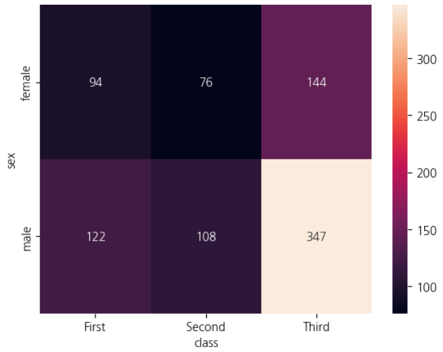
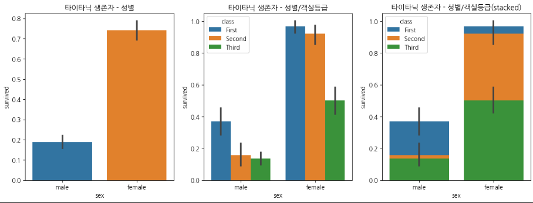
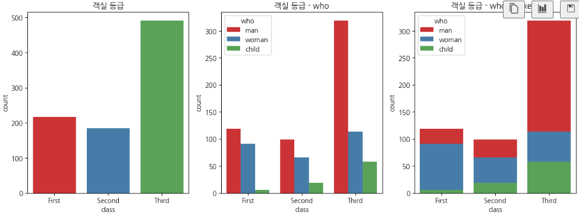
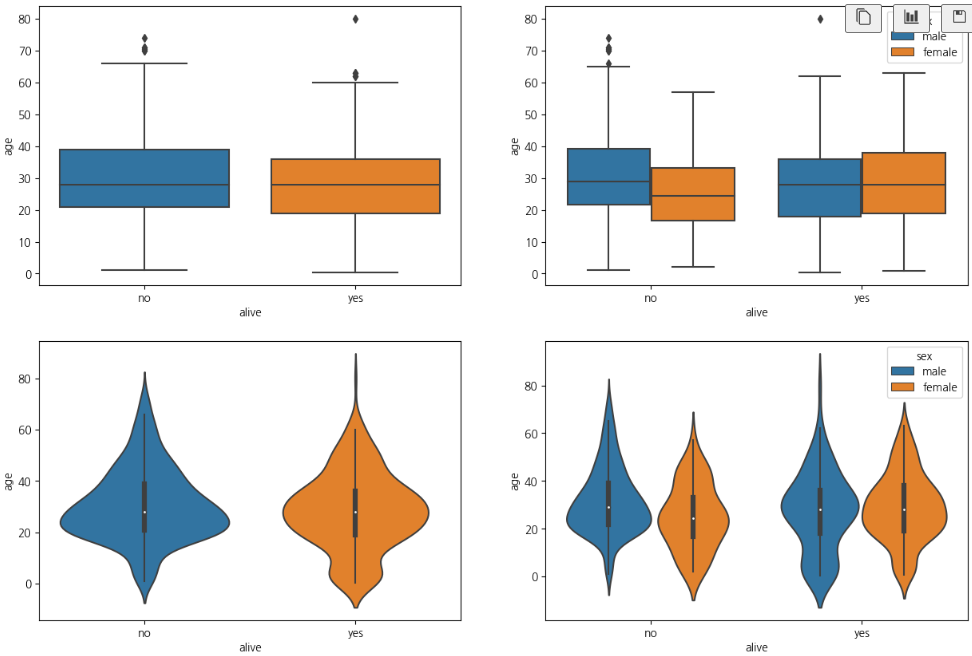
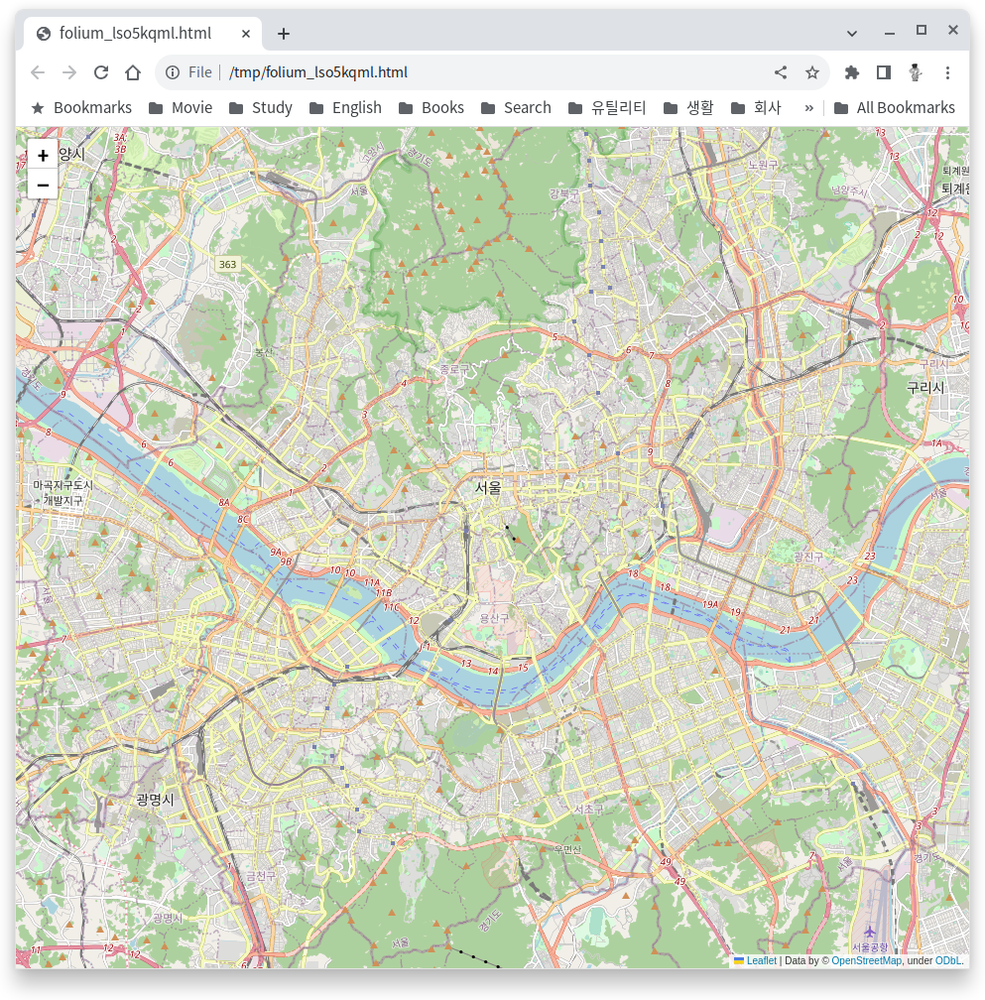
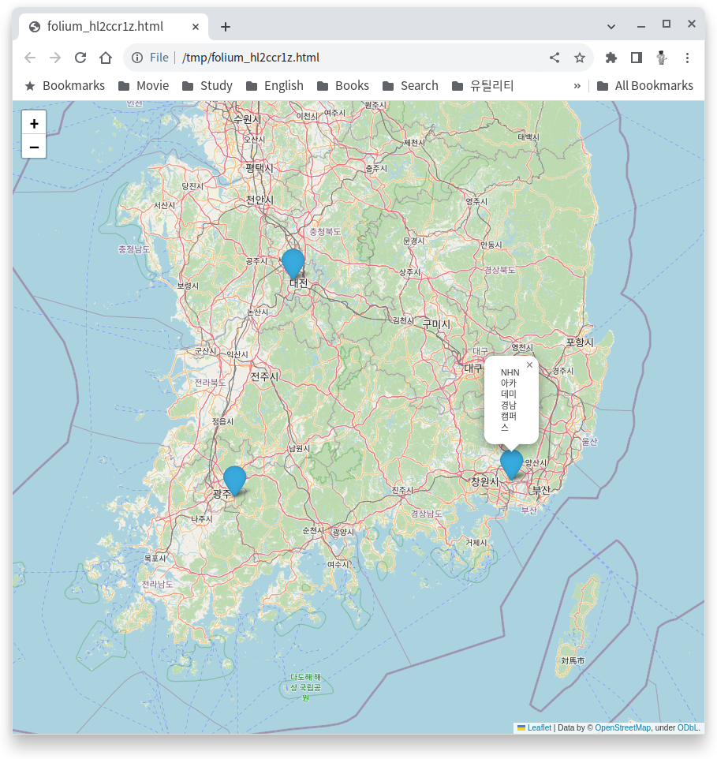
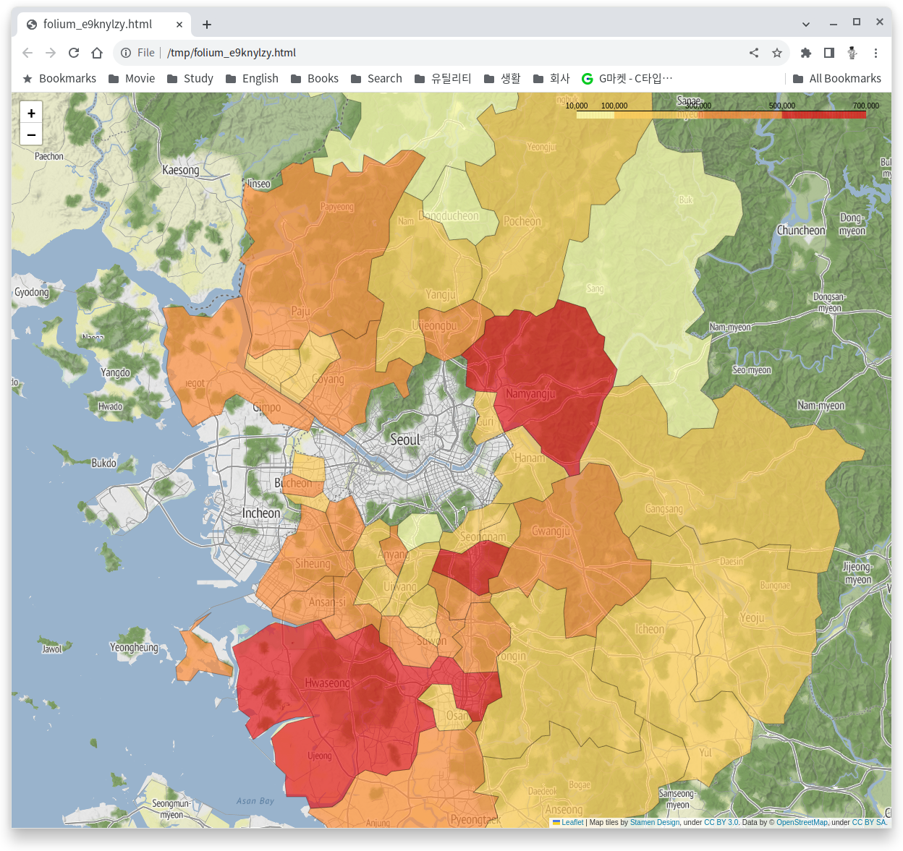

= Data Visualization

* 데이터 분석에서 다루는 데이터의 종류는 매우 다양함
* 그래프를 이용하면 데이터의 구조와 패턴을 파악하기 유용함
* 다양한 관점엣거 데이터에 관한 insignt를 제공
* pandas에 포함된 시각화 도구만으로는 부족함

== Matplotlib

* python 표준 시각화 도구라고 부를 수 있을 정도로 많이 사용됨
* 2D 평면 그래프에 관한 다양한 포맷과 기능 지원
* 사용하기 쉬움

== Sample Data

[%header, cols="2,1,1,1,1,1,1,1,1", width=100%]
|===
|전입지     |1970	    |1971	    |1972	    |1973       |...	|2014	    |2016	    |2017
|전국	    |1448985	|1419016	|1210559	|1647268    |...	|1661425	|1655859	|1571423
|부산광역시	 |11568	    |11130	    |11768	    |16307      |...	|17320	|15062	|14484
|대구광역시	 |-	        |-	|-	|-	|...    |10062	|9623	|8891
|인천광역시	 |-         |-	|-	|-	|...    |43212	|43745	|40485
|광주광역시	 |-	        |-	|-	|-	|...    |9759	|8354	|7932
|대전광역시	 |-	        |-	|-	|-	|...    |13403	|12619	|11815
|울산광역시	 |-	        |-	|-	|-	|...    |6047	|5102	|4260
|세종특별자치시	|-	    |-	|-	|-	 |...   |6481	|5943	|5813
|경기도	    |130149	    |150313	|93333	|143234 |...	|332785	|370760	|342433
|강원도	    |9352	    |12885	|13561	|16481	|...	|21173	|21590	|21016
|충청북도	|6700	    |9457	|10853	|12617	|...	|14244	|14087	|13302
|충청남도	|15954	    |18943	|23406	|27139	|...	|21473	|21741	|21020
|전라북도	|10814	    |13192	|16583	|18642	|...	|14566	|13835	|13179
|전라남도	|10513	    |16755	|20157	|22160	|...	|14591	|13065	|12426
|경상북도	|11868	    |16459	|22073	|27531	|...	|14456	|14236	|12464
|경상남도	|8409	    |10001	|11263	|15193	|...	|14799	|13717	|12692
|제주특별자치도	|1039	|1325	|1617	|2456	|...	|9031	|10465	|10404
|===

== 선 그래프

[source, python]
----
sr_one = df_seoul.loc['경기도']
plt.plot(sr_one.index, sr_one.values)
----
+
image:./images/image01.png[]

=== 차트 제목, 축 이름 추가

* 차트 제목에는 title() 함수 사용
* x, y 축 제목을 위해 xlabel(), ylabel() 함수를 사용

[source, python]
----
plt.plot(sr_one.index, sr_one.values)
plt.plot(sr_one)
plt.title('경기도 -> 서울 이동 인구')
plt.xlabel('기간')
plt.ylabel('이동 인구수')
plt.show()
----

=== 그래프 설정

* 그래프 크기 설정 +
_plt.figure(figsize=(horizontal_inch, vertical_inch))_
* 눈금 라벨 회전 +
_plt.xticks(rotation='vertical')_

[source, python]
----
plt.figure(figsize=(14, 5))
plt.xticks(rotation='vertical')
plt.plot(sr_one)
plt.title('경기도 -> 서울 이동 인구')
plt.xlabel('기간')
plt.ylabel('이동 인구수')
plt.show()
----

image:./images/image03.png[]

=== 스타일 적용

* 색, 폰트 등 디자인 요소를 사전에 지정된 스타일로 일괄 변경
* Matplotlib 실행 환경을 변경하므로, 설정 후 모든 그래프에 적용
* 기본 값은 'default'
+
_plt.style.use('style_name')_

image:./images/image04.png[]

> 참고 https://matplotlib.org/stable/users/prev_whats_new/dflt_style_changes.html

=== 화면 분할, 여러개 그래프 작성

* axe 객체를 사용하여 분할된 화면마다 axe 객체를 하나씩 배정
* axe 객체는 각각 서로 다른 그래프를 표현할 수 있음
+
[source, python]
----
# 그래프 객체 생성(figure에 2개의 서브 플롯 생성)
fig = plt.figure(figsize=(10, 10))
# add_subplot(row 크기, column 크기, 서브 플롯 순서)
ax1 = fig.add_subplot(2, 1, 1)
ax2 = fig.add_subplot(2, 1, 2)

# axe 객체에 plot 함수로 그래프 출력
ax1.plot(sr_one, marker='o', markersize=10, linewidth=0)
ax2.plot(sr_one, marker='+', markerfacecolor='green',markersize=10, color='olive', linewidth=2, label='서울->경기')
ax2.legend(loc='best')

# y축 범위 지정
ax1.set_ylim(50000, 800000)
ax2.set_ylim(50000, 800000)

# 축 눈금 라벨 지정 및 75도 회전
ax1.set_xticklabels(sr_one.index, rotation=75)
ax2.set_xticklabels(sr_one.index, rotation=75)

plt.show()
----

image:./images/image05.png[]

=== 여러 그래프

* 단일 캔버스에 여러 그래프를 표시할 수 있음
* 단일 axe 객체에 여러 Series를 표시
+
[source, python]
----
col_years = list(map(str, range(1970, 2018)))
df_2 = df_seoul.loc[['부산광역시','경상남도','대구광역시','경상북도'], col_years]

years = list(map(str, range(1970, 1981)))
df_2.loc['대구광역시', years] = 0

plt.style.use('ggplot')

fig = plt.figure(figsize=(20, 5))
ax = fig.add_subplot(1, 1, 1)

ax.plot(df_2.loc['부산광역시'], label='서울->부산', marker='*')
ax.plot(df_2.loc['경상남도'], label='서울->경남', marker='*')
ax.plot(df_2.loc['대구광역시'], label='서울->대구', marker='*')
ax.plot(df_2.loc['경상북도'], label='서울->경북', marker='*')

ax.legend(loc='best')

plt.show()
----

image:./images/image06.png[]

== 면적 그래프(area plot)

* 선 그래프에서, 선 그래프와 x 축 사이의 공간에 색이 입혀지는 행태의 그래프
* 기본적으로 그래프를 누적하여 표시함
* plot(kind='area') 옵션으로 표시
+
[source, python]
----
col_years = list(map(str, range(1970, 2018)))
df_3 = df_seoul.loc[['충청남도','경상북도','강원도','전라남도'], col_years]
df_4 = df_3.transpose()

plt.style.use('ggplot')

#df_4.index = df_4.index.map(int)
df_4.plot(kind='area', stacked=False, alpha=0.2, figsize=(20, 10))

plt.title('서울->타시도 인구 이동', size=30)
plt.ylabel('이동 인구수', size=20)
plt.xlabel('기간', size=20)
plt.legend(loc='best',fontsize=15)

plt.show()
----

image:./images/image07.png[]

== 막대 그래프(bar plot)

* 데이터 값의 크기에 비례하여 높이를 갖는 직사각형 막대로 표현
* 막대 높이의 상대적 길이 차이를 통해 값의 크고 작음을 설명
* plot(kind='bar') 옵션으로 표시

image:./images/image08.png[]

=== 가로형 막대 그래프

* plot(kind='barh') 옵션으로 표시
+
[source, python]
----
col_years = list(map(str, range(2010, 2018)))
df_3 = df_seoul.loc[['충청남도','경상북도','강원도','전라남도'], col_years]
df_4 = df_3.transpose()

df_4['합계'] = df_4.sum(axis=1)

df_total = df_4[['합계']].sort_values(by='합계', ascending=True)

plt.style.use('ggplot')

df_total.plot(kind='barh',figsize=(10,5),width=0.5,color='cornflowerblue')

plt.title('서울->타시도 인구 이동', size=30)
plt.ylabel('전입자', size=20)
plt.xlabel('이동 인구수', size=20)

plt.show()
----

== 히스토그램(histogram)

* 변수가 하나는 단변수 데이터의 빈도수를 그래프로 표현
* 같은 크기의 여러 구간으로 나누고 각 구간에 속하는 데이터 값의 개수(빈도)를 y축에 표시
* 구간을 나누는 간격의 크기에 따라 빈도가 달라지고 히스토그램의 모양이 변함
* plot(kind='hist') 옵션으로 표시
+
[source, python]
----
plt.style.use('classic')

df = pd.read_csv('./auto-mpg.csv', header=None)

df.columns = ['mpg','cylinders','displacement','horsepower','weight','acceleration','model year','origin','name']

df['mpg'].plot(kind='hist', bins=10, color='coral', figsize=(10,5))

plt.title('Histogram')
plt.xlabel('mpg')
plt.show()
----

== 산점도(scatter plot)

* 서로 다른 두 변수 사이의 관계를 나타냄
* 각 변수는 연속되는 값을 가짐
* 일반적으로 정수형 또는 실수형 값
* plot('scatter') 옵션으로 표시
+
[source, python]
----
df_car.plot(kind='scatter',x='weight',y='mpg',c='coral',s=10,figsize=(10,5))
plt.title('Scatter plnt = 연비 vs. 무게')
plt.show()
----

=== 버블차트

* 점의 크기에 변화를 주어 세 변수 사이의 관계를 나타냄
+
[source, python]
----
cylinders_size = df_car.cylinders / df_car.cylinders.max() * 300

df_car.plot(kind='scatter',x='weight',y='mpg',c='coral',figsize=(10,5),s=cylinders_size, alpha=0.3)
plt.title('Scatter plot: 연비-무게-실린더수')
plt.show()
----

== 파이차트(pie chart)

* 원을 파이 조각처럼 표현
* 조각의 크기는 해당 변수에 속하는 데이터 값의 크기에 비례함
* plot('pie') 옵션으로 표시
+
[source, python]
----
df_car['count'] = 1
df_origin = df_car.groupby('origin').sum()

df_origin.index = ['USA','EU','JPN']

df_origin['count'].plot(kind='pie',
                        figsize=(7,5), 
                        autopct='%1.1f%%',
                        startangle=0,
                        colors=['chocolate','bisque','cadetblue'])

plt.title('Model Origin', size=20)
plt.axis('equal')
plt.legend(labels=df_origin.index, loc='upper right')
plt.show()
----

image:./images/image13.png[]

== 박스 플롯(Boxplot)

* 범주형 데이터의 범위를 파악
* 5개의 통계 지표(최소값, 1분위값, 중간값, 3분위값, 최대값)을 제공
* 각 axe 객체에 boxplot() 함수를 호출

[source, python]
----
fig = plt.figure(figsize=(15,5))
ax1 = fig.add_subplot(1,2,1)
ax2 = fig.add_subplot(1,2,2)

ax1.boxplot(x=[df_car[df_car['origin']==1]['mpg'],
               df_car[df_car['origin']==2]['mpg'],
               df_car[df_car['origin']==3]['mpg']],
               labels=['USA','EU','JAPAN'])
ax2.boxplot(x=[df_car[df_car['origin']==1]['mpg'],
               df_car[df_car['origin']==2]['mpg'],
               df_car[df_car['origin']==3]['mpg']],
               labels=['USA','EU','JAPAN'],
               vert=False)
ax1.set_title('제조국가별 연비 분포(수직)')
ax2.set_title('제조국가별 연비 분포(수평)')

plt.show()
----

image:./images/image14.png[]

== 연습문제

한국 복지패널 데이터는 한국보건사회연구원에서 우리나라 가구의 경제활동을 복지 정책에 반영할 목적으로 발간하는 조사자료이다. 전국에서 7000여 가구를 선정해 2006년부터 추적 조사한 자료로, 경제활동, 생활실태, 복지욕구 등 천 여개 변수로 구성되어 있음.

* 데이터 다운로드
** 한국 복지패널 연구소에서 다운로드 할 수 있으나, 아래 주소에서 미리 준비된 데이터를 다운로드하여 사용한다.
** https://nhnacademy.dooray.com/drive/3619694603650156997
** 파일은 통계 분석 소프트웨어인 SPSS 전용 파일로, 이를 읽기 위해서는 pyreadstat 패키지가 필요함
** 터미널(또는 명령 프롬프트)에서 아래 명령을 실행하여 설치
+
----
$ conda install -c conda-forge pyreatstat
# 실패할 경우 pip로 설치
$ pip install pyreatstat
----
** 데이터는 read_spss() 함수로 읽을 수 있음
+
[source, python]
----
df_welpare_raw = pd.read_spss('file_name')
----

* 분석 연습문제 - 1
** 성별에 따른 월급차이 분석
*** sex column의 타입을 검토하고 빈도를 점검
*** sex 데이터의 빈도를 표시하기 위한 최적의 그래프를 선택하여 표시
*** 급여를 표시하는 income 변수의 타입을 검토
*** 급여의 평균값, 중앙값을 계산
*** 급여 분포를 표시하기 위한 최적의 그래프를 선택하여 표시
*** 급여의 결측치 처리
**** Series의 isna() 함수를 사용하여 결측치를 처리
*** 성별 월급차이 분석
*** 성별 월급차이를 표시하기 위한 최적의 그래프를 선택하여 표시

* 분석 연습문제 - 2
** 연령에 따른 급여차이 분석
*** birth column의 타입을 파악하고 빈도를 점검
*** birth 데이터의 빈도를 표시하기 위한 최적의 그래프를 선택하여 표시
*** birth 데이터의 결측치 처리
*** 연령별 월급차이 분석
*** 연령별 월급차이를 표시하기 위한 최적의 그래프를 선택하여 표시

* 분석 연습문제 - 3
* 직업별 월급 차이를 구하시오

== Seabon 패키지

* Matplotlib의 기능과 스타일을 확장한 Python 시각화 도구의 고급 버전
* 비교적 단순한 인터페이스

=== Sample Data

* seaborn에 기본 탑재된 titanic 데이터셋 사용

[source, python]
----
df_titanic = sns.load_dataset('titanic')
df_titanic.head()
----

=== 산점도

* 2개의 연속 변수 사이의 산점도 및 선형 회귀 분석에 의한 회귀선 표시
* regplot() 함수

[source, python]
----
fig = plt.figure(figsize=(15, 5))
sns.regplot(x='age',y='fare',data=df_titanic)
----

=== 히스토그램

* distplot() 함수

[source, python]
----
fig = plt.figure(figsize=(15,5))
ax1 = fig.add_subplot(1,3,1)
ax2 = fig.add_subplot(1,3,2)
ax3 = fig.add_subplot(1,3,3)

sns.distplot(df_titanic['fare'], ax=ax1)
sns.distplot(df_titanic['fare'], hist=False, ax=ax2)
sns.distplot(df_titanic['fare'], kde=False, ax=ax3)

ax1.set_title('요금 - hist./ked')
ax2.set_title('요금 - ked')
ax3.set_title('요금 - hist')
----

=== 히트맵

* 2개의 범주형 변수를 각각 x, y 축에 놓고 데이터를 매트릭스 형태로 분류
* 피봇 테이블로 정리한 후 heatmap() 함수 사용

[source, python]
----
table = df_titanic.pivot_table(index=['sex'], columns=['class'], aggfunc='size')
sns.heatmap(table,
            annot=True, fmt='d',
            cbar=True)
----

=== 막대 그래프

* barplot() 함수 사용

[source, python]
----
fig = plt.figure(figsize=(15,5))
ax1 = fig.add_subplot(1,3,1)
ax2 = fig.add_subplot(1,3,2)
ax3 = fig.add_subplot(1,3,3)

sns.barplot(x='sex', y='survived', data=df_titanic, ax=ax1)
sns.barplot(x='sex', y='survived', hue='class', data=df_titanic, ax=ax2)
sns.barplot(x='sex', y='survived', hue='class', dodge=False, data=df_titanic, ax=ax3)

ax1.set_title('타이타닉 생존자 - 성별')
ax2.set_title('타이타닉 생존자 - 성별/객실등급')
ax3.set_title('타이타닉 생존자 - 성별/객실등급(stacked)')
----

=== 빈도 그래프

* 각 범주에 속하는 데이터의 개수를 막대 그래프로 나타냄
* countplot() 함수 사용

[source, python]
----
fig = plt.figure(figsize=(15,5))
ax1 = fig.add_subplot(1,3,1)
ax2 = fig.add_subplot(1,3,2)
ax3 = fig.add_subplot(1,3,3)

sns.countplot(x='class', palette='Set1',data=df_titanic, ax=ax1)
sns.countplot(x='class', hue='who', palette='Set1',data=df_titanic, ax=ax2)
sns.countplot(x='class', hue='who', palette='Set1',dodge=False,data=df_titanic, ax=ax3)

ax1.set_title('객실 등급')
ax2.set_title('객실 등급 - who')
ax3.set_title('객실 등급 - who(stacked)')

plt.show()
----

=== 박스플롯/바이올린 그래프

* 박스 플롯만으로는 데이터 분산의 정도를 정확하게 알기 어려움
* 커널 밀도 함수 그래프를 y 축에 추가하여 바이올린 그래프를 표시할 수 있음
* violinplot() 함수 사용

[source, python]
----
fig = plt.figure(figsize=(15,10))
ax1 = fig.add_subplot(2,2,1)
ax2 = fig.add_subplot(2,2,2)
ax3 = fig.add_subplot(2,2,3)
ax4 = fig.add_subplot(2,2,4)

sns.boxplot(x='alive',y='age',data=df_titanic,ax=ax1)
sns.boxplot(x='alive',y='age',hue='sex',data=df_titanic,ax=ax2)
sns.violinplot(x='alive',y='age',data=df_titanic,ax=ax3)
sns.violinplot(x='alive',y='age',hue='sex',data=df_titanic,ax=ax4)

plt.show()
----

=== 조인트 그래프

* 산점도를 기본으로 표시하고, x-y 축의 각 변수에 대한 히스토그램을 동시에 보여줌
* 두 변수의 관계와 데이터가 분산되어 있는 정도를 파악하기 쉬움
* jointplot() 함수 사용

[source, python]
----
j1 = sns.jointplot(x='fare',y='age',data=df_titanic)
j2 = sns.jointplot(x='fare',y='age',kind='reg',data=df_titanic)
j3 = sns.jointplot(x='fare',y='age',kind='hex',data=df_titanic)
j4 = sns.jointplot(x='fare',y='age',kind='kde',data=df_titanic)

j1.fig.suptitle('타이타닉 요금 - scatter', size=15)
j2.fig.suptitle('타이타닉 요금 - reg', size=15)
j3.fig.suptitle('타이타닉 요금 - hex', size=15)
j4.fig.suptitle('타이타닉 요금 - kde', size=15)
----

== Forum 라이브러리

* Forum 라이브러리는 지도를 시각화할 때 유용함
* 라이브러리 설치
+
----
$ conda install -c conda-forge folium
----

[source, python]
----
import folium

seoulmap = folium.Map(location=[37.55,126.98], zoom_start=12)
seoulmap.show_in_browser()
----

=== 마커를 사용해서 위치 표시

[source, python]
----
map = folium.Map(location=[35.235,128.8664], zoom_start=15)

folium.Marker(
    location=[35.235,128.8664],
    popup="NHN 아카데미 경남캠퍼스",
    icon=folium.Icon(icon="green"),
).add_to(map)

folium.Marker(
    location=[35.1403,126.9339],
    popup="NHN 아카데미 광주캠퍼스",
    icon=folium.Icon(icon="green"),
).add_to(map)

folium.Marker(
    location=[36.3677,127.3445],
    popup="NHN 아카데미 대전캠퍼스",
    icon=folium.Icon(icon="green"),
).add_to(map)

map.show_in_browser()
----

=== 지도 영역에 단계구분도 표시

* 지도상의 경계에 둘러싸인 영역에 색을 칠하거나 음영으로 정보 표시

[source, python]
----
import json

df = pd.read_excel('경기도인구데이터.xlsx', index_col='구분')
df.columns = df.columns.map(str)

# 경기도 시군구 경계 정보를 가진 geo-json 파일 불러오기
geo_path = './경기도행정구역경계.json'
try:
    geo_data = json.load(open(geo_path, encoding='utf-8'))
except:
    geo_data = json.load(open(geo_path, encoding='utf-8-sig'))

# 경기도 지도 만들기
g_map = folium.Map(location=[37.5502,126.982], 
                   tiles='Stamen Terrain', zoom_start=9)

# 출력할 연도 선택 (2007 ~ 2017년 중에서 선택)
year = '2017'  

# Choropleth 클래스로 단계구분도 표시하기
folium.Choropleth(geo_data=geo_data,    # 지도 경계
                 data = df[year],      # 표시하려는 데이터
                 columns = [df.index, df[year]],  # 열 지정
                 fill_color='YlOrRd', fill_opacity=0.7, line_opacity=0.3,
                 threshold_scale=[10000, 100000, 300000, 500000, 700000],               
                 key_on='feature.properties.name',
                 ).add_to(g_map)

g_map.show_in_browser()
# 지도를 HTML 파일로 저장하기
# g_map.save('./gyonggi_population_' + year + '.html')
----

