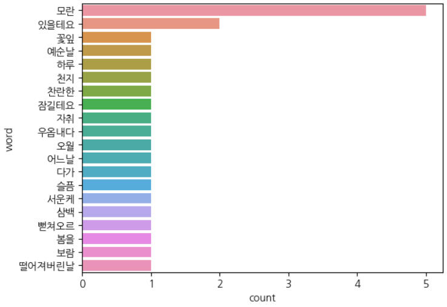

= Text Mining

* 문자로 된 데이터에서 가치 있는 데이터를 얻어내는 분석 기법
* 형태소 분석 기법을 사용하여 문장을 구성하는 어절의 품사를 파악하여 처리
* 명사, 동사, 형용사 등으로 구분하고 추출해 어떤 단어가 어떤 의미로 사용되었는지 분석

== 한글 형태소 분석 라이브러리

* 많이 사용하는 한글 형태소 분석 라이브러리는 KoNLPy 패키지
* Java가 설치되어 있어야 동작함
* pip 명령으로 설치
----
$ pip install konlpy
----

=== 텍스트 준비

[source, python]
----
text = open('모란이피기까지는.txt', encoding='UTF-8').read()
# 한글이 아닌 모든 문자열을 빈값으로 치환
clean_text = re.sub('[^가-힣]', ' ', text)
# konlpy 라이브러리를 사용하여 텍스트에서 명사 추출
nouns = konlpy.tag.Hannanum().nouns(clean_text)
----

=== 데이터 프레임으로 변환하여 문자 빈도수 계산

[source, python]
----
df_words = pd.DataFrame({'word': nouns})

# 2글자 이하인 단어 삭제
df_words['count'] = df_words['word'].str.len()
df_words = df_words[(df_words['count'] >= 2)]
# query() 메소드 사용
#df_words = df_words.query('count >= 2')

# count 컬럼을 1로 수정
df_words['count'] = 1

# groupby 함수로 집계
df_wc = df_words.groupby(by='word',as_index=False).agg(count=('word','count')).sort_values('count', ascending=False)
----

=== 그래프로 확인

[source, python]
----
sns.barplot(data=df_wc.head(20),y='word',x='count')
----

