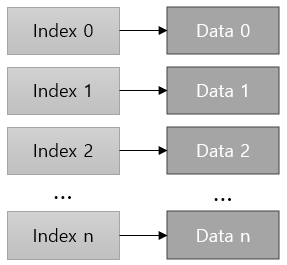
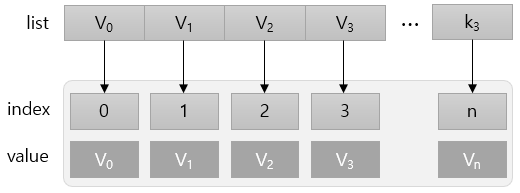
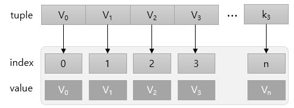
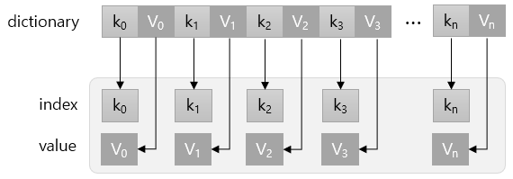
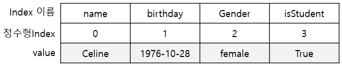

= Series

* 데이터가 순차적으로 나열된 1차원 배열의 형태로 데이터를 저장
* Python의 dictionary와 유사한 형태의 자료구조
** index와 Value로 구성됨
** 열벡터 형태의 자료구조

---

시리즈는 데이터 순차적으로 나열된 1차원 배열의 형태를 갖습니다. 위 그림과 같이 index와 data가 일대일 대응이 됩니다. 이런 관점에서 key과 value가 쌍을 이루는 Python의 dictionary와 비슷한 구조를 가진다고 할 수 있습니다.

Series의 index는 데이터의 위치를 나타내는 이름표(데이터의 주소)와 역할을 합니다. Serise는 list, tuple, dictionary 등에서 생성할 수 있습니다.

== list에서 생성

* list에서 Series생성
+
_pandas.Series(list)_
+
[source, python]
----
list = ['2023-12-30', 3.14, 'Celine', True]
series = pd.Series(list)
----
+

== tuple에서 생성

* tuple에서 Series 생성
+
_pandas.Series(tuple)_
+
[source, python]
----
tup = ('Celine', '1976-10-28', 'femail', True)
# 인덱스 옵션 지정
series = pd.Series(tup, index=['name','birthday','gender', "isStudent"])
----
+

== Dictionary에서 생성

* Dictionary에서 Series 생성
+
_pandas.Series(dictionary)_
+
[source, python]
----
dict = {'name': 'Celine', 'birthday': '1976-10-28', 'gender': 'female', 'isStudent': True}
series = pd.Series(dict)
series
----
+

생성된 Series는 `pandas.core.series.Series` 타입입니다.

== Series 데이터 액세스

Series 객체의 index 속성과 values 속성을 사용하면 값을 불러올 수 있습니다.

[source, python]
----
series.index
series.values
----

* 인덱스, 인덱스명 사용
** list를 사용하여 여러 데이터에 액세스
+

+
[source, python]
----
series[0]
'Celine'

series[[0, 1]]
----
+
----
name        Celine
birthday    1976-10-28
----
+
[source, python]
----
series[0:4]
----
+
----
name             Celine
birthday     1976-10-28
gender           femail
isStudent          True
----
+
[source, python]
----
series['gender']
----
+
----
'female'
----
+
[source, python]
----
series[['name', 'gender']]
----
+
----
name      Celine
gender    female
----
+
** 인덱스에 액세스
+
_Series_object.index_
+
[source, python]
----
series.index
Index(['name', 'birthday', 'gender', 'isStudent'], dtype='object')
----
+
** 데이터에 액세스
+
_Series_object.values
+
[source, python]
----
series.values
array(['Celine', '1978-10-26', 'female', True], dtype=object)
----