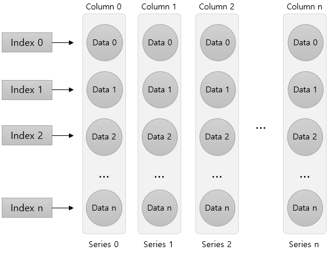
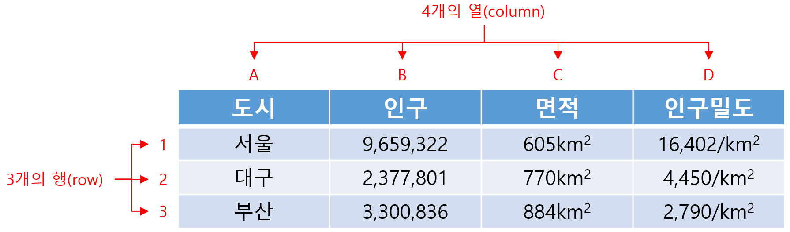

= DataFrame 

* 데이터를 다룰 때 가장 많이 사용하는 데이터 형태
* 열(column)과 행(row)로 구성된 2차원 벡터(Vector) 또는 행렬(Matrix)
** 열은 column, variable로 불리며, 세로로 나열되는 열을 나타냄
** 행은 row, case로 불리며, 각 데이터 객체를 나타냄

---

== DataFrame 생성

* DataFrame을 만들기 위해서는 같은 길이(원소의 개수가 동일한)dml 1차원 배열 여러 개가 필요함
* DataFrame은 여러 개의 Series(열, column)을 모아놓은 집합과 같음
** Dictionary의 value에 해당하는 각 리스트가 Series 배열로 변환되어 DataFrame의 column이 됨
** Dictionary의 key는 각 시리즈의 이름으로 변환되어 DataFrame의 column 이름이 됨

== DataFrame 생성 (List)

* list 사용
** column 이름이 정수형으로 지정됨
+
_Pandas.DataFrame( list )_
+
[source, python]
----
import pandas as pd

df = pd.DataFrame([ 
    ['Celine', 'France', 90, 100, 100],
    ['James','UK', 80, 40, 30],
    ['Jason','USA',80, 40, 60],
    ['Hans','Germany', 60, 50, 90]
])
----
+
[%header, cols=6, width=50%]
|===
|  | 0      | 1         |2  | 3  | 4
|0 |Celine  |France     |90 |100 |100
|1 |James   |UK         |80 |40  |30
|2 |Jason   |USA        |20 |40  |60
|3 |Hans    |Germany    |40 |50  |90
|===

== DataFrame 생성 (List + columns)

* column 이름 지정
+
[source, python]
----
df = pd.DataFrame([ 
    ['Celine', 'France', 90, 100, 100],
    ['James','UK', 80, 40, 30],
    ['Jason','USA',80, 40, 60],
    ['Hans','Germany', 60, 50, 90]],
    columns = ['name', 'nation', 'english', 'math', 'science']
)
----
+
[%header, cols=6, width=50%]
|===
|  |name    |nation     |english  |math  |science
|0 |Celine  |France     |90 |100 |100
|1 |James   |UK         |80 |40  |30
|2 |Jason   |USA        |20 |40  |60
|3 |Hans    |Germany    |40 |50  |90
|===

== DataFrame 생성 (List + columns + index)

* name을 index로 지정
+
[source, python]
----
df = pd.DataFrame([ 
    ['France', 90, 100, 100],
    ['UK', 80, 40, 30],
    ['USA',80, 40, 60],
    ['Germany', 60, 50, 90]],
    columns = ['nation', 'english', 'math', 'science'],
    index = ['celine', 'James','Jason','Hans']
)
----
+
[%header, cols=4, width=50%]
|===
|nation  |english  |math  |science
|Celine  |France     |90 |100 |100
|James   |UK         |80 |40  |30
|Jason   |USA        |20 |40  |60
|Hans    |Germany    |40 |50  |90
|===

== DataFrame 생성 (Dictionary)

* Dictionary 사용
** column 이름 지정
+
[source, python]
----
import pandas as pd

df2 = pd.DataFrame({
    'name':     ['Celine','James','Jason','Hans'],
    'nation':   ['France','UK','USA','Germany'],
    'english':  [90,80,80,60],
    'math':     [100,40,40,50],
    'science':  [100,30,60,90]
})
----
+
[%header, cols=6, width=50%]
|===
|  |name   |nation  |english    |math   |science
|0 |Celine |France  |90         |100    |100
|1 |James  |UK      |80         |40     |30
|2 |Jason  |USA     |20         |40     |60
|3 |Hans   |Germany |40         |50     |90
|===

== DataFrame 생성 (Dictionary + index)

* dictionary 사용
** 이름을 key로 사용

[source, python]
----
import pandas as pd

df = pd.DataFrame({
    'nation':   ['France','UK','USA','Germany'],
    'english':  [90,80,80,60],
    'math':     [100,40,40,50],
    'science':  [100,30,60,90]
})
df.index = ['Celine','James','Jason','Hans']
----

[%header, cols=5, width=40%]
|===
|       |nation |english    |math   |science
|Celine |France |90         |100    |100
|James  |UK     |80         |40     |30
|Jason  |USA    |20         |40     |60
|Hans   |Germany|40         |50     |90
|===
