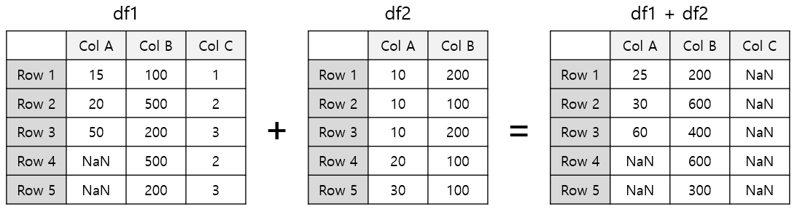

= DataFrame 산술 연산

* 시리즈 연산을 확장
* column/row 인덱스를 기준으로 정렬 후 1:1 대응되는 원소끼리 연산을 처리

== DataFrame, 숫자

* DataFrame에 어떤 숫자를 연산하면 모든 원소에 대해 연산을 수행
+
[source, python]
----
df = pd.DataFrame({
    'nation':   ['France','UK','USA','Germany'],
    'english':  [90,80,80,60],
    'math':     [100,40,40,50],
    'science':  [100,30,60,90]
})
df.index = ['Celine','James','Jason','Hans']
----
+
[%header, cols=5, width=40%]
|===
|       |nation |english    |math   |science
|Celine |France |90         |100    |100
|James  |UK     |80         |40     |30
|Jason  |USA    |20         |40     |60
|Hans   |Germany|40         |50     |90
|===
+
[source, python]
----
df2 = df[['english', 'math','science']] + 10
----
+
[%header, cols=5, width=40%]
|===
|       |nation |english    |math   |science
|Celine |France |100        |110    |110
|James  |UK     |90         |50     |20
|Jason  |USA    |30         |50     |70
|Hans   |Germany|50         |60     |100
|===

== DataFrame, DataFrame

* 각 DataFrame의 같은 column, 같은 row에 있는 원소끼리 계산
* 동일한 원소끼리 계산한 값을 원래 위치에 다시 입력하여 새 DataFrame을 생성
* 어느 한쪽에 원소가 존재하지 않거나 NaN이면 연산 결과는 NaN으로 처리됨

