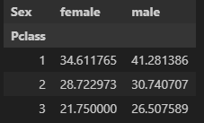

= Pandas 메소드

Pandas 라이브러리는 로드한 데이터의 미리보기, 산술 연산, 통계, 행렬 연산 등 분석에 유용한 많은 메소드들을 제공합니다. 

== Sample DataFrame

[%header, cols=5, width=40%]
|===
||nation |english    |math   |science
|name||||
|Celine|	France|	90|	100|	100
|James|	UK|	80|	40|	30
|Jason|	USA|80|	40|	60
|Hans|	Germany|60|	50|	90
|Robert|	USA|40|	60|	80
|Killdong|Korea|	100|95|	90
|Vesper|USA|100|80|90
|===

== DataFrame 메소드

DataFrame 메소드는 로드한 데이터의 일부를 확인하기 위한 메소드를 제공합니다.

=== 미리보기 메소드

**head() 메소드**

상위 5개 데이터를 읽습니다.

[source, python]
----
df.head()
----

[%header, cols=5, width=40%]
|===
||nation |english    |math   |science
|name||||
|Celine|	France|	90|	100|	100
|James|	UK|	80|	40|	30
|Jason|	USA|80|	40|	60
|Hans|	Germany|60|	50|	90
|Robert|	USA|40|	60|	80
|===

**tail() 메소드**

하위 5개 데이터를 읽습니다.

[source, python]
----
df.tail()
----

[%header, cols=5, width=40%]
|===
||nation |english    |math   |science
|name||||
|Jason|	USA|80|	40|	60
|Hans|	Germany|60|	50|	90
|Robert|	USA|40|	60|	80
|Killdong|Korea|	100|95|	90
|Vesper|USA|100|80|90
|===

=== 기본 정보 조회 메소드

**info() 메소드**

각 컬럼별로 null값과 자료형을 출력합니다.

[source, python]
----
df.info()
----

----
<class 'pandas.core.frame.DataFrame'>
Index: 7 entries, Celine to Vesper
Data columns (total 5 columns):
 #   Column   Non-Null Count  Dtype 
---  ------   --------------  ----- 
 0   name     7 non-null      object
 1   nation   7 non-null      object
 2   english  7 non-null      int64 
 3   math     7 non-null      int64 
 4   science  7 non-null      int64 
dtypes: int64(3), object(2)
memory usage: 336.0+ bytes
----

**describe() 메소드**

각 컬럼별로 기본적인 통계 수치들을 출력합니다. 출력되는 수치는 개수(Count), 평균(mean), 표준편차(std), 최솟값(min), 최댓값(max)
4분위수(25%, 50%, 75%) 등입니다.

[source, python]
----
df.describe()
----

[%header, cols=4, width=40%]
|===
||	english	|math|	science
|count|	7.000000|	7.000000|	7.000000
|mean|	78.571429|	66.428571|	77.142857
|std|	21.930627|	25.284100|	24.299716
|min|	40.000000|	40.000000|	30.000000
|25%|	70.000000|	45.000000|	70.000000
|50%|	80.000000|	60.000000|	90.000000
|75%|	95.000000|	87.500000|	90.000000
|max|	100.000000|	100.000000|	100.000000
|===

**isnull() 메소드**

DataFrame내의 결측치(NaN 값) 여부를 판별합니다. 각 cell에 표시되며, 결측치가 있으면 True, 없으면 False를 표시합니다.

[source, python]
----
df.isnull()
----

[%header, cols=6, width=40%]
|===
||name|nation |english    |math   |science
|name|False|False|False|False|False
|Celine|	False|	False|	False|	False|False
|James|	False|	False|	False|	False|False
|Jason|	False|False|	False|	False|False
|Hans|	False|False|	False|	False|False
|Robert|	False|False|	False|	False|False
|Killdong|False|	False|False|	False|False
|Vesper|False|False|False|False|False
|===

**value_counts() 메소드**

범주형 컬럼(카테고리형 데이터)에서 범주별로 데이터의 수를 출력합니다. value_counts() 메소드는 컬럼(Series)을 대상으로 실행합니다.

[source, python]
----
df.nation.value_counts()
----

----
nation
USA        3
France     1
UK         1
Germany    1
Korea      1
Name: count, dtype: int64
----

=== 기본 통계 메소드

**sum() 메소드**

DataFrame의 모든 컬럼의 숫자를 합한 값을 표시합니다.

[source, python]
----
df.sum()
----

----
name       CelineJamesJasonHansRobertKilldongVesper
nation                FranceUKUSAGermanyUSAKoreaUSA
english                                         550
math                                            465
science                                         540
dtype: object
----

sum() 메소드는 DataFrame의 컬럼(Series)에서도 실행할 수 있습니다.

[source, python]
----
df.english.sum()
----

----
df.english.sum()
----

**max() 메소드**

컬럼에서 가장 큰 값을 반환합니다.

[source, python]
----
df.max()
----

----
name       Vesper
nation        USA
english       100
math          100
science       100
dtype: object
----

max() 메소드는 DataFrame의 컬럼(Series)에서도 실행할 수 있습니다.

[source, python]
----
df.english.max()
----

----
100
----

**min() 메쇼드**

컬럼에서 가장 작은 값을 반환합니다.

[source, python]
----
df.min()
----

----
name       Celine
nation     France
english        40
math           40
science        30
dtype: object
----

min() 메소드는 DataFrame의 컬럼(Series)에서도 실행할 수 있습니다.

[source, python]
----
df.english.min()
----

----
40
----

**count() 메소드**

컬럼의 요소 수를 표시합니다. 결측치(NaN)는 제외합니다.

[source, python]
----
df.count()
----

----
name       7
nation     7
english    7
math       7
science    7
dtype: int64
----

count() 메소드는 DataFrame의 컬럼(Series)에서도 실행할 수 있습니다.

[source, python]
----
df.english.count()
----

----
7
----

**mean() 메소드**

컬럼 원소의 평균값을 표시합니다. 결측치(NaN)은 제외합니다.

[source, python]
----
df[['english','math']].mean()
----

----
english    78.571429
math       66.428571
dtype: float64
----

**median() 메소드**

컬럼 원소의 중앙값을 표시합니다. 결측치는 제외하며, 개수가 짝수이면 중앙값 두 값의 평균값을 return 합니다.

[source, python]
----
df[['english','math']].median()
----

----
english    80.0
math       60.0
dtype: float64
----

**mode() 메소드**

대상 행/열의 최빈값(가장 자주 나오는 값)을 반환합니다.

[source, python]
----
df.english.mode()
----

----
0     80
1    100
Name: english, dtype: int64
----

== 전문 통계 메소드

**corr() 메소드**

컬럼간의 상관계수를 반환합니다. 상관계수 산정 방식에는 피어슨 상관계수, 켄달-타우 상관계수, 스피어먼 상관계수를 사용합니다.

[%header, cols="1,1,4"]
|===
|산정 방식|옵션|설명
|피어슨 상관계수|pearson|두 변수간의 선형 상관관계를 계량화 한 수치입니다. 코시-슈바르츠 부등식에 의해 +1과 -1 사이의 값을 가집니다.
|켄달-타우 상관계수|kendall|두 변수들간의 순위를 비교해서 연관성을 계산합니다.
|스피어먼 상관계수|spearman|두 변수의 순위 값 사이의 피어슨 상관계수와 같습니다. 순서 척도가 적용되는 경우에는 스피어먼 상관계수가, 간격 척도가 적용되는 경우에는 피어슨 상관계수가 적용됩니다.
|===

[source, python]
----
df.english.corr(df.math,method='pearson')
----

----
0.5302969482553226
----

[source, python]
----
df.english.corr(df.math,method='kendall')
----

----
0.2564945880212885
----

**corrwith() 메소드**

두 DataFrame 객체의 동일한 행/열 간의 상관계수를 return 합니다.

**pivot_table() 메소드**

pivot_table() 보통 4개의 인자를 필수로 사용합니다.

* index: 행 인덱스
* columns: 열 인덱스
* values: 데이터 값
* aggfunc: 데이터 집계함수

[source, python]
----
df_객실등급별_남녀의나이_중간값 = pd.pivot_table(titanic,
                    index = 'Pclass',    # 행 위치에 들어갈 열
                    columns = 'Sex',    # 열 위치에 들어갈 열
                    values = 'Age',     # 데이터로 사용할 열
                    aggfunc = 'mean')   # 데이터 집계함수
----

타이타닉 예제에 위 메소드를 실행하면 결과는 아래와 같습니다.

help() 함수를 통해 pivot_table() 메소드의 설명을 볼 수 있습니다.

https://wikidocs.net/155458