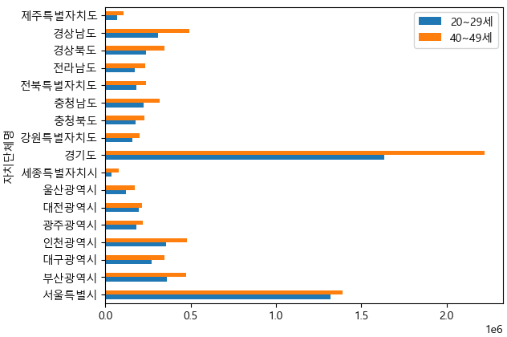

= Pandas Plot

* Pandas 라이브러리는 DataFrame 객체를 직접 시각화 할 수 있는 메소드를 제공
* DataFrame 객체의 plot() 메소드를 사용하여 데이터 시각화
+

---

데이터 분석에서 다루는 데이터의 종류는 매우 다양합니다. 데이터의 크기도 수천, 수만 개를 넘기는 경우도 흔합니다. 시각화 도구를 사용하는 이유가 여기에 있습니다. 그래프를 이용하면 데이터의 구조와 패턴을 파악하기가 용이합니다. 또한 다양한 관점에서 데이터에 관한 통찰력을 제공합니다. 

Pandas 라이브러리는 데이터 시각화 라이브러리를 제공하고, DataFrame 객체의 plot() 메소드를 사용하여 데이터를 시각화 합니다.

DataFrame 객체의 plot() 메소드의 옵션은 아래와 같습니다.

[%header, cols="1,3a"]
|===
|파라미터|설명
|kind|플로팅할 유형입니다. 목록은 아래와 같습니다. +
※ {line / bar / barh / hist / box / kde / density / area / pie / scatter / hexbin} x / y : 각 축으로 설정할 값(컬럼명) 입니다.
|ax|현재 figure의 axes 입니다. (fig와 axes의 개념은 아래 링크 참고)
|subplot|각 열들을 별개의 서브차트로 플로팅할지의 여부입니다.
|sharex / sharey|subplot=True 인 경우 각축의 눈금을 공유할지 여부 입니다.
|layout|투플로 입력하는 subplot의 배열입니다.
|figsize|출력할 fig의 크기 입니다.
|use_index|인덱스를 x축의 눈금으로 사용할지 여부 입니다.
|title|fig의 제목 입니다.
|grid|배경 격자의 형성 여부입니다.
|legend|subplot에서의 범례 배치 입니다.
|style|선의 스타일 입니다. 자세한것은 링크 참고 바랍니다.
|logx / logy / loglog|각 축에 대해 로그 스케일을 적용할지 여부 입니다. loglog=True인 경우 두 축에 모두 적용합니다.
|xticks / yticks|각 축의 눈금 값을 지정합니다.
|xlim / ylim|각 축의 값의 경계를 지정합니다.
|xlabel / ylabel|각 축의 라벨을 지정합니다.
|rot|눈금값의 기울기 입니다. 눈금값이 많을경우 유용합니다.
|fontsize|눈금값의 크기 입니다.
|colormap / colorbar|각 값에 대해 matplolib 에서 지원하는 colormap을 적용할 수 있습니다.
|table|True면 데이터를 테이블로 출력하며 matplotlib의 기본 레이아웃에 맞게 전치됩니다.
|yerr / xerr|특정 열의 값을 이용하여 오차범위 표현을 할 수 있습니다.
|stacked|bar plot이나 barh plot의 경우 막대 그래프를 누적 막대그래프로 표현할 수 있습니다.
|sort_columns|열을 정렬하여 플랏할지 여부입니다.
|secondary_y|보조축 레이블을 출력할지 여부 입니다.
|mark_right|보조축 레이블을 출력할 경우 범례에 "(right)"으로 열 레이블을 표시할지 여부 입니다.
|include_bool|bool형식의 값을 플랏할지 여부입니다.
|backend|plotting.backend 옵션에 지정된 백엔드 대신 사용할 백엔드. 예를 들어, 'matplotlib'. 또는 전체 세션에 대해 plotting.backend를 지정하려면 pd.options.plotting.backend를 설정할 수 있습니다.
|===