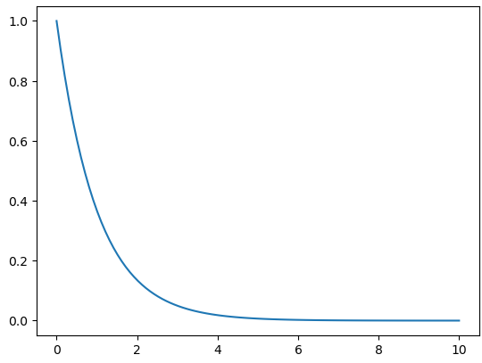
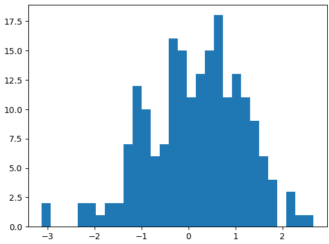
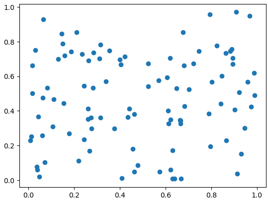
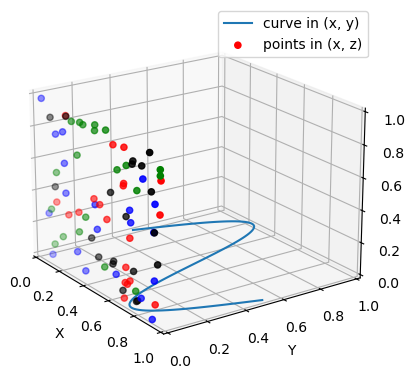

= matplot 라이브러리

* DataFrame의 시각화 도구는 기능이 풍부하지 않음
* Python 표준 시각화 도구로 여겨질 만큼 많이 사용되는 도구
* 2D 평면 그래프에 관한 다양한 포맷과 기능을 지원

---

DataFrame이 시각화 도구를 제공하긴 하지만 기능이 충분하지 않습니다. 일반적으로 Python을 사용하여 데이터를 시각화 할 때는 다른 전문화된 도구를 Pandas와 함께 많이 사용합니다. 

matplotlib은 Python 표준 시각화 도구라고 부를 수 있을 정도로 2D 평면 그래프에 관한 다양한 포맷과 기능을 제공합니다. 그래프 요소를 세세하게 꾸밀 수 있고, 비교적 사용법을 익히기 쉬워 실무에서 가장 많이 사용됩니다.

matplotlib은 Python 프로그래밍 언어 및 수학적 확장 numpy 라이브러리를 활용한 ploting 라이브러리입니다. Tkinter , wxPython , Qt 또는 GTK 와 같은 범용 GUI 툴킷을 사용하여 애플리케이션에 플롯을 포함 하기 위한 객체 지향 API를 제공합니다. 

Matplotlib 2.0.x는 Python 버전 2.7~3.10을 지원합니다. Python 3 지원은 Matplotlib 1.2부터 시작되었으며, Matplotlib 1.4는 Python 2.6을 지원하는 마지막 버전입니다. Matplotlib는 Python 3 선언문에 서명하여 2020년 이후 Python 2를 지원하지 않는 것을 명시했습니다.

matplotlib 라이브러리를 사용하려면 matplotlib.pyplot 모듈을 import 해야 하며, plt라는 이름으로 import 하는것이 일반적입니다. 또한 numpy 라이브러리를 np라는 이름으로 import 하여 사용합니다.

[source, python]
----
import matplotlib.pyplot as plt
import numpy as np
----

matplotlib을 활용하면 다양한 그래프를 그릴 수 있습니다.

== 선 그래프

[source, python]
----
a = np.linspace(0, 10, 100)
b = np.exp(-a)
plt.plot(a, b)
plt.show()
----

== 히스토그램

[source, python]
----
from numpy.random import normal,rand

x = normal(size=200)
plt.hist(x, bins=30)
plt.show()
----

== 산점도 그래프

[source, python]
----
a = rand(100)
b = rand(100)
plt.scatter(a, b)
plt.show()
----

== 3D 플롯

[source, python]
----
ax = plt.figure().add_subplot(projection='3d')

x = np.linspace(0, 1, 100)
y = np.sin(x * 2 * np.pi) / 2 + 0.5
ax.plot(x, y, zs=0, zdir='z', label='curve in (x, y)')

colors = ('r', 'g', 'b', 'k')

np.random.seed(19680801)

x = np.random.sample(20 * len(colors))
y = np.random.sample(20 * len(colors))
c_list = []
for c in colors:
    c_list.extend([c] * 20)
ax.scatter(x, y, zs=0, zdir='y', c=c_list, label='points in (x, z)')

ax.legend()
ax.set_xlim(0, 1)
ax.set_ylim(0, 1)
ax.set_zlim(0, 1)
ax.set_xlabel('X')
ax.set_ylabel('Y')
ax.set_zlabel('Z')

ax.view_init(elev=20., azim=-35, roll=0)

plt.show()
----

