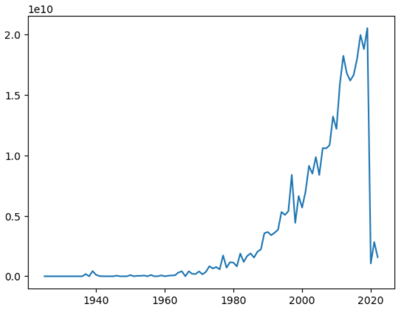
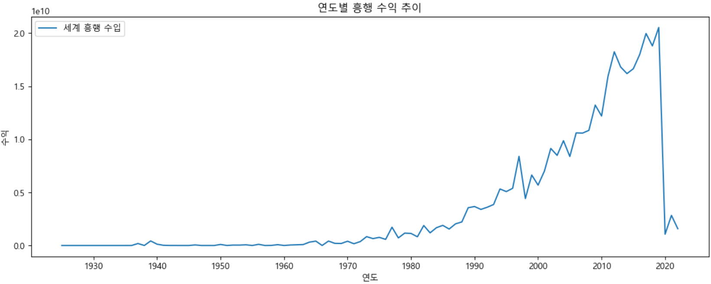
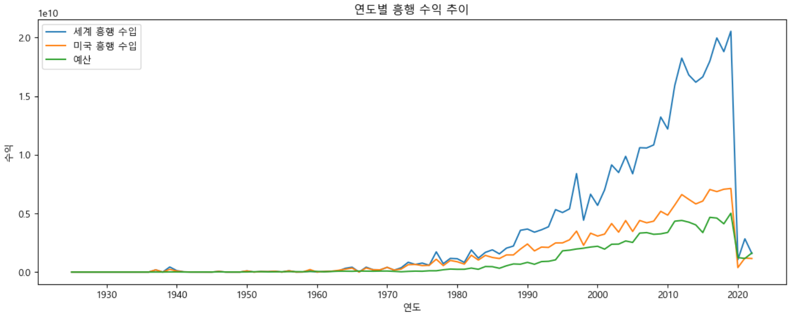
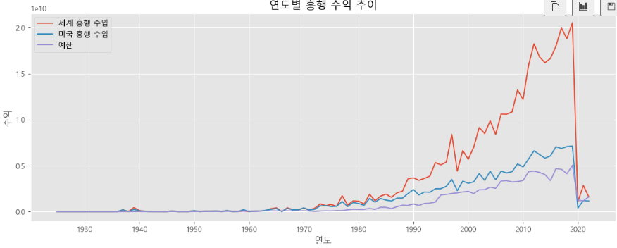
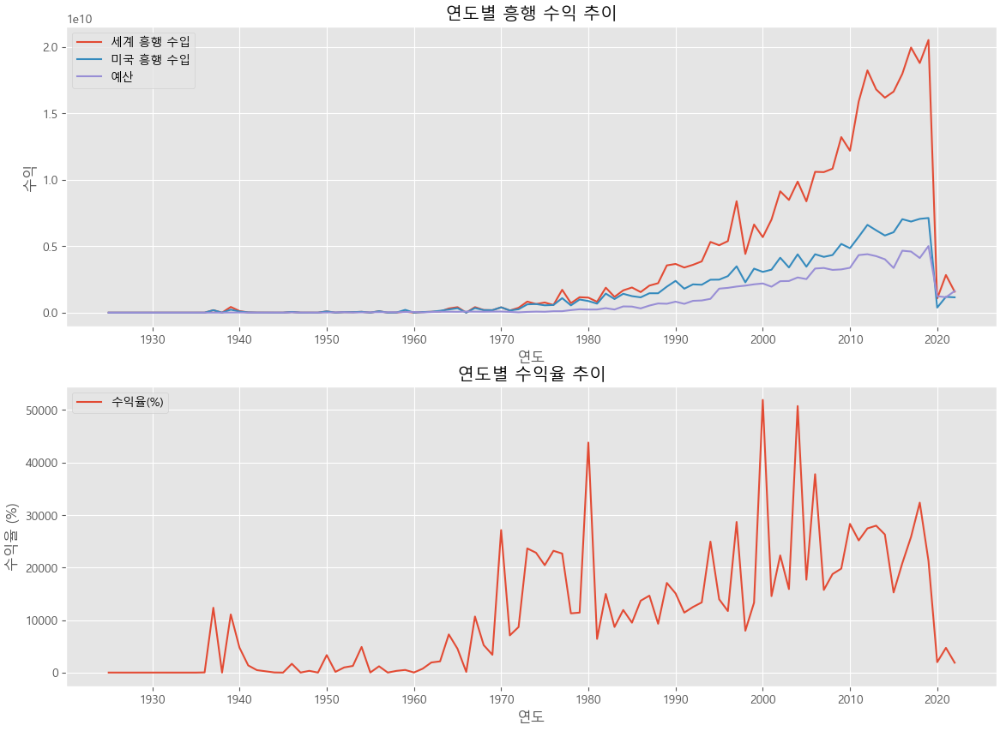
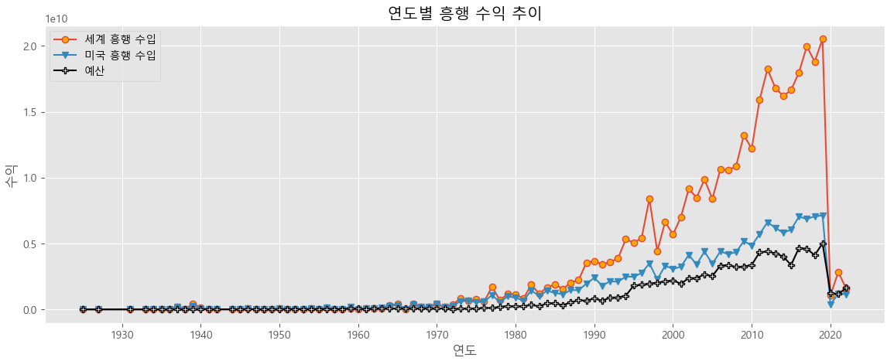

= Line plot

* 연속하는 데이터 값들을 직선 또는 곡선으로 연결하여 데이타 값 사이의 관계를 표시
* 시계열 데이터와 같이 연속적인 값의 변화와 패턴을 파악하는데 유리

---

line plot(선 그래프)는 연속하는 값들을 직선 또는 곡선으로 연결하여 데이터 값 사이의 관계를 나타냅니다. 특히 시계열 데이터와 같이 연속적인 값의 변화와 패턴을 파악하는데 적합합니다.

아래 DataFrame을 기준으로 Line plot을 그려봅니다.

[%header, cols=9]
|===
||	movie_id|	title|	korean_title|	release_year|	running_time|	boxoffice_ww_gross|	boxoffice_us_gross|	budget
|0|	1|	Whiplash|	위플래쉬|	2014|	107|	33020729|	13092000|	3300000
|1|	2|	Birdman: Or (The Unexpected Virtue of Ignorance)|	버드맨|	201|4	119|	103215094|	42335698|	22000000
|2|	3|	American Sniper|	아메리칸 스나이퍼|	2014|	132|	547426372|	350126372|	58800000
|3|	4|	Boyhood|	보이후드|	2014|	165|	43237465|	25359200|	4000000
|4|	5|	The Imitation Game|	이미테이션 게임|	2014|	114|	219979959|	91121452|	14000000
|...|	...|	...|	...|	...|	...|	...|	...|	...
|1917|	13739|	Bullet Train|	불릿 트레인|	2022|	127|	77347703|	44947703|	85900000
|1918|	13742|	Black Panther: Wakanda Forever|	블랙 팬서: 와칸다 포에버|	2022|	161|	250000000|	453829060|	859208836
|1919|	13743|	Everything Everywhere All at Once|	에브리씽 에브리웨어 올 앳 원스|	2022|	129|	143370485|	77191785	|14300000
|1920|	13744|	Elvis|	엘비스|	2022|	159|	288670284|	151040048|	85000000
|1921|	13745|	The Banshees of Inisherin|	이니셰린의 밴시|	2022|	114|	0|	10582266|	49262687|
|===

== 기본 plot

연도별 흥행수익을 구하기 위해서, DataFrame의 groupby 메소드를 사용해서 release_year별 세계 흥행수익(boxoffice_ww_gross)에 대한 DataFrame을 구합니다.

[source, python]
----
df_year_ww = df[['release_year','boxoffice_ww_gross']].groupby('release_year').sum()
----

matplotlib을 사용해서 line plot을 그립니다.

[source, python]
----
plt.plot(df_year_ww)
----

== 차트 제목과 축 이름 추가

그래프 객체에 차트 제목을 추가할 때는 title() 함수를 사용합니다. x 축 이름은 xlabel() 함수를, y 축 이름은 ylabel() 함수를 사용합니다.

[source, python]
----
plt.plot(df_year_ww)

plt.title('연도별 흥행 수익 추이')
plt.xlabel('연도')
plt.ylabel('수익')

plt.show()
----

== 범주 추가

범주를 추가하기 위해 legend() 메소드를 사용합니다. 이름으로 labels 속성을, 범주의 위치를 위해 loc 속성을 사용합니다.

[source, python]
----
plt.plot(df_year_ww)

plt.title('연도별 흥행 수익 추이')
plt.xlabel('연도')
plt.ylabel('수익')

plt.legend(labels=['세계 흥행 수입'], loc='best', color=)

plt.show()
----

== 차트 크기 및 x 축 데이터 밀집도 변경

차트 크기를 변경하기 위해 figure() 메소드를, 각 축의 설정을 위해 plt.ticks() 메소드를 사용합니다.

[source, python]
----
plt.figure(figsize=(14, 5))
plt.plot(df_year_ww)

plt.title('연도별 흥행 수익 추이')
plt.xlabel('연도')
plt.ylabel('수익')

plt.legend(labels=['세계 흥행 수입'], loc='best')
plt.xticks(range(1930, 2030, 10))

plt.show()
----

== 하나의 차트에 여러 그래프 그리기

하나의 차트에 여러 그래프를 포함시킬 수 있습니다.

[source, python]
----
plt.figure(figsize=(14, 5))

plt.plot(df[['release_year','boxoffice_ww_gross']].groupby('release_year').sum())
plt.plot(df[['release_year','boxoffice_us_gross']].groupby('release_year').sum())
plt.plot(df[['release_year','budget']].groupby('release_year').sum())

plt.title('연도별 흥행 수익 추이')
plt.xlabel('연도')
plt.ylabel('수익')

plt.legend(labels=['세계 흥행 수입','미국 흥행 수입','예산'], loc='best')
plt.xticks(range(1930, 2030, 10))

plt.show()
----

== 서식 사용

pyplot 개체의 style 속성을 사용하면 지정된 서식을 사용할 수 있습니다. style은 색, 폰트 등 디자인적 요소들을 사전에 지정된 스타일로 지정해 놓은 것으로, 많은 코드의 사용없이 지정된 서식을 차트에 적용할 수 있습니다. style은 지정되면 

[source, python]
----
# 연도별 흥행수익
plt.figure(figsize=(14, 5))
plt.style.use('ggplot')

plt.plot(df[['release_year','boxoffice_ww_gross']].groupby('release_year').sum())
plt.plot(df[['release_year','boxoffice_us_gross']].groupby('release_year').sum())
plt.plot(df[['release_year','budget']].groupby('release_year').sum())

plt.title('연도별 흥행 수익 추이')
plt.xlabel('연도')
plt.ylabel('수익')

plt.legend(labels=['세계 흥행 수입','미국 흥행 수입','예산'], loc='best')
plt.xticks(range(1930, 2030, 10))

plt.show()
----

== 화면 분할

axe 개체를 사용하면 화면을 여러개로 분할하고 분할된 각 화면에 서로 다른 그래프를 그릴 수 있습니다. 분할된 그래프를 그리기 위해, 여러 개의 axe 객체를 만들고 분할된 화면마다 하나의 axe 객체를 배정하는 방식으로 화면을 분할 할 수 있습니다. axe 객체를 하나만 생성하면 하나의 그래프만 표시됩니다.

방법은 다음과 같습니다.

1. figure() 함수를 사용하여 그래프를 그리는 그림틀을 만듭니다.
* figsize 파라미터로 그림틀의 크기를 조절할 수 있습니다.
2. figure 객체의 add_subplot() 메소드를 사용하여 그림틀을 여러개로 분할합니다.
* 각 나눠진 부분을 axe 객체라고 부릅니다.
* subplot() 메소드의 인자에 행의 크기, 열의 크기, 서브플롯 순서를 차례대로 지정합니다.
3. 각 axe 객체에 차트를 그립니다.
4. 각 axe 객체의 제목, 축 등을 설정합니다.
* 제목은 set_title() 메소드로 지정합니다.
* x축 레이블은 set_xlabel() 메소드로 지정합니다.
* y축 레이블은 set_ylabel() 메소드로 지정합니다.
* x축 설정은 set_xticks() 메소드로 지정합니다.
* 범례는 legend() 메소드로 지정합니다.
5. 전체 그래프를 그립니다.

아래와 같이 화면 분할된 그래프를 그릴 수 있습니다.

[source, python]
----
fig = plt.figure(figsize=(14, 10))

ax1 = fig.add_subplot(2, 1, 1)
ax2 = fig.add_subplot(2, 1, 2)

ax1.plot(df[['release_year','boxoffice_ww_gross']].groupby('release_year').sum())
ax1.plot(df[['release_year','boxoffice_us_gross']].groupby('release_year').sum())
ax1.plot(df[['release_year','budget']].groupby('release_year').sum())

ax2.plot(df_ratio['revenue_ratio'])

ax1.set_title('연도별 흥행 수익 추이')
ax1.set_xlabel('연도')
ax1.set_ylabel('수익')
ax1.set_xticks(range(1930, 2030, 10))
ax1.legend(labels=['세계 흥행 수입','미국 흥행 수입','예산'], loc='best')

ax2.set_title('연도별 수익율 추이')
ax2.set_xlabel('연도')
ax2.set_ylabel('수익율(%)')
ax2.set_xticks(range(1930, 2030, 10))
ax2.legend(labels=['수익율'], loc='upper left')

plt.show()
----

== 모양과 색상

plot() 메소드의 옵션을 지정하여 선의 색상/모양 및 점의 모양과 색상을 지정할 수 있습니다. 관련 옵션은 matplotlib 공식 홈페이지에서 참조할 수 있습니다.

link:https://matplotlib.org/stable/api/_as_gen/matplotlib.pyplot.plot.html[matplotlib.pyplot.plot]

[source, python]
----
plt.figure(figsize=(14, 5))
plt.style.use('ggplot')

plt.plot(df[['release_year','boxoffice_ww_gross']].groupby('release_year').sum(), marker='o', markerfacecolor='orange')
plt.plot(df[['release_year','boxoffice_us_gross']].groupby('release_year').sum(), marker='v')
plt.plot(df[['release_year','budget']].groupby('release_year').sum(), marker='P', color='black', markerfacecolor='white')

plt.title('연도별 흥행 수익 추이')
plt.xlabel('연도')
plt.ylabel('수익')

plt.legend(labels=['세계 흥행 수입','미국 흥행 수입','예산'], loc='best')
plt.xticks(range(1930, 2030, 10))

plt.show()
----

