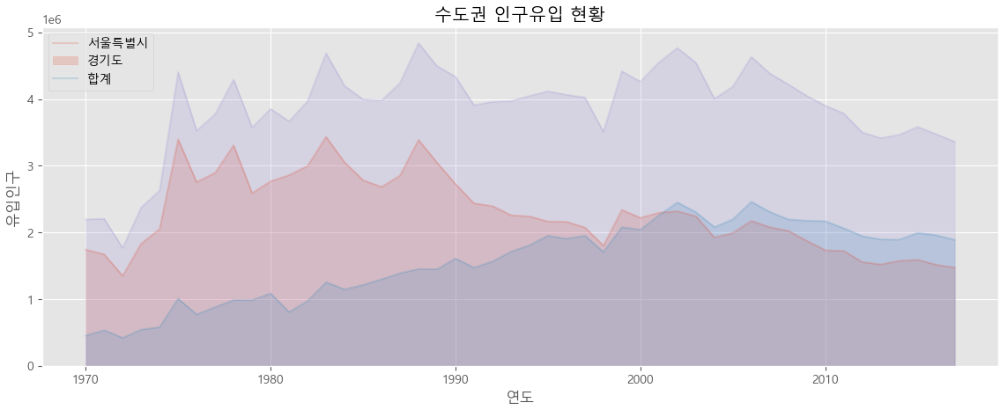
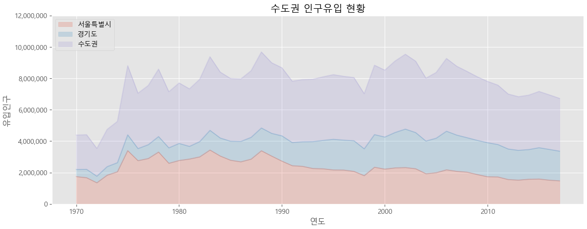

= Area plot

* 기본적으로 선 그래프
** 선 그래프와 x축 사이의 공간에 색이 입혀진 형태
** 누적 그래프를 볼 수 있어 전체 데이터의 누적값으로 분석할 수 있음
** 총량의 변화를 보기에 유리
* 선 그래프와 Bar 그래프와 마찬가지로 Trend를 보기에 적합

---

Area plot(면적 그래프)는 각 열의 데이터를 선 그래프로 구현하는데, 선 그래프와 x축 사이의 공간에 색이 입혀진 형태입니다. pyplot 객체의 plot()이 아닌 DataFrame의 plot() 메소드를 사용하며, kind 파라미터에 area 값을 넘기면 Area Plot 형태의 그래프를 그립니다.

== 예제 데이터 준비

이 예제에서는 '시도별 전출입 인구수.xlsx' 데이터를 사용하며, 서울특별시와 경기도로 전입한 인구수를 저장하도록 작성된 DataFrame을 사용합니다. 분석을 위한 DataFrame은 서울특별시와 경기도로 전입한 인구 수만 포함하며, 서울시와 경기도 전입한 수의 합계를 '수도권'이라는 이름으로 가지도록 작성됩니다.

[source, python]
----
df = pd.read_excel('./data/시도별 전출입 인구수.xlsx', header=0).fillna(0)
df.drop(0, axis=0, inplace=True)
df_cap_movein = df.iloc[[1, 9]]
df_cap_movein.drop(['전출지별'], axis=1, inplace=True)
df_cap_movein.index = df_cap_movein['전입지별']
df_cap_movein.drop(['전입지별'], axis=1, inplace=True)
df_cap_movein.loc['수도권'] = list(df_cap_movein.sum())
df_cap_movein = df_cap_movein.transpose()
df_cap_movein.head(10)
----

[%header, cols=4, width=50%]
|===
|전입지별|	서울특별시|	경기도|	수도권
|1970|	1742813|452060|2194873
|1971|	1671705|533375|	2205080
|1972|	1349333|418045|	1767378
|1973|	1831858|542224|	2374082
|1974|	2050392|579194|	2629586
|1975|	3396662|1006818|	4403480
|1976|	2756510|770036|	3526546
|1977|	2893403|880019|	3773422
|1978|	3307439|985879|	4293318
|1979|	2589667|984187|	3573854
|===

작성된 DataFrame을 사용해 Area plot을 작성할 수 있습니다. Area Plot은 누적치와 비누적치를 표현할 수 있으며, 비 누적치는 선 그래프에 색상을 입힌 것과 동일합니다. 누적치와 비 누적치는 DataFrame의 plot() 메소드에서 stacked 파라미터의 값을 True(누적치) 또는 False(비누적치)로 설정하여 구할 수 있습니다.

아래 코드는 비 누적치를 표시합니다.

[source, python]
----
plt.style.use('ggplot')

df_cap_movein.plot(kind='area', figsize=(14, 5), alpha=0.2, stacked=False)

plt.title('수도권 인구유입 현황')
plt.xlabel('연도')
plt.ylabel('유입인구')

plt.legend(labels=['서울특별시','경기도','합계'], loc='upper left')

plt.show()
----

아래 코드는 누적치를 표시합니다. Y축의 데이터 또한 지수 형식이 아닌 숫자 형식으로 변경됩니다.

[source, python]
----
plt.style.use('ggplot')

df_cap_movein.plot(kind='area', figsize=(14, 5), alpha=0.2, stacked=True)

plt.title('수도권 인구유입 현황')
plt.xlabel('연도')
plt.ylabel('유입인구')

plt.legend(loc='upper left')
arrYticks, txtYticks = plt.yticks()
plt.yticks(arrYticks, ['{:,.0f}'.format(x) for x in arrYticks])

plt.show()
----

