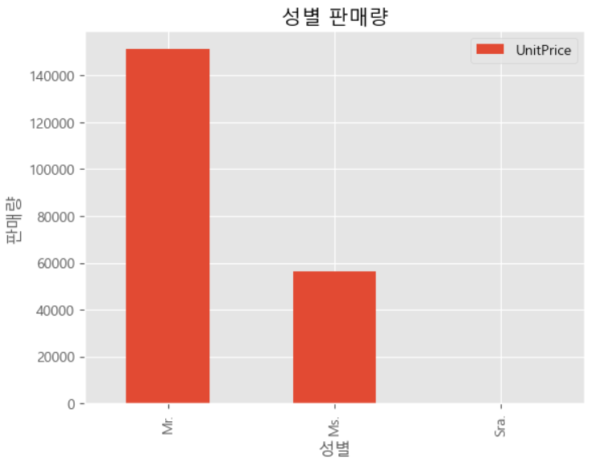
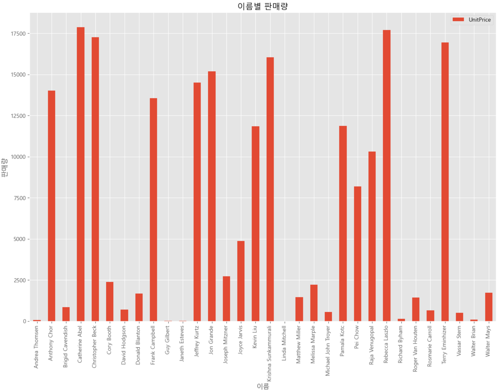

= Bar plot

* 데이터를 시각적으로 비교하는데 사용되는 기본적인 그래프
* 다양한 범주의 값을 수직 또는 수평 막대로 표현하여 각 범주의 크기를 쉽게 비교할 수 있게 함

---

막대 그래프(Bar Plot)는 데이터를 시각적으로 비교하는 데 사용되는 기본적인 그래프입니다. 이는 다양한 범주의 데이터 값을 수직 또는 수평 막대 형태로 표현하여 각 범주의 크기를 쉽게 비교할 수 있게 합니다.

막대 그래프의 주요 요소는 아래와 같습니다.

* 범주(Categories): X축 또는 Y축에 표시되는 데이터의 그룹 또는 클래스입니다. 예를 들어, 제품의 종류, 연도, 월 등이 될 수 있습니다.
* 값(Values): 범주에 해당하는 데이터의 크기입니다. 이 값이 막대의 길이 또는 높이로 표시됩니다.
* 막대(Bar): 범주와 값을 시각적으로 나타내는 막대입니다. 막대의 길이 또는 높이는 해당 범주의 값을 나타내며, 이를 통해 데이터의 크기를 비교할 수 있습니다.

== 예제 데이터 준비

Microsoft SQL Server 예제 데이터베이스인 AdventureWorksLT 데이터베이스의 판매 데이터베이스에서 데이터를 가져옵니다.

[source, python]
----
sql_query = '''SELECT C.CustomerID, Title, FirstName, LastName, CompanyName, ShipMethod, UnitPrice, P.Name as ProductName, ProductNumber, Color, PC.Name AS CategoryName
FROM SalesLT.Customer AS C INNER JOIN SalesLT.SalesOrderHeader AS O ON C.CustomerID = O.CustomerID
	INNER JOIN SalesLT.SalesOrderDetail AS D ON O.SalesOrderID = D.SalesOrderID
	INNER JOIN SalesLT.Product AS P ON D.ProductID = P.ProductID
	INNER JOIN SalesLT.ProductCategory AS PC ON P.ProductCategoryID = PC.ProductCategoryID'''

conn = pymssql.connect(
    server='127.0.0.1:1433',
    user='sa',
    password='P@ssw0rd',
    database='AdventureWorksLT2022',
)

try:
    df = pd.read_sql(sql_query, conn)
except Exception as e:
    print(e)
finally:
    conn.close()
----

== DataFrame에 적재된 Dataset

[%header, cols=12]
|===
||CustomerID|Title|FirstName|LastName|CompanyName|	ShipMethod|	UnitPrice|	ProductName|ProductNumber|Color|CategoryName
|0|29847|Mr.|David|Hodgson|Good Toys|CARGO TRANSPORT 5|356.898|ML Road Frame-W - Yellow, 48|FR-R72Y-48|Yellow|Road Frames
|1|29847|Mr.|David|Hodgson|Good Toys|CARGO TRANSPORT 5|356.898|ML Road Frame-W - Yellow, 38|FR-R72Y-38|Yellow|Road Frames
|2|30072|Ms.|Andrea|Thomsen|West Side Mart|CARGO TRANSPORT 5|63.900|Rear Brakes|RB-9231|Silver|Brakes
|3|30113|Mr.|Raja|Venugopal|Nearby Cycle Shop|CARGO TRANSPORT 5|218.454|ML Mountain Frame-W - Silver, 42|FR-M63S-42|Silver|Mountain Frames
|4|30113|Mr.|Raja|Venugopal|Nearby Cycle Shop|CARGO TRANSPORT 5|461.694|Mountain-400-W Silver, 46|BK-M38S-46|Silver|Mountain Bikes
|===

== 성별 판매량 

[source, python]
----
df_by_title = df[['Title','UnitPrice']].groupby('Title').sum()
----

[%header, cols="1,2", width=30%]
|===
||UnitPrice
|Title|
|Mr.|151327.0185
|Ms.|56156.9802
|Sra.|31.5840
|===

성별 판매량 bar plot

[source, python]
----
plt.style.use('ggplot')

df_by_title.plot(kind='bar')

plt.title('성별 판매량')
plt.xlabel('성별')
plt.ylabel('판매량')

plt.show()
----

== 이름별 판매량

[source, python]
----
df_by_name = df[['Title','UnitPrice']]
df_by_name['name'] = df['FirstName'] + " " + df['LastName']
df_by_name.drop('Title',axis=1, inplace=True)
df_by_name = df_by_name.groupby('name').sum()
----

[%header, cols="2,2", width=40%]
|===
||UnitPrice
|name|
|Andrea Thomsen|63.9000
|Anthony Chor|14016.5940
|Brigid Cavendish|858.9000
|Catherine Abel|17880.1080
|Christopher Beck|17251.3920
|Cory Booth|2400.0842
|David Hodgson|713.7960
|Donald Blanton|1680.5880
|Frank Campbell|13564.0380
|Guy Gilbert|13.6022
|Janeth Esteves|31.5840
|Jeffrey Kurtz|14508.9900
|Jon Grande|15200.1989
|Joseph Mitzner|2736.4440
|Joyce Jarvis|4876.5240
|Kevin Liu|11846.2578
|Krishna Sunkammurali|16045.1022
|Linda Mitchell|5.3940
|Matthew Miller|1460.9820
|Melissa Marple|2207.9760
|Michael John Troyer|564.6240
|Pamala Kotc|11884.3482
|Pei Chow|8179.6860
|Raja Venugopal|10320.3000
|Rebecca Laszlo|17710.4580
|Richard Byham|142.4940
|Roger Van Houten|1430.6460
|Rosmarie Carroll|669.3720
|Terry Eminhizer|16934.8390
|Vassar Stern|500.3040
|Walter Brian|91.5780
|Walter Mays|1724.4782
|===

이름별 판매량 bar plot

[source, python]
----
plt.style.use('ggplot')

df_by_name.plot(kind='bar',figsize=(15, 10))

plt.title('이름별 판매량')
plt.xlabel('이름')
plt.ylabel('판매량')

plt.show()
----

== 회사별 판매량

[source, python]
----
df_by_company = df[['CompanyName','UnitPrice']]
df_by_company = df_by_company.groupby('CompanyName').sum()
----

[%header, cols="3,2", width=50%]
|===
||UnitPrice
|CompanyName|
|Action Bicycle Specialists|16934.8390
|Aerobic Exercise Company|669.3720
|Bulk Discount Store|17251.3920
|Central Bicycle Specialists|31.5840
|Channel Outlet|142.4940
|Closest Bicycle Store|11884.3482
|Coalition Bike Company|1680.5880
|Discount Tours|2207.9760
|Eastside Department Store|11846.2578
|Engineered Bike Systems|2736.4440
|Essential Bike Works|5.3940
|Extreme Riding Supplies|14016.5940
|Futuristic Bikes|91.5780
|Good Toys|713.7960
|Instruments and Parts Company|17710.4580
|Many Bikes Store|14508.9900
|Metropolitan Bicycle Supply|16045.1022
|Nearby Cycle Shop|10320.3000
|Paints and Solvents Company|4876.5240
|Professional Sales and Service|17880.1080
|Remarkable Bike Store|2400.0842
|Riding Cycles|15200.1989
|Sports Products Store|1724.4782
|Sports Store|1430.6460
|Tachometers and Accessories|1460.9820
|The Bicycle Accessories Company|13.6022
|Thrifty Parts and Sales|564.6240
|Thrilling Bike Tours|8179.6860
|Trailblazing Sports|13564.0380
|Transport Bikes|500.3040
|Vigorous Sports Store|858.9000
|West Side Mart|63.9000
|===

회사별 판매량 bar plot

[source, python]
----
plt.style.use('ggplot')

df_by_company.plot(kind='barh',figsize=(15, 10))

plt.title('회사별 판매량')
plt.xlabel('회사명')
plt.ylabel('판매량')

plt.show()
----