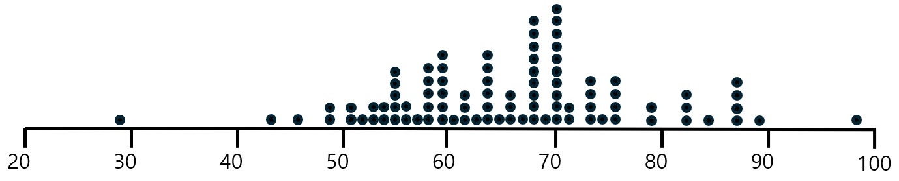
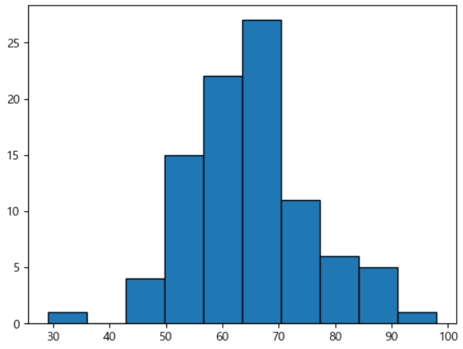
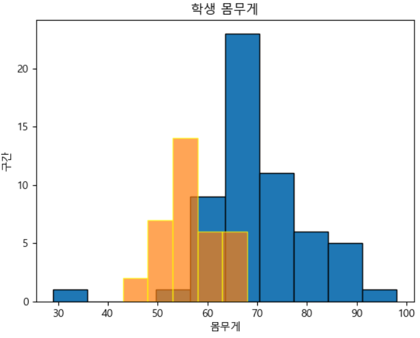

= 히스토그램(histogram)

* 표로 되어있는 도수 분포(도수 분포료)를 정보 그림으로 나타낸 것
* 주로 연속형 데이터의 빈도를 분석하는데 사용
* 데이터의 범위를 여러 구간으로 나누고, 각 구간의 데이터 개수를 막대로 표현
** 막대의 높이는 해당 구간에 속하는 데이터의 빈도를 나타냄

---

히스토그램(histogram)은 데이터 분포를 시각적으로 나타내는 그래프입니다. 주로 연속형 데이터의 빈도를 분석하는 데 사용됩니다. 히스토그램은 데이터 범위를 여러 구간으로 나누고, 각 구간의 데이터 개수를 막대로 표현합니다. 여기서 각 막대의 높이는 해당 구간에 속하는 데이터의 빈도를 나타냅니다.

히스토그램의 주요 요소

* 구간(Bin): 데이터 범위를 나눈 구간입니다. 각 구간의 크기(Bin width)는 일정하거나 상황에 따라 다를 수 있습니다.
* 막대(Bar): 각 구간에 해당하는 데이터 빈도를 나타내는 직사각형입니다. 막대의 높이는 빈도와 비례합니다.
* 축(Axis): X축은 데이터 구간을 나타내며, Y축은 각 구간의 빈도를 나타냅니다.

히스토그램의 용도

* 데이터 분포 분석: 데이터가 어떻게 분포되어 있는지를 시각적으로 파악할 수 있습니다.
* 중심 경향과 변동성 파악: 데이터의 중심 경향(평균, 중앙값)과 변동성(표준편차 등)을 이해하는 데 도움이 됩니다.
* 이상치 탐지: 데이터 분포에서 벗어난 이상값을 식별할 수 있습니다.

히스토그램은 데이터의 분포를 이해하고 분석하는 데 매우 유용한 도구입니다. 히스토그램을 만드는 과정은 다음과 같습니다.

1. 데이터 수집: 먼저 분석할 데이터를 수집해야 합니다. 예를 들어, 학생들의 시험 점수를 수집했다고 가정해 보겠습니다.
2. 구간 설정: 데이터를 적절한 구간으로 나눕니다. 각 구간은 데이터의 범위를 나타내며, 구간의 크기(bins)는 데이터를 어떻게 분포시킬지 결정합니다. 예를 들어, 0-10, 11-20, 21-30...과 같이 나눌 수 있습니다.
3. 빈도 계산: 각 구간에 속하는 데이터의 개수를 셉니다. 예를 들어, 0-10 구간에 5개의 점수가 있고, 11-20 구간에 8개의 점수가 있다면, 각각의 빈도는 5와 8이 됩니다.
4. 막대 그리기: 각 구간의 빈도에 따라 히스토그램의 막대를 그립니다. 막대의 높이는 해당 구간의 빈도를 나타냅니다.

히스토그램의 해석

히스토그램을 해석하는 방법은 다음과 같습니다:

* **분포의 모양** 히스토그램의 형태를 보고 데이터가 어떻게 분포되어 있는지 알 수 있습니다. 데이터가 좌우 대칭인지, 한쪽으로 치우쳐 있는지, 여러 봉우리가 있는지 등을 파악할 수 있습니다.
* **중심 경향** 데이터의 중앙값이나 평균값을 시각적으로 파악할 수 있습니다. 예를 들어, 대부분의 데이터가 중앙에 몰려 있다면, 평균값이 해당 구간에 있을 가능성이 큽니다.
* **변동성** 데이터의 분포가 넓게 퍼져 있는지, 좁게 모여 있는지를 확인할 수 있습니다. 이는 데이터의 변동성을 나타내며, 표준편차와 같은 통계적 척도를 통해 더 정확히 분석할 수 있습니다.
* **이상치** 분포에서 눈에 띄게 벗어난 데이터 포인트를 확인할 수 있습니다. 이러한 이상치는 데이터 수집 과정에서의 오류이거나 특이한 상황을 나타낼 수 있습니다.

== 데이터와 히스토그램

아래 데이터는 학생 92명의 몸무게를 데이터화 한 것입니다.

남학생
63 66 73 86 70 29 68 86 88 63 73 70 69 66 77 79 79 77 82 61 77 71 59 84 86 70 77 70 98 68 66 70 70 68 70 68 82 73 61 73 59 70 68 67 70 68 63 82 86 71 68 74 63 64 62 56 70 

여학생
63 54 59 63 55 57 53 66 68 51 57 59 54 59 59 54 54 57 61 57 54 55 52 46 52 68 50 53 49 43 57 60 50 68 49

이 데이터를 점도표로 표시할 수 있습니다. 각 학생의 몸무게를 1개의 점으로 나타냅니다.

점도표를 보면 50kg에서 80kg 사이에 학생들이 밀집해 있는 것을 알 수 있습니다. 

**도수분포표**로 이 데이터를 요약 정리할 수 있습니다. 수직선을 여러 개의 구간으로 나누고, 그 구간마다 구간에 해당하는 몸무게의 학생수를 셉니다. 그것이 구간의 **도수**입니다. 상대도수는 각 구간에 속하는 학생수의 비율로서, 도구를 전체 학생수로 나눈것입니다.

[%header, cols="1,2,1,1", width=50%]
|===
|계급|계급값(중앙값)|도수|상대도수
|0~10|5|0|0
|10~20|0|0|0
|20~30|25|0|	0
|30~40|35|1|0.01
|40~50|45|1|0.01
|50~60|55|16|0.17
|60~70|57|7|0.08
|70~80|65|18|0.20
|80~90|85|43|0.47
|90~100|95|5|0.05
|===

도수분포표는 각 계급값 '주번'에 얼마나 많은 데이터 점들이 있는지를 보여줍니다. 이것은 그래프로도 그릴 수 있는데, 이를 **히스토그램**이라 합니다. 각 계급마다 막대가 하나씩 있고, 막대의 높이는 그 계급 구간의 데이터 점들의 개수를 나타냅니다.

[source, python]
----
plt.hist(df_weight,bins=10, edgecolor='black') 
----

히스토그램을 그릴 때 사용할 수 있는 옵션은 다음과 같습니다.

[%header, cols="1,1,5"]
|===
|파라미터|기본값|설명
|bins|-|데이터를 몇 개의 구간으로 나눌것인지(계급 설정)를 설정합니다.
|density|-|True 설정시 y축 값이 상대도수 값이 되며 False 설정시 데이터의 수로 그래프를 그릴 수 있습니다.
|alpha|1|bar의 투명도를 설정할 수 있습니다.
|histtype|bar|'step'으로 설정시 히스토그램 내부의 색이 비어있는 그래프를 그릴 수 있으며 'stepfilled'로 설정하면 색으로 채워진 bar를 그립니다.
|color|-|색을 설정합니다.
|level|-| 범례 표시시 해당 히스토그램의 이름을 설정할 수 있습니다.
|===

하나의 차트에 두 히스토그램을 그릴 수 있습니다.

[source, python]
----
plt.hist(df_man,bins=10, edgecolor='black')
plt.hist(df_woman,bins=5, edgecolor='yellow',alpha=0.7)

plt.title('학생 몸무게') 
plt.xlabel('몸무게') 
plt.ylabel('구간') 

plt.show()
----

또한 각 몸무게에 상대도수를 대응시키는 상대도수 히스토그램도 그릴 수 있습니다. 이는 수직축 값의 크기만 다를 뿐 히스토그램과 같습니다.

matplotlib으로 히스토그램을 그릴때 사용할 수 있는 옵션은 다음과 같습니다.

[%header, cols="1,1,4"]
|===
|파라미터|기본값|설명
|x||히스토그램을 그릴 데이터입니다.
|bins|-|구간의 개수를 설정합니다.
|range|-|데이터의 범위를 설정합니다.
|density|False|히스토그램의 y축 값을 빈도 수 대신 확률 밀도로 표시할 지 여부를 설정합니다.
|cumulative|False|누적 히스토그램을 그릴지 여부를 설정합니다.
|edgecolors|-|히스토그램 막대기의 테두리 색상을 설정합니다.
|linewidths|-|히스토그램 막대기의 테두리 선의 두께를 설정합니다.
|histtype|bar|히스토그램의 막대기 모양을 설정합니다. bar는 일반 막대기 모양, step은 계단식 모양, stepfilled는 채워진 계단식 모양입니다.
|===