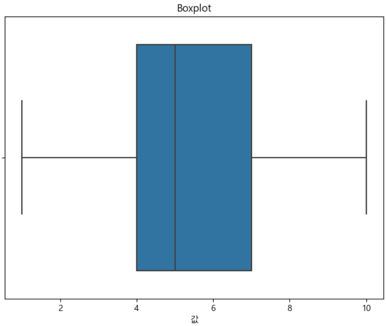

= Box plot (상자 - 수염 그림)

* 데이터의 중심 경향과 분포를 한 눈에 파악할 수 있는 그래프
* 4분위 범위 그래프를 사용

---

박스 플롯(Box Plot), 또는 상자-수염 그림,은 데이터의 분포를 시각적으로 나타내는 통계 그래프입니다. 데이터의 중심 경향과 분포를 한눈에 파악할 수 있게 도와주며, 주로 다음과 같은 요소들로 구성됩니다:

* 최소값(Minimum): 데이터셋에서 가장 작은 값입니다.
* 제1사분위수(Q1, 25th Percentile): 데이터셋의 하위 25% 지점을 의미합니다.
* 중앙값(Median, Q2, 50th Percentile): 데이터셋의 중간값으로, 데이터를 반으로 나눕니다.
* 제3사분위수(Q3, 75th Percentile): 데이터셋의 상위 25% 지점을 의미합니다.
* 최대값(Maximum): 데이터셋에서 가장 큰 값입니다.
* 이상치(Outliers): 박스 플롯의 상자나 수염(whisker) 바깥에 위치한 값들로, 일반적인 데이터 분포에서 크게 벗어난 값들입니다.

박스 플롯은 데이터의 분산, 비대칭성, 이상치 등을 시각적으로 쉽게 파악할 수 있어서 데이터 분석에서 유용하게 사용됩니다.

== 간단한 예제

[source, python]
----
import pandas as pd
import seaborn as sns 
import matplotlib.pyplot as plt 

# 예시 데이터 생성 
data = {'values': [1, 2, 2, 3, 3, 3, 4, 4, 4, 4, 5, 5, 5, 6, 6, 6, 7, 7, 7, 8, 8, 8, 9, 9, 10]} 
df = pd.DataFrame(data) 

# 박스 플롯 그리기 
plt.figure(figsize=(8, 6)) sns.boxplot(x='values', data=df) plt.title('박스 플롯 예시') plt.xlabel('값')
----

