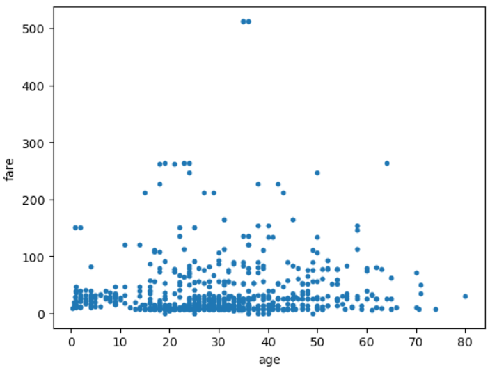
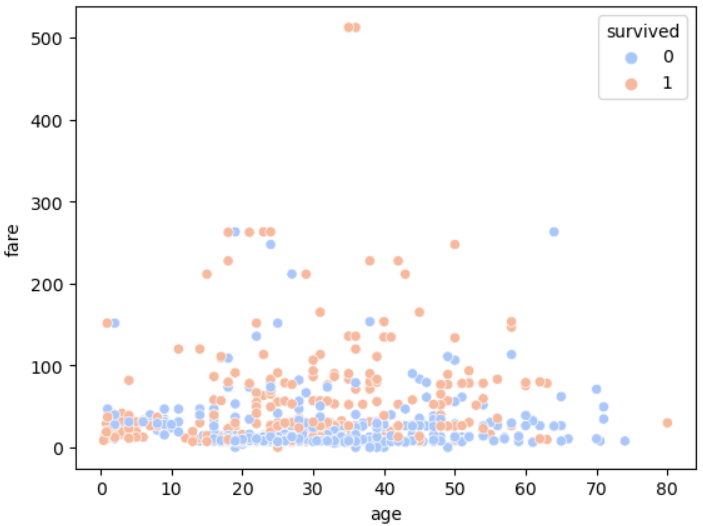

= Scatter plot

* 두 변수간의 관계를 시각적으로 표현하는데 사용되는 그래프 유형
* 데이터 포인트를 x축과 y축에 따라 표시

---

산점도(Scatter Plot)는 두 변수 간의 관계를 시각적으로 표현하는 데 사용되는 그래프 유형입니다. 이 그래프는 데이터 포인트를 x축과 y축에 따라 표시하여 각 데이터가 두 변수의 값에 따라 어디에 위치하는지를 보여줍니다. 다음은 산점도에 대한 주요 특징들입니다:

* 데이터 포인트: 각 점은 하나의 데이터 샘플을 나타내며, x축과 y축 값에 따라 그래프에 위치합니다.
* 변수 간의 관계: 두 변수 간의 상관관계를 파악하는 데 유용합니다. 예를 들어, 변수 A와 변수 B가 양의 상관관계에 있다면, 데이터 포인트가 오른쪽 상단으로 몰리게 됩니다.
* 추세선: 산점도에 추세선을 추가하면 두 변수 간의 일반적인 관계를 더욱 명확하게 볼 수 있습니다. 이를 통해 데이터의 패턴이나 경향을 이해할 수 있습니다.
* 산점도의 활용: 산점도는 통계 분석, 데이터 시각화, 머신러닝 모델 평가 등 다양한 분야에서 사용됩니다.

titanic 예제로 산점도 그래프를 그리는 방법을 알아봅니다. 타이타닉 승객 중, 요금과 나이의 상관관계에 대한 분포를 알고 싶다면 산점도 그래프를 활용할 수 있습니다.

== 예제 데이터 준비

예제 데이터로 seaborn 패키지에서 제공하는 타이타닉 승객 정보를 사용합니다.

[source, python]
----
import pandas as pd
import seaborn as sns
import matplotlib.pyplot as plt

df_titanic = sns.load_dataset('titanic')
----

산점도 그래프는 kind 파라미터를 scatter로 하여 그릴 수 있습니다.

[source, python]
----
df_titanic.plot(kind='scatter',x='age',y='fare',s=10)
----

산점도 그래프를 그리는데 사용할 수 있는 파라미터는 아래와 같습니다.

[%header, cols="1,1,3"]
|===
|파라미터|기본값|설명
|x||x축에 표시할 데이터입니다.
|y||Y축에 표시할 데이터입니다.
|s|-|표시될 마커의 종류를 표시합니다.
|===

Seaborn 패키지의 scatterplot 메소드를 사용하면 몇가지 표현을 추가할 수 있습니다.

hue 속성을 사용하면 색상을 표시할 컬럼을 사용할 수 있습니다.

[source, python]
----
sns.scatterplot(data=df_titanic, x='age', y='fare', hue='survived', palette='coolwarm')
----

== 자동차 연비 데이터 분석

아래와 같은 데이터셋이 df_car Data Frame에 로드되어 있을 때,

[%header, cols=10]
|===
||mpg|cylinders|displacement|horsepower|weight|acceleration|model|year|origin|name
|0|15.0	8|350.0|165.0|3693.0|11.5|70|1|buick skylark 320
|1|18.0|8|318.0|150.0|3436.0|11.0|70|1|plymouth satellite
|2|16.0|8|304.0|150.0|3433.0|12.0|70|1|amc rebel sst
|3|17.0|8|302.0|140.0|3449.0|10.5|70|1|ford torino
|4|15.0|8|429.0|198.0|4341.0|10.0|70|1|ford galaxie 500
|...|...|...|...|...|...|...|...|...|...
|===

자동차의 무게와 연비의 상관관계를 아래와 같이 산점도 그래프로 표현할 수 있습니다.

[source, python]
----
df_car.plot(kind='scatter',x='weight',y='mpg',c='blue',s=10,figsize=(10,5))
plt.title('Scatter plnt = 연비 vs. 무게')
plt.show()
----