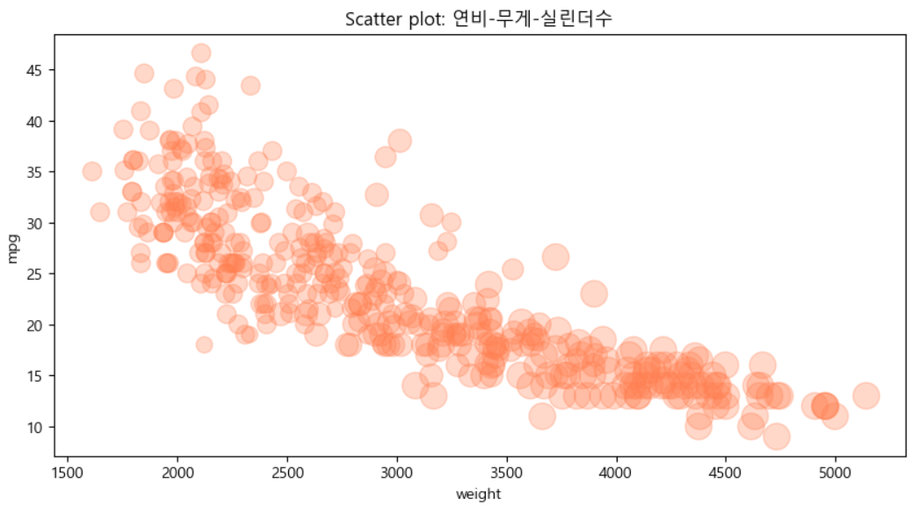

= Bubble plot

* 산점도의 확장된 형태
* 데이터를 버블(또는 원)의 형태로 나타냄
* 각 버블의 크기로 세번째 변수를 표현

---

버블 차트(Bubble Chart)는 산점도의 확장된 형태로, 데이터 포인트를 버블(또는 원)로 나타내며 각 버블의 크기로 세 번째 변수를 표현합니다. 이는 세 개의 변수를 시각화하는 데 유용합니다.

버블 차트의 주요 요소는 다음과 같습니다:

* x축과 y축 값: 각각 두 변수의 값을 나타냅니다.
* 버블의 크기: 버블의 크기는 세 번째 변수의 값을 나타내며, 값이 클수록 버블이 커집니다.
* 버블의 색상: 네 번째 변수까지 표현하려면 버블의 색상도 다르게 설정할 수 있습니다.

== 간단한 예제

[source, python]
----
import pandas as pd
import matplotlib.pyplot as plt 

# 예시 데이터 생성 
data = { 
    'x': [1, 2, 3, 4, 5], 
    'y': [10, 15, 20, 25, 30], 
    'size': [100, 200, 300, 400, 500] 
}
df = pd.DataFrame(data) 

# 버블 차트 그리기 
plt.figure(figsize=(10, 6)) 
plt.scatter('x', 'y', s='size', alpha=0.5, data=df) 
plt.title('버블 차트 예시') 
plt.xlabel('X축') 
plt.ylabel('Y축')
----

== 자동차 연비 데이터를 사용한 버블 차트

아래와 같은 데이터셋이 df_car Data Frame에 로드되어 있을 때,

[%header, cols=10]
|===
||mpg|cylinders|displacement|horsepower|weight|acceleration|model|year|origin|name
|0|15.0	8|350.0|165.0|3693.0|11.5|70|1|buick skylark 320
|1|18.0|8|318.0|150.0|3436.0|11.0|70|1|plymouth satellite
|2|16.0|8|304.0|150.0|3433.0|12.0|70|1|amc rebel sst
|3|17.0|8|302.0|140.0|3449.0|10.5|70|1|ford torino
|4|15.0|8|429.0|198.0|4341.0|10.0|70|1|ford galaxie 500
|...|...|...|...|...|...|...|...|...|...
|===

자동차의 무게와 연비의 상관관계에 실린더 수를 더하여 아래와 같이 버블 차트로 표현할 수 있습니다.

[source, python]
----
cylinders_size = df_car.cylinders / df_car.cylinders.max() * 300

df_car.plot(kind='scatter',x='weight',y='mpg',c='coral',figsize=(10,5),s=cylinders_size, alpha=0.3)
plt.title('Scatter plot: 연비-무게-실린더수')
plt.show()
----

