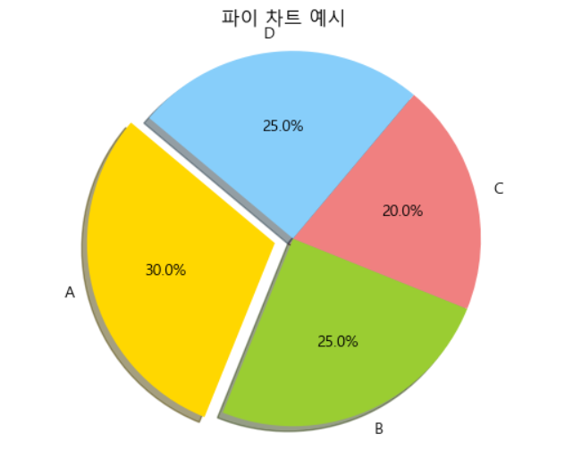

= Pie plot

* 데이터의 비율을 시각적으로 나타내는 원형 차트
* 각 데이터 카테고리는 파이의 한 조각으로 표현
** 조각의 크기는 해당 카테고리의 비율을 나타냄
* 데이터의 구성 비율을 한 눈에 파악할 수 있어 매우 유용함

---

파이 차트(Pie Chart)는 데이터의 비율을 시각적으로 나타내는 데 사용되는 원형 차트입니다. 각 데이터 카테고리는 파이(원형)의 한 조각으로 표현되며, 조각의 크기는 해당 카테고리의 비율을 나타냅니다. 파이 차트는 데이터의 구성 비율을 한눈에 파악할 수 있어 매우 유용합니다.

파이 차트의 주요 특징

* 조각(Slice): 각 조각은 전체의 일부를 나타내며, 특정 카테고리의 비율을 보여줍니다.
* 라벨(Label): 각 조각에 해당하는 카테고리 이름이나 비율을 표시합니다.
* 색상(Color): 각 조각은 구분하기 쉽게 다양한 색상으로 표시됩니다.
* 범례(Legend): 차트 옆에 각 조각의 카테고리를 설명하는 범례가 추가될 수 있습니다.

파이 차트의 장점과 단점

* 장점
** 데이터의 비율을 쉽게 시각화할 수 있습니다.
** 시각적으로 매력적이며 이해하기 쉽습니다.
* 단점
** 많은 카테고리를 나타내기에는 적합하지 않습니다.
** 각 조각의 크기 차이가 미세할 경우 비교하기 어려울 수 있습니다.

---

== 간단한 예제

[source, python]
----
# 데이터 
labels = ['A', 'B', 'C', 'D'] 
sizes = [30, 25, 20, 25] 
colors = ['gold', 'yellowgreen', 'lightcoral', 'lightskyblue'] 
explode = (0.1, 0, 0, 0) # 첫 번째 조각을 강조 

# 파이 차트 그리기 
plt.pie(sizes, explode=explode, labels=labels, colors=colors, autopct='%1.1f%%', shadow=True, startangle=140) 
plt.title('파이 차트 예제') 
plt.axis('equal') # 파이를 원형으로 유지
----

== 자동차 연비 데이터를 사용한 예제

아래와 같은 데이터셋이 df_car Data Frame에 로드되어 있을 때,

[%header, cols=10]
|===
||mpg|cylinders|displacement|horsepower|weight|acceleration|model|year|origin|name
|0|15.0	8|350.0|165.0|3693.0|11.5|70|1|buick skylark 320
|1|18.0|8|318.0|150.0|3436.0|11.0|70|1|plymouth satellite
|2|16.0|8|304.0|150.0|3433.0|12.0|70|1|amc rebel sst
|3|17.0|8|302.0|140.0|3449.0|10.5|70|1|ford torino
|4|15.0|8|429.0|198.0|4341.0|10.0|70|1|ford galaxie 500
|...|...|...|...|...|...|...|...|...|...
|===

각 국가별 자동차 생산 비율은 아래와 같이 알 수 있습니다.

[source, python]
----
df_car['count'] = 1
df_origin = df_car.groupby('origin').sum()

df_origin.index = ['USA','EU','JPN']

df_origin['count'].plot(kind='pie',
                        figsize=(7,5), 
                        autopct='%1.1f%%',
                        startangle=0,
                        colors=['chocolate','bisque','cadetblue'])

plt.title('생산국가', size=20)
plt.axis('equal')
plt.legend(labels=df_origin.index, loc='upper right')
plt.show()
----

