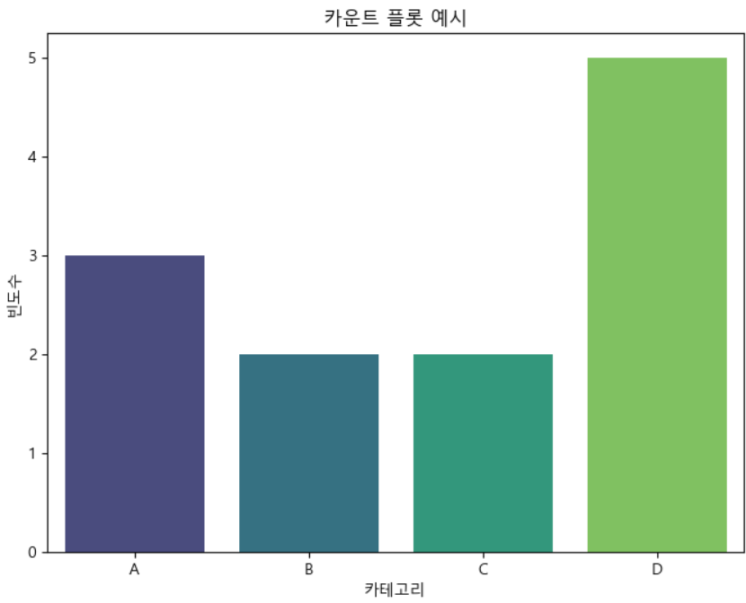

= Count plot

* 각 카테고리의 빈도수를 시각적으로 표현하는데 사용되는 막대 그래프의 일종
* 주로 이산적 데이터의 빈도를 시각화
* Seaborn 패키지 사용

---

카운트 플롯(Count Plot)은 데이터셋에서 각 카테고리의 빈도수를 시각적으로 표현하는 데 사용되는 막대 그래프의 일종입니다. 주로 이산적(discrete) 데이터의 빈도를 시각화하는 데 사용되며, seaborn 라이브러리를 통해 쉽게 그릴 수 있습니다.

주요 특징
* 카테고리 빈도수: 각 카테고리의 빈도수를 막대로 나타냅니다.
* 데이터 분포: 데이터가 어떻게 분포되어 있는지 한눈에 파악할 수 있습니다.
* 비교: 여러 카테고리 간의 빈도 차이를 쉽게 비교할 수 있습니다.

== 간단한 예제

[source, python]
----
import pandas as pd
import seaborn as sns 
import matplotlib.pyplot as plt 

# 예시 데이터 
data = {'Category': ['A', 'B', 'C', 'D', 'A', 'A', 'B', 'C', 'D', 'D', 'D', 'D']} 
df = pd.DataFrame(data) 

# 카운트 플롯 그리기 
plt.figure(figsize=(8, 6)) 
sns.countplot(x='Category', data=df, palette='viridis') 
plt.title('카운트 플롯 예시') 
plt.xlabel('카테고리') 
plt.ylabel('빈도수') 

plt.show()
----

== 타이타닉 데이터를 사용한 예제

[source, python]
----
df_titanic = sns.load_dataset('titanic')

fig = plt.figure(figsize=(15,5))
ax1 = fig.add_subplot(1,3,1)
ax2 = fig.add_subplot(1,3,2)
ax3 = fig.add_subplot(1,3,3)

sns.countplot(x='class', palette='Set1',data=df_titanic, ax=ax1)
sns.countplot(x='class', hue='who', palette='Set1',data=df_titanic, ax=ax2)
sns.countplot(x='class', hue='who', palette='Set1',dodge=False,data=df_titanic, ax=ax3)

ax1.set_title('객실 등급')
ax2.set_title('객실 등급 - who')
ax3.set_title('객실 등급 - who(stacked)')
----

