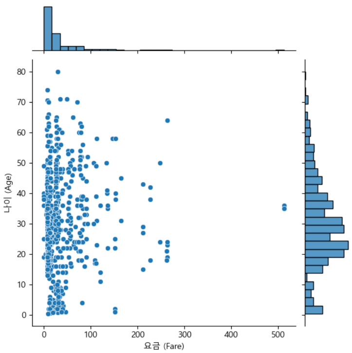

= Joint plot

* 두 변수간의 관계를 시각적으로 나타내는 그래프
* 산점도와 두 변수 각각의 히스토그램(또는 KDE)와 결합
* 데이터의 분포와 관계를 한 눈에 파악할 수 있도록 도움

---

조인트 플롯(Joint Plot)은 두 변수 간의 관계를 시각적으로 나타내는 그래프입니다. 조인트 플롯은 산점도와 두 변수 각각의 히스토그램(또는 커널 밀도 추정, KDE)을 결합하여 데이터의 분포와 관계를 한눈에 파악할 수 있도록 돕습니다.

주요 특징

* 중앙 그래프: 두 변수 간의 관계를 나타내는 산점도 또는 다른 유형의 플롯이 중앙에 표시됩니다.
* 가장자리 그래프: x축과 y축에 각각 해당 변수의 히스토그램 또는 KDE 플롯이 표시됩니다. 이를 통해 각 변수의 분포를 쉽게 이해할 수 있습니다.
* 상관관계: 두 변수 간의 상관관계를 시각적으로 파악할 수 있습니다.

== 타이타닉 생존자 예제를 사용한 요금과 나이의 관계

[source, python]
----
import seaborn as sns
import matplotlib.pyplot as plt

# 예시 데이터셋 로드 (titanic 데이터셋 사용)
titanic = sns.load_dataset('titanic')

# 조인트 플롯 그리기
plt.figure(figsize=(10, 6))
sns.jointplot(x='fare', y='age', data=titanic, kind='scatter', marginal_kws=dict(bins=30, fill=True))
plt.xlabel('요금 (Fare)')
plt.ylabel('나이 (Age)')
plt.show()
----

