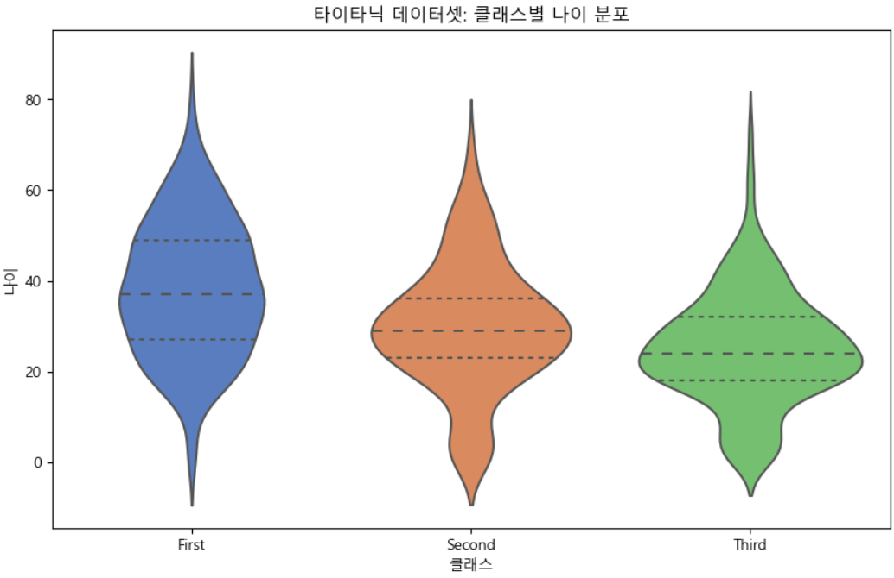

= Violin Plot

* 박스 플롯과 커널 밀도 추청 그래프를 결합한 그래프
* 사각형으로 표현되는 box plot에 더해 데이터의 밀도를 보여줌
* 데이터의 분포 특성을 이해하는데 도움을 줌

---

바이올린 그래프(Violin Plot)는 박스 플롯과 커널 밀도 추정(Kernel Density Estimation, KDE)을 결합한 그래프로, 데이터의 분포를 더 잘 시각화할 수 있도록 도와줍니다. 바이올린 그래프는 데이터의 분포와 밀도 정보를 동시에 보여주기 때문에, 데이터의 분포 특성을 이해하는 데 매우 유용합니다.

주요 특징

* 밀도 곡선: 그래프의 양쪽에 나타나는 대칭적인 곡선은 데이터의 밀도 분포를 나타냅니다. 커널 밀도 추정을 사용하여 데이터의 분포를 부드럽게 표현합니다.
* 중앙값 및 사분위수: 박스 플롯과 마찬가지로 중앙값(Median)과 제1사분위수(Q1), 제3사분위수(Q3) 등을 시각화할 수 있습니다.
* 대칭성: 데이터의 분포가 대칭적인지, 비대칭적인지 쉽게 파악할 수 있습니다.
* 데이터 비교: 여러 그룹 간의 분포를 비교하는 데 유용합니다.

== 타이타닉 생존자 데이터를 사용한 예제

[source, python]
----
import seaborn as sns 
import matplotlib.pyplot as plt 

# 예시 데이터셋 로드 (titanic 데이터셋 사용) 
df_titanic = sns.load_dataset('titanic') 

# 바이올린 플롯 그리기 
plt.figure(figsize=(10, 6)) 
sns.violinplot(x='class', y='age', data=df_titanic, palette='muted', inner='quartile') 
plt.title('타이타닉 데이터셋: 클래스별 나이 분포') 
plt.xlabel('클래스') 
plt.ylabel('나이')
----

