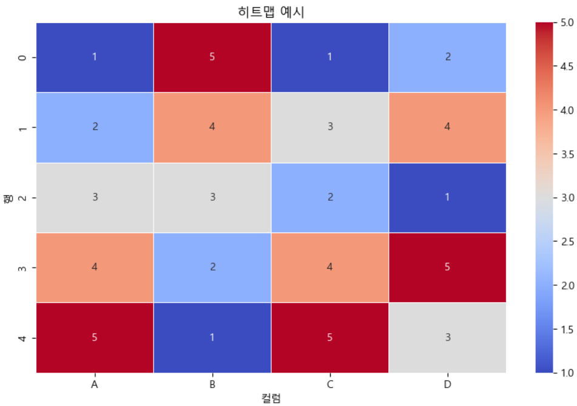

= heatmap

* 데이터 값을 색상으로 나타내어 데이터의 패턴, 변동성 및 상관관계를 시각적으로 표현
* 다차원 데이터를 시각화 할 때 유용
* 색상의 농도를 통해 데이터의 크기나 빈도를 직관적으로 파악

---

히트맵(Heatmap)은 데이터 값을 색상으로 나타내어 데이터의 패턴, 변동성 및 상관관계를 시각적으로 표현하는 그래프입니다. 히트맵은 특히 다차원 데이터를 시각화할 때 유용하며, 색상의 농도를 통해 데이터의 크기나 빈도를 직관적으로 파악할 수 있습니다.

주요 특징

* 색상 농도: 데이터 값의 크기나 빈도에 따라 색상이 변합니다. 보통 색상이 진할수록 값이 크거나 빈도가 높은 것을 나타냅니다.
* 데이터의 패턴: 히트맵을 통해 데이터의 패턴이나 트렌드를 쉽게 확인할 수 있습니다.
* 행렬 시각화: 히트맵은 행렬 데이터를 시각화하는 데 유용하며, 상관관계 매트릭스 등을 표현할 때 자주 사용됩니다.

== 간단한 예제

[source, python]
----
import pandas as pd
import seaborn as sns
import matplotlib.pyplot as plt

# 예시 데이터 생성
data = {
    'A': [1, 2, 3, 4, 5],
    'B': [5, 4, 3, 2, 1],
    'C': [1, 3, 2, 4, 5],
    'D': [2, 4, 1, 5, 3]
}
df = pd.DataFrame(data)

# 히트맵 그리기
plt.figure(figsize=(10, 6))
sns.heatmap(df, annot=True, cmap='coolwarm', linewidths=0.5)
plt.title('히트맵 예시')
plt.xlabel('컬럼')
plt.ylabel('행')
plt.show()
----

