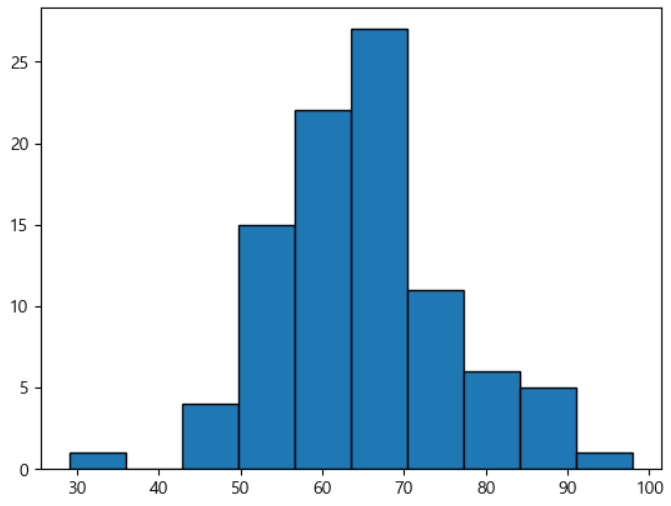

= 도수분포표와 히스토그램

아래 데이터는 학생 92명의 몸무게를 데이터화 한 것입니다.

남학생
63 66 73 86 70 29 68 86 88 63 73 70 69 66 77 79 79 77 82 61 77 71 59 84 86 70 77 70 98 68 66 70 70 68 70 68 82 73 61 73 59 70 68 67 70 68 63 82 86 71 68 74 63 64 62 56 70 

여학생
63 54 59 63 55 57 53 66 68 51 57 59 54 59 59 54 54 57 61 57 54 55 52 46 52 68 50 53 49 43 57 60 50 68 49

이 데이터를 점도표로 표시할 수 있습니다. 각 학생의 몸무게를 1개의 점으로 나타냅니다.

image:../images/image1.png[]

점도표를 보면 50kg에서 80kg 사이에 학생들이 밀집해 있는 것을 알 수 있습니다. 

**도수분포표**로 이 데이터를 요약 정리할 수 있습니다. 수직선을 여러 개의 구간으로 나누고, 그 구간마다 구간에 해당하는 몸무게의 학생수를 셉니다. 그것이 구간의 **도수**입니다. 상대도수는 각 구간에 속하는 학생수의 비율로서, 도구를 전체 학생수로 나눈것입니다.

[%header, cols="1,2,1,1", width=50%]
|===
|계급|계급값(중앙값)|도수|상대도수
|0~10|5|0|0
|10~20|0|0|0
|20~30|25|0|	0
|30~40|35|1|0.01
|40~50|45|1|0.01
|50~60|55|16|0.17
|60~70|57|7|0.08
|70~80|65|18|0.20
|80~90|85|43|0.47
|90~100|95|5|0.05
|===

도수분포표는 각 계급값 '주번'에 얼마나 많은 데이터 점들이 있는지를 보여줍니다. 이것은 그래프로도 그릴 수 있는데, 이를 **히스토그램**이라 합니다. 각 계급마다 막대가 하나씩 있고, 막대의 높이는 그 계급 구간의 데이터 점들의 개수를 나타냅니다.

