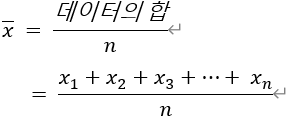
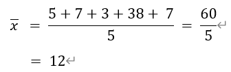
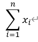
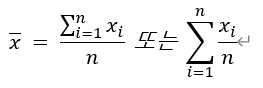
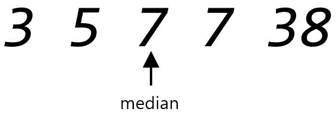
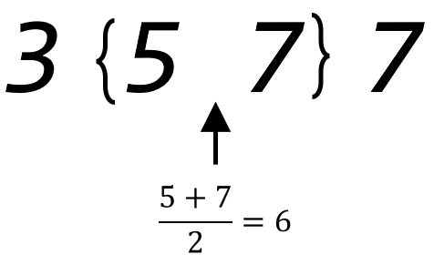
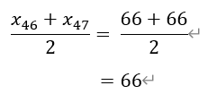

= 요약 통계량
:stem:

통계를 위해서는 테이터 집합의 일반적인 특성을 알아야 할 필요가 있습니다. 일반적인 특성들은 간단하게 알아낼 수 있습니다.

어떤 측정값이든 두 가지의 중요한 특징인 중앙값 또는 대표값, 그리고 그 점을 중심으로 흩여저 있는 정도, 즉 산포도가 있습니다. 산포도는 히스토그램으로 쉽게 알 수 있습니다.

악간의 기호 표시법을 알면 도움이 됩니다. 연속적인 측정을 할 때, 그 중 n개의 측정값을 다음과 같이 씁니다.

_x~1~, x~2~, x~3~...x~n~_

n은 데이터의 전체 개수이며, x~4~ 은 네 번째 데이터 점의 값입니다.

배열은 다음과 같은 표를 발합니다.

[cols="2,1,1,1,1,1,1", width=50%]
|===
|측정|1|2|3|4|...| x
|데이터 값|x~1~|x~2~|x~3~|x~4~|...|x~n~
|===

n=5인 작은 데이터 집합은 정리하기가 쉽습니다. 예를 들어 5명에게 일주일에 TV보는 시간을 물었을 때, 아래와 같은 배열을 얻을 수 있습니다.

[sols="6" cols="2,1,1,1,1,1", width=50%]
|===
|측정|1|2|3|4|5
|데이터 값|5|7|3|38|7
|===

위 데이터는 아래와 같이 표시할 수 있습니다.

x~1~ = 5, x~2~ = 7, x~3~ = 3, x~4~ = 38, x~5~ = 7

이 데이터의 중앙을 표시하는 방법에는 두 가지가 있습니다.

== 평균값

평균값은 asciimath:[bar(x)] 로 표시합니다. 평균값은 모든 데이터의 값을 더한 다음 데이터의 개수로 나누어서 구합니다.

위 예의 경우, 

와 같이 됩니다.

_x~1~, x~2~, x~3~...x~n~_ 합계는 그리스 문자 시그마를 사용하여 간단히 줄여 쓸 수 있습니다.

위 식은 'i가 1부터 n까지 일 때 x1의 합' 이라고 읽습니다.

따라서, 데이터 집합의 평균은 

 입니다.

== 중앙값(Median)

중앙값(median)은 또 다른 대표값으로, 중점을 말합니다.

중앙값을 찾으려면 데이터를 작은 것부터 순서대로 정리해야 합니다. 중앙값은 그 중앙에 있는 데이터의 값입니다.

데이터가 짝수인 경우에는 중앙이 없기 때문에 중앙 부분에 있는 2개의 값을 평균합니다. 데이터는 아래와 같습니다.

중앙값을 구하는 방법은 데이터를 작은것부터 순서대로 정리하고, 데이터의 개수가 홀수이면, 중앙값은 중앙에 있는 데이터의 값이 됩니다. 데이터의 값이 짝수이면, 값은 데이터의 중앙 부근에 있는 2개 데이터의 평균값입니다.

아래 줄기-잎 그림에서 중앙값을 찾을 수 있습니다. 학생이 92명이므로 46번째의 중앙값을 찾으면

[cols=2, width=5%]
|===
|2|9
|4|3699
|5|0012233444556777779999999
|6|01112333333466**66**788888888889
|7|00000000001133334777799
|8|222466667
|9|8
|===

 이 됩니다.

중앙값은 데이터들 중 다른 것과 차이가 큰 극단적인 값에 민감하지 않습니다. TV 시청 시간의 경우 한 사람이 매주 200시간을 본다고 할 때 데이터는 3,5,7,7,200이 됩니다. 이 경우 중간값은 7이므로 변화가 없지만, 평균값은 45.8시갼이 됩니다.

1984년 버지니아 대학은 커뮤니케이션학과 줄업생들의 평균 초임 연봉이 5만 5000달러라고 발표했습니다. NBA 센터인 랄프 샘슨의 연봉도 포함되었습니다. 중간값은 발표되지 않았습니다.