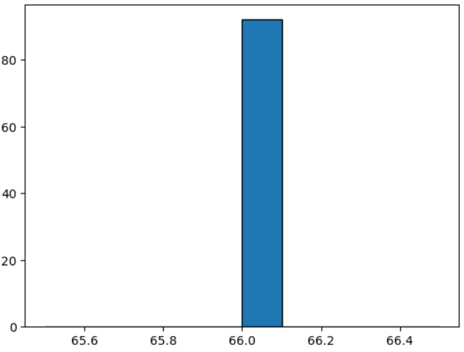

= 산포도

산포도는 데이터가 대표값에서 얼마나 멀리 떨어지고 있는지 나타냅니다. 예를 들어서 학생들의 몸무게가 모두 66kg이라면 산포도는 전혀 없습니다. 산술적으로 산포도가 0이되고 히스토그램은 매우 날씬한 모양이 됩니다.

몸무게가 작거나 큰 학생들이 많다면 어떤 형태를 갖춘 분산된 분포를 볼 수 있습니다.

== 사분위 범위

이 개념은 데이터를 4개의 동일한 그룹으로 나눈 다음 양끝의 그룹이 얼마나 많이 떨어져 있는지를 알아보는 것입니다.

사분위 범위를 찾는 방법은 아래와 같습니다.

1. 데이터를 숫자순으로 정렬합니다.
2. 데이터를 중앙값(median)을 기준으로 숫자가 낮은 2개 그룹와 숫자가 높은 2개 그룹으로 나눕니다. 중앙값이 데이터 점이면, 양쪽 그룹에 모두 포함시킵니다.
3. 숫자가 낮은 그룹의 중앙점을 찾습니다.이것을 첫 번째 사분위, Q~1~이라 한다.
4. 숫자가 높은 그룹의 중앙값을 찾습니다. 이것을 세 번째 사분위, Q~3~라 합니다.

사분위 범위(IQR)은 이들 사이의 거리(또는 차이) 입니다.

> IQR = Q~3~ - Q~1~

몸무게 데이터에서 굵은 값은 1분위(25%), 중간값(50%), 3분위 값(75%)입니다.

[cols=2, width=5%]
|===
|2|9
|4|3699
|5|001223344455677**7**779999999
|6|01112333333466**6**6788888888889
|7|000000**0**0001133334777799
|8|222466667
|9|8
|===

사분위 범위는 아래와 같습니다.

----
IQR = 70 - 57
    = 13
----

존 터키는 IQR을 찾는 다른 그림, 즉 상자 수염(Box plot)그림을 고안했습니다. 상자의 양끝은 사분위인 Q~1~과 Q~3~이고 중앙값은 상자안에 그립니다.

상자의 끝에서 1.5 IQR 이상 떨어져 있는 값은 이상값입니다. 이런 이상 값들은 따로 하나하나 그립니다.

마지막으로 이상값이 아닌 가장 먼 점(1.5 IQR 이내에 있는 가장 먼 점)까지 '수엄'을 그립니다.

상자수염그림은 그룹들간의 차이를 보여줄 때 아주 유리합니다.

