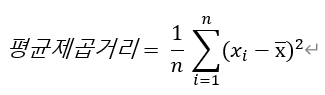
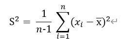
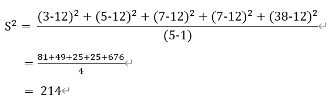
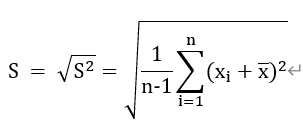
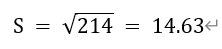

= 표준 편차

산포도를 측정하는 표준 방법으로 중앙값을 근거로 한 IQR과는 달리, 표준 편차는 평균으로 부터 산포도를 측정합니다. 표준편차는 데이터가 평균에서 떨어져 있는 평균 거리라고 할 수 있습니다.

여기에서는 거리의 제곱을 사용합니다. 즉, 점 x에서 평균까지의 거리의 제곱을 (x-평균)^2^ 이라 하면,

기술적인 이유때문에 n 대신에 n-1을 사용하여 표본분산 s^2^를 아래와 같이 정의합니다.

데이터셋 {3,5,7,7,38}의 경우, 평균 = 12, n = 5이므로, 분산은 아래와 같이 계산됩니다.

분산이 큰 것은 데이터가 넓게 흩여져 있다는 것을 의미합니다.

산포도의 측정은 데이터와 같은 단위를 이용해야 합니다. 몸무게에서 분산 S^2^는 제곱으로 결정됩니다. 따라서, 표준편차의 공식은 아래와 같습니다.

위 예의 경우,

이 됩니다.