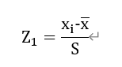
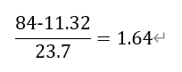

= 평균과 표준 편차의 특성

평균과 표준편차는 이상값이 없는 대칭적인 히스토그램, 즉 흙더미 모양의 히스토그램의 성질을 나타내는데 안성맞춤입니다.

데이터가 평균에서 표준편차로부터 몇 배나 떨어져 있는지 알면 유용할 때가 많습니다. 그래서 Z-점수(표준점수)를 평균으로 부터의 표준편차 거리로 정의합니다.

각각의 _i_ 에 대하여, 

몸무게가 84kg 인 학생의 경우 표준편차는 

 이 됩니다.
