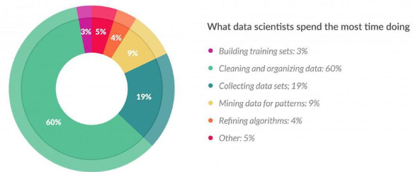

= 데이터 전처리 개요

* 데이터의 이상값(outlier)은 분석 및 통계 모델링 결과를 왜곡할 수 있음
** 오차 분산을 증가시키고 통계 검정의 검정력을 감소시킴
** 이상값이 무작위로 분포되지 않으면 정규성이 감소함
** 추정치를 편향시키거나 영향을 줄 수 있음
** 통계 분석의 기본 가정에 영향을 줄 수 있음
* 데이터 전처리
** 이상값을 제거하여 분석 검증을 명확히 함
** 이상값이 발생시키는 현상을 제거하기위해 데이터를 제거하고, 통합하고, 변환하는 작업

---

== 이상값(outlier)

**이상값의 원인**

우리가 이상 값을 발견할 때마다 이를 해결하는 이상적인 방법은 이러한 이상값을 갖는 이유를 찾는 것입니다. 그런 다음 처리 방법은 발생 이유에 따라 다르니다. 이상값의 원인은 크게 두 가지 범주로 분류 할 수 있습니다.

1. 인공(오류) / 비자연적
2. 자연적

다양한 유형의 이상값을 더 자세히 살펴보면 아래와 같습니다.

* 데이터 입력 오류 : 데이터 수집, 기록 또는 입력 중 발생하는 오류와 같은 인적 오류는 데이터에 이상값을 유발할 수 있습니다. +
ex) 연간 수입이 $ 100,000인 고객이 있다. 실수로 데이터 입력시 0을 추가하면, 이제 수입은 $ 1,000,000가 되어 10 배가 된다. 분명히 이것은 다른 모집단과 비교할 때 이상값이 될 것입니다.
* 측정 오류 : 가장 일반적인 이상값의 원인이다. 이는 사용된 측정 기기에 결함이 있는 경우 발생합니다. +
ex) 10 개의 계량기가 있다. 그 중 9 개가 정확하고 1 개에 결함이 있다. 결함이 있는 기계로 측정한 사람의 몸무게는 그룹의 다른 사람보다 높거나 낮다. 결함이 있는 기계에서 측정된 몸무게는 이상값을 초래할 수 있다.
* 실험 오류 : 이상값의 또 다른 원인은 실험 오류입니다. 실험 진행 상황에서 오류가 있는 경우로, 측정 오류라고 볼 수 있습니다. +
ex) 100m달리기에서 7명의 주자가 있을 때, 한 명의 주자가 '출발'신호에 집중하지 못해 늦게 출발했다. 따라서 이로 인해 주자의 런타임이 다른 주자보다 길어졌다. 그의 총 실행 시간은 이상값일 수 있다.
* 의도적 이상치 : 일반적으로 민감한 데이터와 관련된 자체보고 측정에서 발견됩니다. +
ex) 10대는 일반적으로 소비하는 알코올의 양을 낮게 보고한다. 그들 중 일부만이 실제 값을 보고 할 것이다. 나머지 10대들이 소비를 낮게 보고하기 때문에 실제 값은 이상값치처럼 보일 수 있다.
* 데이터 처리 오류 : 데이터 마이닝을 수행 할 때마다 여러 소스에서 데이터를 추출합니다. 일부 조작 또는 추출 오류로 인해 데이터 세트에서 이상값이 발생할 수 있습니다
* 샘플링 오류 : 예를 들어 운동 선수의 키를 측정하는 경우, 실수로 샘플에 농구 선수 몇 명을 포함 시켰습니다. 이 포함으로 인해 데이터 집합에 이상값이 발생할 수 있습니다.
* 자연적 이상값 : 이상값이 인위적이지 않은 경우(오류로 인해) 자연적 이상값이라 합니다. +
ex) 저명한 보험 회사 중 하나와의 마지막 임무에서 저는 상위 50 명의 재무 고문의 성과가 다른 인구보다 훨씬 높다는 것을 알았다. 놀랍게도 오류로 인한 것이 아니다. 따라서 어드바이저와 데이터 마이닝 활동을 수행 할 때마다 이 세그먼트를 개별적으로 처리했다.

**이상값이 미치는 영향(데이터 전처리의 필요성)**

이상값이 데이터 분석 및 통계 모델링 결과를 크게 변경할 수 있습니다. 데이터가 불완전(incomplete)하며, 잡음(noisy)이 있고 불일치(inconsistent)하기 때문이다. 데이터 세트에서 이상값의 불리한 영향은 다음과 같습니다.

* 오차 분산을 증가시키고 통계 검정의 검정력을 감소시킨다.
* 이상값이 무작위로 분포되지 않으면 정규성이 감소 할 수 있다.
* 그들은 실질적인 관심이 있을 수있는 추정치를 편향 시키거나 영향을 줄 수 있다
* 또한 회귀, 분산 분석 및 기타 통계 모델 가정의 기본 가정에 영향을 줄 수 있다.

== 데이터 전처리 방법
1. 데이터 클리닝(Cleaning)
* 결측치 대체
* 잡음 데이터의 평활
* 이상치의 확인 및 제거
* 불일치 해결

2. 데이터 통합(Integration)
* 다양한 로그 파일 및 데이터베이스의 통합
* 일관성 있는 데이터 형태로 변환

3. 데이터 변환(Transformation)
* 정규화(normalization)
* 집합화(Aggregation)
* 요약(summarization)
* 계층 생성

4. 데이터 축소(Reduction)
* 축소된 데이터도 원래 데이터와 같은 분석 결과를 얻을 수 있어야 함.
* 컴퓨팅 시간 등 고려 위해 데이터 축소가 필요
* 방대한 로그 데이터의 경우 일정 시간 단위로 데이터 축소 필요

5. 데이터 이산화(Discretization)
* 데이터 축소의 일종이나 중요시 됨
* 수치 값을 속성 값으로 변환 +
예) [0~0.5) : Low, [0.5~1.0] : High
* 많은 알고리즘은 데이터 이산화 과정이 요구됨

6. 데이터 표현 특징 추출(Descriptive Characteristics Mining)
* 데이터를 더 잘 이해하기 위해 대표 특징을 이해하는 과정
* 데이터 축소의 일종이기도 함
* 실제 도메인을 고려한 방법이 많이 사용됨 +
예) 가속도 센서: 가속도 특성에 따른 연산 필요 +
예) GPS 센서: GPS 데이터 특성에 따른 연산 필요

== 결측치 처리 방법
1. 해당 튜플 무시
* 주로 분류 문제에서 클래스 구분 라벨이 빠진 경우
* 결측치가 자주 발생하는 환경에서는 비효율적

2. 기준에 따라 자동으로 결측치 보정
* 결측치에 대한 값을 별도로 정의: 예) "unknown“
* 통계: 전체 평균값, 같은 클래스에 속한 데이터의 평균값
* 추정: 베이지안 확률 추론, 결정 트리

3. 전문가가 직접 값을 채움
* 가장 신뢰성 있으나 시간과 노력 크게 소모
* 비효율적

== 노이즈 데이터 처리 방법

1. 노이즈란 ?
* 의미: 랜덤 에러나 측정된 변수의 변형된 값
* 발생원인: 센서의 작동 실패, 데이터 엔트리(기입, 표기) 문제, 데이터 전송 문제, 기술적인 한계, 데이터 속성값의 부정확성
2. Bining
* 데이터를 정렬한 다음 일정한 주파수 단위의 bins로 나누고 대표값으로 변환
* 구간 단위별로 잡음 제거 및 데이터 축약 효과
* 사용되는 대표값: 평균, Median 등
3. Regression
* 데이터를 가장 잘 표현하는 추세 함수를 찾아서 이 함수의 값을 사용
4. 클러스터링
* 비슷한 성격을 가진 클러스터 단위로 묶은 다음 outlier 제거

== 데이터 통합

1. 데이터 통합이란 ?
* 다양한 소스로부터 얻은 데이터를 일관성있는 하나의 데이터로 합치는 것
2. 스키마 통합
* 다양한 소스의 데이터의 메타데이터를 통합
3. 데이터 통합시의 문제 및 해결책
* 중복 문제: 같은 내용의 데이터가 다른 이름으로 들어가 있는 것
** 해결책: 연관관계 분석 등을 통해 중복데이터 검출 필요
* 일관성 문제: 계산/통계를 통해 얻을 수 있는 값이 틀린 경우
** 해결책: 계산에 의해 검증 필요
* Entity 확인 문제: 통합 대상 entry가 정말 동일한지 여부
** 해결책: 검사 필요
* 다른 표현 문제: 예를 들어, 계량/계측 단위가 다른 것; 파운드와 kg
** 표현 일치 과정 필요
* 다른 스케일(mm 와 cm)에 의한 통합 문제
** 스케일 변환 과정 필요
* 상관 분석을 통해 문제 발견 및 해결
** 0에 가까울수록 서로 무관

== 데이터 변환
1. Smoothing
* 데이터로부터 노이즈를 제거하기 위해 데이터 추세에 벗어나는 데이터를 추세에 맞게 변환하는 방법
2. Aggregation
* 요약하고 데이터 큐브를 생성하는 방법이다.
3. Generalization
* 특정 구간에 분포하는 값으로 스케일을 변화시키는 방법이다.
4. Normalization
* min-max normalization
* z-score normalization
* normalization by decimal scaling
5. Attribute/feature construction
* 데이터 통합을 위해 새로운 속성이나 특징을 만드는 방법
* 주어진 여러 데이터 분포를 대표할 수 있는 새로운 속성/특징 활용

== 데이터 축소
1. 데이터 축소
* 적은 양으로도 전체 데이터 집합을 잘 대표하는 데이터 얻는 과정이다.
* 대규모 데이터의 작업시 분석에 필요한 줄이고 효율성을 향상시키기 위해 필요하다.
2. 차원 축소 방법
* 여러 속성 중 분석하는데 관계없거나 중복되는 속성을 제거
* 속성의 최소 집합을 찾음
* Stepwise forward selection 방법: 공집합에서 시작해서 하나씩 속성을 추가
* Stepwise backward elimination 방법: 전체 집합에서 시작해서 하나씩 삭제
3. 데이터 압축
* 데이터 인코딩이나 변환을 통해 데이터 축소
* 아무런 손실 없이 다시 구할 수 있다면 압축 기법은 lossless : 예) BMP 포맷
* 데이터의 손실이 있을 경우에는 lossy : 예) JPEG 포맷
4. Discrete wavelet transform (DWT)
* 선형의 신호를 처리하는 기술
* 수는 다르지만 길이는 같은 벡터(wavelet coefficients)로 변환
* 여러 개의 벡터 중에서 가장 영향력이 큰 벡터를 선택해서 다른 벡터들을 제거
* 데이터 평활화 작업 없이도 잡음 제거 효과
5. Principal components analysis (PCA)
* 데이터를 가장 잘 표현하고 있는 직교상의 데이터 벡터들을 찾아서 데이터 압축
* 속성들을 선택하고 다시 조합시켜서 다른 작은 집합을 만듦
* 계산하는 과정이 간단하고 정렬되지 않은 속성들도 처리 가능
* 빈약한 데이터나 일률적인 데이터 처리 가능
* 일반적으로 PCA는 빈약한 데이터를 WT는 고차원의 데이터를 처리하는데 유용
6. Numerosity Reduction(수량 축소)
* 데이터를 더 작은 형태로 표현해서 데이터의 크기 줄임
* 1) 데이터 파라미터만 저장: 예) Log-linear 모델
* 2) 기존의 데이터에서 축소된 데이터를 저장: 예) 히스토그램, 군집화(clustering), 표본추출(sampling)

※ 차원 축소(Dimension Reduction): 웨이블릿 변환, 주성분 분석, 회귀와 로그-선형 모형