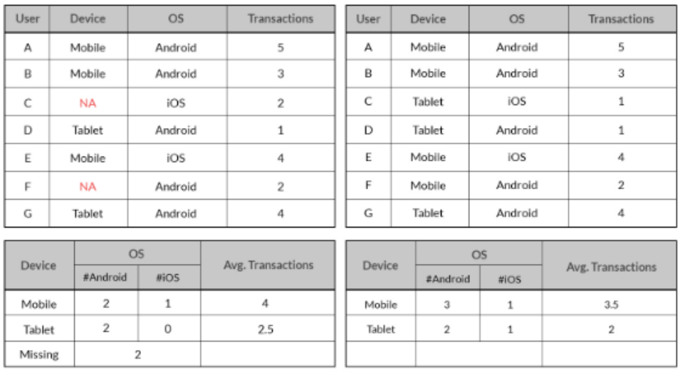
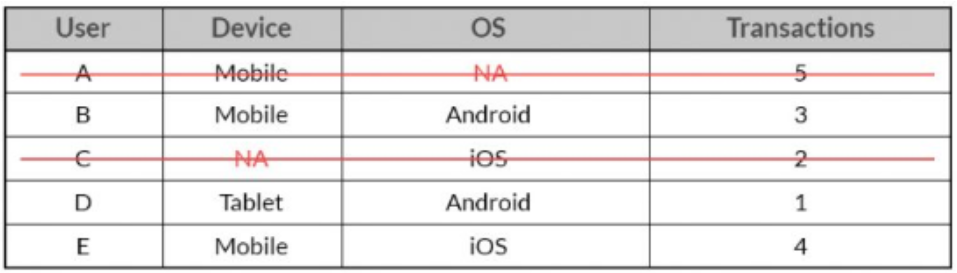
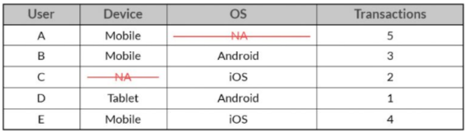

= 누락 데이터 삭제

* 누락된 데이터는 올바른 분석을 위해 처리되어야 함
** 데이터의 제거(Deletion)
*** 목록 삭제(Listwise): 결측치가 존재하는 전체 데이터(row) 삭제
*** 단일값 삭제(Pairwise): 손실된 관측지를 삭제하여 통계에 포함되지 않도록 함

---

머신러닝을 포함한 모든 형태의 분석에서는 결측치/결측값이 중요한 요소가 될 수 있습니다. 이 값들을 잘못 처리하고 진행하면 결과에도 잘못 반영될 것이며 비즈니스 및 insight를 발견하는데도 영향을 미치므로 신중하게 접근해야 할 필요가 있습니다.

 +
출처: datasciencecentral.com

위 데이터를 보면, Device 데이터에 결측치가 있습니다. 결측치가 있는 데이터를 보면, 안드로이드 모바일 사용자의 수치가 더 낮게 나왔고, tablet의 평균 트랜젹션 수치가 더 높게 나옵니다. 이는 비즈니스 의사 결정에 영향을 줄 수 있습니다. 

**전체 행 삭제(Listwise deletion)**

결측치가 존재하는 전체 행을 삭제하는 방법입니다.

 +
출처: datasciencecentral.com

결측치가 존재하는 전체 행을 삭제하면 사용자 A 및 C에 대한 전체 데이터가 데이터셋 목록에서 삭제되고, 모든 분석 결과에 포함되지 않습니다.

**값 삭제(Pairwise deletion)**

손실된 관측치 자체만 삭제하고, 다른 변수들은 유지하는 방법입니다. 이 경우, 다른 데이터는 유지 되면서 결측치가 존재하는 데이터에 대한 분석에서는 삭제된 데이터를 무시하고 분석이 수행됩니다.

 +
출처: datasciencecentral.com

위 데이터의 경우, Transaction을 분석할 때는 모든 데이터에 대한 분석을 수행하지만 Device나 OS에 대한 분석에서는 A 사용자와 C사용자의 값이 각각 무시된 채 분석이 수행됩니다.

결론적으로, 결측치에 대한 삭제는 어떤 방법이든 정보가 손실됩니다. Listwise deletion은 최대치의 정보 손실이 발생하게 되며, Pairwise deletion은 결측치가 많은 경우 분석 결과를 신뢰할 수 없는 문제가 생기기도 합니다.

== 예제

아래 데이터셋을 기준으로 데이터 삭제를 수행합니다.

[source, python]
----
dict = {'First score':[100,90,np.nan,95],
        'Second score':[30,np.nan,45,56],
        'Third score':[52,40,80,98],
        'Fourth score':[np.nan,np.nan,np.nan,65]}

df= pd.DataFrame(dict)
df.head()
----

[%header, cols="1,2,2,2,2" width=60%]
|===
||First score|Second score|Third score|Fourth score
|0|100.0|30.0|52|NaN
|1|90.0|NaN|40|NaN
|2|NaN|45.0|80|NaN
|3|95.0|56.0|98|65.0
|===

**Listwise deletion**

DataFrame의 dropna() 메소드를 사용하여 제거할 수 있습니다.

결측치가 있는 행(row)은 모두 제거합니다. axis 옵션을 지정하지 않으면 기본 값으로 0이 지정되고, row를 삭제합니다. axis 옵션을 사용하려면 0 또는 'row'를 입력합니다. how 옵션의 'any'는 결측치가 존재하는 row면 전부 삭제한다는 의미 입니다.

[source, python]
----
df_listwise = df.dropna(how='any')
----

[%header, cols="1,2,2,2,2" width=60%]
|===
||First score|Second score|Third score|Fourth score
|3|95.0|56.0|98|65.0
|===

dropna() 메소드의 파라미터는 다음과 같습니다.

[%header, cols='1,1,6']
|===
|파라미터|기본값|설명
|axis|0|결측치가 있는 데이터를 인덱스(row)로 삭제할 지, 컬럼으로 삭제할 지 지정합니다. 0이면 row 삭제, 1이면 컬럼을 삭제합니다.
|how|'any'|제거할 유형을 지정합니다. 'any' 이면 결측치가 존재하면 제거, 'all' 이면 모두 결측치면 제거합니다.
|subset|-|list 형태의 값을 지정해서, 결측치 제거를 수행할 레이블을 지정할 수 있습니다.
|tresh|-|결측값이 아닌 값이 몇 개 미만일 경우에만 삭제할 필요가 있을 경우에 사용합니다.
|===

결측치가 존재하는 컬럼을 삭제할 수 있습니다. axis 속성을 1 또는 'column'으로 지정합니다. 이 경우 결측치가 있는 컬럼은 모두 삭제됩니다.

[source, python]
----
df_listwise_col = df.dropna(axis=1)
----

[%header, cols="1,2" width=20%]
|===
||Third score
|0|52
|2|40
|3|80
|4|98
|===

thresh 파라미터를 사용하면 결측치의 갯수를 기준으로 삭제할지 여부를 결정할 수 있습니다. 아래 코드는 결측치가 3미만인 row를 삭제합니다.

[source, python]
----
df_listwise_thresh = df.dropna(thresh=3)
----

[%header, cols="1,2,2,2,2" width=60%]
|===
||First score|Second score|Third score|Fourth score
|0|100.0|30.0|52|NaN
|3|95.0|56.0|98|65.0
|===

subset 파라미터를 사용하면 삭제 대상 기준 컬럼을 지정할 수 있습니다.

[source, python]
----
df_listwise_subset = df.dropna(subset=['Second score', 'Fourth score'])
----

[%header, cols="1,2,2,2,2" width=60%]
|===
||First score|Second score|Third score|Fourth score
|3|95.0|56.0|98|65.0
|===

dropna() 함수는 inplace 옵션을 사용할 수 있습니다. 기본값은 False이며, True 옵션을 사용하면 해당 결측치를 포함하는 row나 column이 삭제된 DataFrame을 return하지 않고 직접적으로 삭제를 적용합니다.