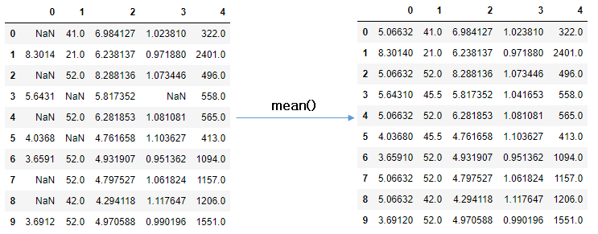

= 누락 데이터를 처리하는 방법

1. Do nothing
2. 데이터 제거
3. 평균값/중간값으로 데이터 대치
4. 가장 많이 사용된 값 / 0 / 상수로 데이터 대치
5. K-NN 대치
6. MICE(Multivariate Impuutation by Chained Equation) 대치
7. Deep learning을 이용한 대치

---

실세계 데이터는 다양한 원인으로 비롯되는 누락 데이터를 포함하고 있습니다. 데이터에서 None, NaN, 공백값으로 표시되는 것들이 누락데이터입니다. 이런 누락된 값들은 분석의 품질에 크게 영향을 줄 수 있습니다. 특히 머신러닝의 일부 알고리즘은 모든 값이 의미있는 값을 가지고 있다고 판단하는 경우가 많습니다.

누락치에는 다음과 같은 3가지 유형이 있습니다.

* Missing completely at random (MCAR)
* Missing at random (MAR)
* Not missing at random (NMAR)

누락치를 처리하는 방법은 크게 7가지 정도로 생각할 수 있습니다.

== Do nothing

가장 쉬운 방법으로, 알고리즘이 누락된 데이터를 처리하게 두는 방법입니다. 일부 알고리즘들은 결측값을 고려해서 처리합니다. 결측값이 있을 경우 무시할 수 있는 파라미터를 사용하는 알고리즘도 있습니다. 그러나 처리하는 로직이 없는 알고리즘(대표적으로 scikit learn의 Linear Regression)은 누락된 데이터를 처리할 수 있지 않아 올바른 예측값을 기대할 수 없게 됩니다.

== 누락된 데이터 제거

누락된 데이터를 제거하는 방법은 중요한 정보를 가진 데이터를 잃어버릴 수 있습니다. 상황에 따라 tuple을 제거하기도 하고, 누락치가 많은 컬럼을 제거하기도 합니다. 

== Mean/Median imputation

한 컬럼에 있는 누락치를 결측되지 않은 다른 값들의 평균(mean)이나 중앙값(median)으로 대체하는 방법입니다. 다른 컬럼은 고려하지 않으며, 숫자형 데이터에만 사용할 수 있습니다.

* 장점
** 쉽고 빠르다
** 작은 크기의 숫자형 데이터셋에 잘 동작한다.
* 단점
** 다른 feature 간의 상관관계가 고려되지 않는다. 단순히 결측지가 존재하는 컬럼만 고려된다.
** 인코딩 된 범주형 feature에 대해 안 좋은 결과를 제공한다.(절대 범주형 feature에 사용하지 말 것)
** 정확하지 않다.
** 불확실성에 반대된다.(동일한 값이므로)

아래와 같은 DataFrame이 있을 때,

df

[%header, cols-5, width=50%]
|===
||First score|Second score|Third score|Fourth score
|0|100.0|30.0|52|NaN
|1|90.0|NaN|40|NaN
|2|NaN|45.0|80|NaN
|3|95.0|56.0|98|65.0
|===

아래 코드는 scikit leran 패키지의 SimpleInputer를 사용하여 결측치를 평균값으로 채웁니다.

[source, python]
----
from sklearn.impute import SimpleImputer

imp_mean = SimpleImputer(strategy='mean')
imp_mean.fit(df)
df_imputed = pd.DataFrame(imp_mean.transform(df))
----

[%header, cols-5, width=50%]
|===
||0|1|2|3
|0|100.0|30.000000|52.0|65.0
|1|90.0|43.666667|40.0|65.0
|2|95.0|45.000000|80.0|65.0
|3|95.0|56.000000|98.0|65.0
|===

== Most Frequent Value / Zero / Constant Imputation

결측치를 가장 빈번한 값으로 대체하거나, 0으로 대체하거나, 지정한 상수값으로 대체하는 방법입니다.

* 장점
** 쉽고 빠름
** categorical(범주형) feature에 잘 동작함
* 단점
** 이것 또한 다른 feature 간의 상관관계가 고려되지 않는다.
** 데이터에 bias를 만들 수 있다.

아래 코드는 가장 빈번한 값으로 결측치를 대체합니다.

[source, python]
----
imp_mean = SimpleImputer(strategy='most_frequent')
imp_mean.fit(df)
df_imputed = pd.DataFrame(imp_mean.transform(df))
----

[%header, cols-5, width=50%]
|===
||0|1|2|3
|0|100.0|30.0|52.0|65.0
|1|90.0|30.0|40.0|65.0
|2|90.0|45.0|80.0|65.0
|3|95.0|56.0|98.0|65.0
|===

== K-NN imputation

K-NN(K Nestrst Neighbours)란 분류에 사용되는 간단한 알고리즘입니다. 'feature similarity'를 이용해 가장 닮은(근접한) 데이터를 K개 찾는 방법입니다. 여러 라이브러리를 사용할 수 있으나, Scikit Learn의 KNNImputer를 사용할 수 있습니다. KDTree를 생성한 후 이를 이용해 가장 가까운 이웃(NN)을 찾으며, K개의 NN을 찾은 뒤에는 거리에 따라 가중 평균을 취합니다.

* 장점
** mean, median이나 most frequent 보다 정확할 때가 많다.(데이터셋에 따라 다르다.)
* 단점
* 메모리가 많이 필요하다. 전체 데이터 세트를 메모리에 올려야 한다.
* outlier에 민감하다.

[source, python]
----
from sklearn.impute import KNNImputer

imputer = KNNImputer(n_neighbors=3)
imputed = imputer.fit(df)
df_imputed = pd.DataFrame(imputer.transform(df))

df_imputed.head()
----

[%header, cols-5, width=50%]
|===
||0|1|2|3
|0|100.0|30.000000|52.0|65.0
|1|90.0|43.666667|40.0|65.0
|2|95.0|45.000000|80.0|65.0
|3|95.0|56.000000|98.0|65.0
|===

== MICE(Multivarate Imputation by Chained Equation) Imputation

이 방식은 누락된 데이터를 여러번 채우는 방식으로 동작하여, 불확실성을 고려했을 때 단일 Imputation보다 더 나은값으로 데이터를 보정할 수 있습니다. chained equration 접근법은 매우 유연해서 연속형, 이진형, 범위형, survey skip 패턴도 처리할 수 있습니다.

* Imputation : distribution을 토대로 m개의 데이터셋을 imputation 한다.
* Analysis : m개의 완성된 데이터셋을 분석한다.
* Pooling : 평균, 분산, 신뢰 구간을 계산하여 결과를 합친다.

[source, python]
----
from sklearn.experimental import enable_iterative_imputer
from sklearn.impute import IterativeImputer

imputer_mice = IterativeImputer(random_state=83)
numeric_data = imputer_mice.fit_transform(df)
df_imputed = pd.DataFrame(imputer_mice.transform(df))

df_imputed.head()
----

[%header, cols-5, width=50%]
|===
||0|1|2|3
|0|100.000000|30.000000|52.0|65.0
|1|90.000000|43.666336|40.0|65.0
|2|97.413186|45.000000|80.0|65.0
|3|95.000000|56.000000|98.0|65.0
|===

https://dining-developer.tistory.com/19