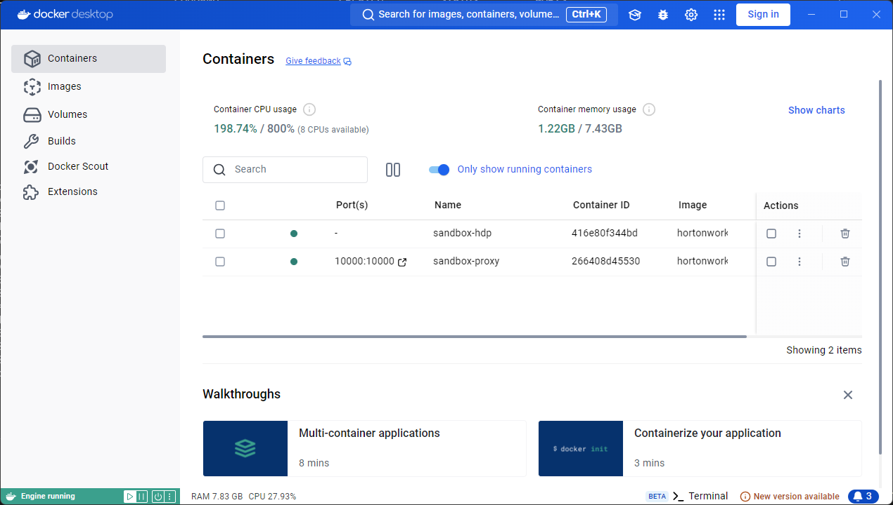

= Install HDP sandbox on docker

이 연습에서는 Docker를 사용하여 HDP Sandbox 2.6.5를 실행합니다. 아래 절차에 따릅니다.

1. 아래 링크에서 설치 스크립트를 다운로드합니다.
+
* https://archive.cloudera.com/hwx-sandbox/hdp/hdp-2.6.5/HDP_2.6.5_deploy-scripts_180624d542a25.zip[HDP 2.6.5]
* https://archive.cloudera.com/hwx-sandbox/hdp/hdp-3.0.1/HDP_3.0.1_docker-deploy-scripts_18120587fc7fb.zip[3.0.1]
+
2. 다운로드한 zip 파일을 압축 해제 합니다.
3. 터미널을 열고 아래 명령을 실행하여 설치 스크립트를 시작합니다.(Windows에서는 Git bash등의 bash 쉘이 필요합니다.)
+
----
./docker-deploy-hdp265.sh
----
+
4. 설치 스크립트가 실행되고, 필요한 컨테이너 이미지를 다운로드하는 등의 설정이 진행됩니다.
+
----
+ registry=hortonworks
+ name=sandbox-hdp
+ version=2.6.5
+ proxyName=sandbox-proxy
+ proxyVersion=1.0
+ flavor=hdp
+ echo hdp
+ mkdir -p sandbox/proxy/conf.d
+ mkdir -p sandbox/proxy/conf.stream.d
+ docker pull hortonworks/sandbox-hdp:2.6.5
2.6.5: Pulling from hortonworks/sandbox-hdp
9770d73ca513: Pulling fs layer
cbba75ae30cd: Pulling fs layer
283e5725c5f6: Pulling fs layer
1426e9ece03d: Pulling fs layer
4b00051fa827: Pulling fs layer
d09cdd825ed6: Pulling fs layer
dcbfe1670fa6: Pulling fs layer
fd78a46757f7: Pulling fs layer
5bad1882139b: Pulling fs layer
d29a62d4eb22: Pulling fs layer
4fb93bf04f14: Pulling fs layer
8827f466ab83: Pulling fs layer
a0fc39e77949: Pulling fs layer
595eabd2c628: Pulling fs layer
2a7fd016935e: Pulling fs layer
87526fe8ce7c: Pulling fs layer
...
----
+
5. 설치가 완료되면 두 개의 컨테이너가 실행중인것을 확인합니다.
+
