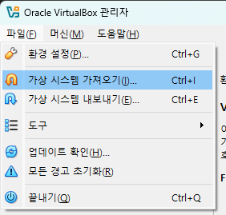
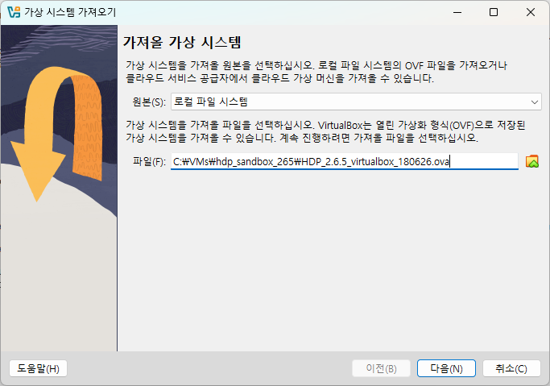
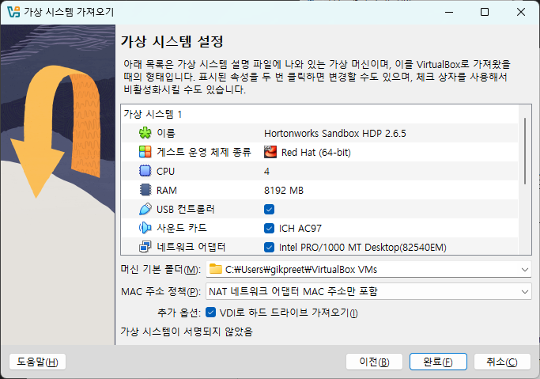
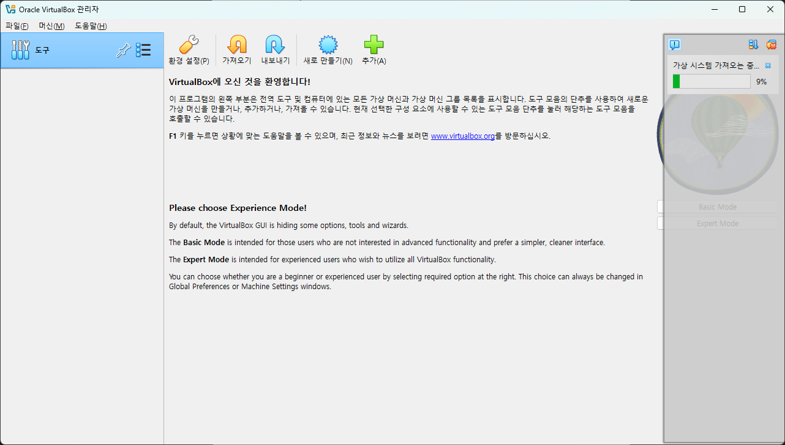
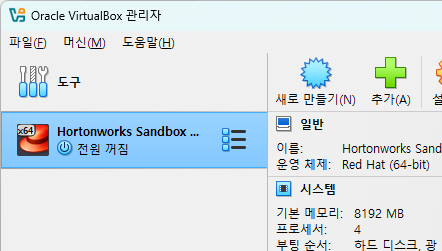

= Install HDP sandbox on Oracle Virtual Box

PC에 HDP Sandbox를 설치하는 일반적인 방법은 두 가지입니다. 하나는 VirtualBox 와 같은 하이퍼바이저를 사용하여 Docker 이미지를 가져와 클러스터에 대한 컨테이너를 실행하는 것이고, 다른 하나는 Docker를 직접 사용하여 Linux에서 명령줄 옵션 을 통해 리소스를 관리하거나 , Windows에서 docker.wslconfig등의 WSL 백엔드를 사용하여 파일을 통해 리소스를 구성하는 것입니다.

Docker에 익숙하지 않은 경우 하이퍼바이저 GUI를 통해 클러스터 리소스를 구성할 수 있는 이 접근 방식을 따를 수 있습니다. 리소스가 적은 경우 Docker를 사용하는 것이 좋습니다. 그러면 게스트 가상 머신을 실행하는 데 리소스를 소비할 필요가 없습니다.

== Hypervisor 설치

VirtualBox는 대부분의 일반적인 운영 체제(Linux, Windows, macOS)에서 지원되므로 하이퍼바이저로 권장합니다 . 다음 목록에 첨부된 링크를 따라 원하는 하이퍼바이저를 다운로드하세요.

* link:./https://www.virtualbox.org/[Oracle VM VirtualBox (추천)]
* link:./https://www.vmware.com/products/desktop-hypervisor/workstation-and-fusion[VMware Workstation Player (Linux 및 Windows 전용)]
* link:./https://www.vmware.com/products/desktop-hypervisor/workstation-and-fusion[Mac용 VMware Fusion (macOS 전용)]

== HDP Sandbox 설치

Hortonworks Data Platform(HDP)은 Apache Hadoop의 최신 개발 사항을 포함하는 간단하고 사전 구성된 학습 환경입니다. Sandbox는 클라우드나 개인 컴퓨터에서 실행할 수 있는 가상 환경으로 패키징되어 제공됩니다. Sandbox를 사용하면 HDP를 직접 학습하고 탐색할 수 있습니다.
 
=== HDP Sandbox 다운로드

HDP Sandbox는 아래 위치에서 다운로드 할 수 있습니다.

VirtualBox용 HDP Sandbox 다운로드:

* HDP 2.5.0( https://archive.cloudera.com/hwx-sandbox/hdp/hdp-2.5.0/HDP_2.5_virtualbox.ova )
* HDP 2.6.5 ( https://archive.cloudera.com/hwx-sandbox/hdp/hdp-2.6.5/HDP_2.6.5_virtualbox_180626.ova )
* HDP 3.0.1( https://archive.cloudera.com/hwx-sandbox/hdp/hdp-3.0.1/HDP_3.0.1_virtualbox_181205.ova )

VMware용 HDP Sandbox 다운로드:

* HDP 2.5.0( https://archive.cloudera.com/hwx-sandbox/hdp/hdp-2.5.0/HDP_2.5_vmware.ova )
* HDP 2.6.5(https://archive.cloudera.com/hwx-sandbox/hdp/hdp-2.6.5/HDP_2.6.5_vmware_180622.ova )
* HDP 3.0.1( https://archive.cloudera.com/hwx-sandbox/hdp/hdp-3.0.1/HDP_3.0.1_vmware_181205.ova )

== Sandbox 설치

여기서는 VirtualBox에 HDP Sandbox를 설치합니다. 

1. `파일` 메뉴에서 `가상 시스템 가져오기` 를 클릭합니다.
+

+
2. `가져올 가상 시스템` 페이지에서 파일 텍스트 상자에 다운로드한 HDP sandbox 가상 컴퓨터 파일의 위치와 파일 이름을 입력한 후 **다음** 버튼을 클릭합니다.
+

+
3. 가상 시스템 설정 페이지에서 CPU 4개 이상, 메모리가 8192MB 이상임을 확인한 후 **완료** 버튼을 클릭합니다.
+

+
4. 설정이 완료될 때 까지 기다립니다.
+

+
5. 가져오기 된 가상 컴퓨터를 확인합니다.
+

////
https://hackmd.io/@firasj/BkSQJQ8eh#Lab-1---Installing-HDP-Sandbox
////
