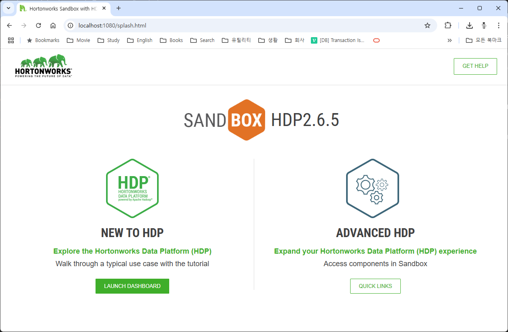

= HDP Sandbox에 액세스

HDP Sandbox는 Docker 또는 Hypervisor에서의 설치 여부에 관계없이 같은 방법으로 액세스 할 수 있습니다. 아래 절차에 따릅니다.

1. 웹 브라우저를 실행합니다.
2. 주소창에 아래 주소를 입력하고 이동합니다.
+
----
http://localhost:1080
----
+
3. HDP 클러스터의 스플래시 웹페이지가 실행됩니다.
+

+
4. ADVANCED HDP 구역의 QUICK LINKS 버튼을 클릭하면 클러스터의 서비스에 액세스할 수 있는 링크 페이지로 이동합니다.
+

+
5. AMBARI 링크를 클릭합니다.
+
6. Sign in 페이지에서 maria_dev/maria_dev로 로그인합니다.
+

+
7. 동작중인 서비스를 확인합니다. 서비스가 시작되지 않음으로 표시되면 서비스가 시작될때 까지 기다립니다.
+

== SSH를 통한 접근

SSH를 통해 HDP Sandbox에 접근할 수 있습니다. 아래 절차에 따릅니다.

1. 터미널을 실행합니다.
2. 터미널에서 아래 명령을 실행합니다.
+
----
ssh root@localhost -p 2222
----
+
3. 패스워드로 `hadoop` 을 입력합니다. 처음 접속했으면 패스워드를 변경해야 합니다. 새 패스워드를 입력하고, 확인 하면 접속이 완료됩니다.
+
----
The authenticity of host '[localhost]:2222 ([::1]:2222)' can't be established.
ED25519 key fingerprint is SHA256:7C3ELG2dUbGt7trSrxBYYsXHZHRprMe+UC0eIlkxTb0.
This key is not known by any other names.
Are you sure you want to continue connecting (yes/no/[fingerprint])? y
Please type 'yes', 'no' or the fingerprint: yes
Warning: Permanently added '[localhost]:2222' (ED25519) to the list of known hosts.
root@localhost's password:
Changing password for root.
(current) UNIX password:
New password:
Retype new password:
[root@sandbox-hdp ~]#
----

== HDFS에 접근

Ambari 홈페이지에서, 격자모양의 아이콘 메뉴로 마우스 포인트를 이동한 후 Files View를 클릭합니다.

image:../images/image11.png[]

HDP 클러스터의 HDFS 파일시스템의 파일들을 확인할 수 있습니다. 이 페이지에서 로컬 파일 시스템과 HDFS 간에 파일/폴더를 업로드하고 다운로드 할 수 있습니다.

터미널에서도 HDFS에 접근할 수 있습니다. 터미널에서 아래 명령을 실행합니다.

----
# hdfs dfs -ls /
Found 11 items
drwxrwxrwx   - yarn   hadoop          0 2018-06-18 15:18 /app-logs
drwxr-xr-x   - hdfs   hdfs            0 2018-06-18 16:13 /apps
drwxr-xr-x   - yarn   hadoop          0 2018-06-18 14:52 /ats
drwxr-xr-x   - hdfs   hdfs            0 2018-06-18 14:52 /hdp
drwx------   - livy   hdfs            0 2018-06-18 15:11 /livy2-recovery
drwxr-xr-x   - mapred hdfs            0 2018-06-18 14:52 /mapred
drwxrwxrwx   - mapred hadoop          0 2018-06-18 14:52 /mr-history
drwxr-xr-x   - hdfs   hdfs            0 2018-06-18 15:59 /ranger
drwxrwxrwx   - spark  hadoop          0 2024-11-21 14:12 /spark2-history
drwxrwxrwx   - hdfs   hdfs            0 2018-06-18 16:06 /tmp
drwxr-xr-x   - hdfs   hdfs            0 2018-06-18 16:08 /user
----

터미널에서 사용할 수 있는 hdfs 명령은 다음과 같습니다.

[%header, cols="1,3,3"]
|===
|옵션|설명|예
|-ls|HDFS의 폴더내 파일의 목록을 보여줍니다|hdfs dfs -ls /user/hadoop/*.txt
|-cat|파일의 내용을 보여줍니다|hdfs dfs -cat/file.txt
|-mv|HDFS간에 파일 또는 폴더를 이동합니다|hdfs dfs -mv /file.txt /names.txt
|-cp|HDFS간에 파일 또는 폴더를 복사합니다|hdfs dfs -cp /file.txt /names.txt
|-put|HDFS로 파일 또는 폴더를 밀어 넣습니다|hdfs dfs -put file.txt /user/hadoop
|-get|HDFS에서 파일 또는 폴더를 가져옵니다|hdfs dfs -get /user/hadoop/file.txt
|-mkdir|HDFS에서 폴더를 생성합니다|hdfs dfs -mkdir /user/hadoop/students
|-rm|파일을 삭제합니다|hdfs dfs -rm /usr/hadoop/file.txt
|===