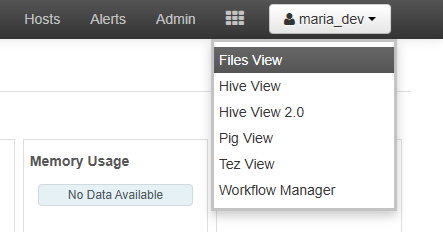
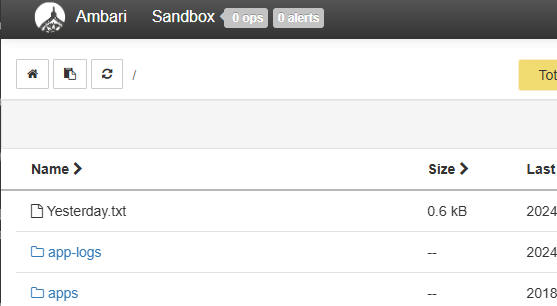

= Lab 01: 간단한 WordCount MapReduce 프로그램 생성 

이 연습에서는 HDP Sandbox에서 실행할 수 있는 MapReduce 프로그램을 작성합니다. 작성한 프로그램은 파일의 단어 수를 카운트하는 간단한 프로그램이며, Apache Maven을 사용하여 작성되어 Hadoop Cluster에서 실행됩니다. 이 연습을 실행하기 전에 아래와 같은 환경이 갖추어져야 합니다.

* Java 11 이상의 JDK
* 동작하는 Apache Maven

아래 절차에 따릅니다.

== 개발환경 구성

이 연습에서는 Apache Maven과 JDK이외의 특정한 개발환경은 필요하지 않으나, 코드 편집을 위해 Visual Studio Code를 사용합니다.

터미널에서 아래 명령을 실행하여 설치된 Maven의 버전을 확인합니다.

----
mvn -version
Apache Maven 3.9.9 (8e8579a9e76f7d015ee5ec7bfcdc97d260186937)
Maven home: C:\apache-maven-3.9.9
Java version: 17.0.11, vendor: Eclipse Adoptium, runtime: C:\Program Files\Eclipse Adoptium\jdk-17.0.11.9-hotspot
Default locale: ko_KR, platform encoding: MS949
OS name: "windows 11", version: "10.0", arch: "amd64", family: "windows"
----

프로젝트를 수행할 디렉토리를 만듭니다. 여기에서는 /mapreduce 디렉토리로 지정합니다.

----
mkdir /mapreduce
----

생성한 디렉토리로 이동합니다.

----
cd /mapreduce
----

== Maven 프로젝트 생성

Maven 프로젝트를 생성합니다. 아래 절차에 따릅니다.

1. 터미널에서, 아래 명령을 실행하여 wordcountjava라는 이름의 Maven 프로젝트를 생성합니다.
+
----
mvn archetype:generate -DgroupId=org.apache.hadoop.examples -DartifactId=wordcountjava -DarchetypeArtifactId=maven-archetype-quickstart -DinteractiveMode=false
----
+
이 명령은 artifactID 매개 변수(이 예제에서는 wordcountjava)로 지정된 이름으로 디렉터리를 만듭니다. 이 디렉터리에는 다음과 같은 항목이 포함됩니다.
+
* pom.xml - 프로젝트 개체 모델(POM)은 프로젝트를 빌드하는 데 사용된 정보 및 구성 세부 정보를 포함합니다.
* src\main\java\org\apache\hadoop\examples: 애플리케이션 코드를 포함합니다.
* src\test\java\org\apache\hadoop\examples: 애플리케이션 테스트를 포함합니다.
2. 생성된 wordcountjava 디렉토리를 Visual Studio Code에서 엽니다.
3. src 폴더를 확장하고 생성된 예제 코드를 삭제합니다. 
* src\main\java\org\apache\hadoop\examples\App.java 파일
* src\test\java\org\apache\hadoop\examples\AppTest.java 파일

== 프로젝트 개체 모델 업데이트

pom.xml 파일을 편집하여 프로젝트 개체 모델을 업데이트합니다. 아래 절차에 따릅니다.

1. Visual Studio Code에서 pom.xml 파일을 엽니다.
2. `<dependencies>` 섹션에 아래 설정을 추가합니다.
+
[source, xml]
----
<dependency>
    <groupId>org.apache.hadoop</groupId>
    <artifactId>hadoop-mapreduce-examples</artifactId>
    <version>2.7.3</version>
    <scope>provided</scope>
</dependency>
<dependency>
    <groupId>org.apache.hadoop</groupId>
    <artifactId>hadoop-mapreduce-client-common</artifactId>
    <version>2.7.3</version>
    <scope>provided</scope>
</dependency>
<dependency>
    <groupId>org.apache.hadoop</groupId>
    <artifactId>hadoop-common</artifactId>
    <version>2.7.3</version>
    <scope>provided</scope>
</dependency>
----
+
이 항목은 특정 버전(<version>에 나열됨)을 사용하는 필수 라이브러리(<artifactId> 내에 나열됨)를 정의합니다. 컴파일 시 이러한 종속성이 기본 Maven 리포지토리에서 다운로드됩니다. Maven 리포지토리 검색 을 사용하여 자세한 정보를 볼 수 있습니다.
+
<scope>provided</scope>는 이러한 종속성은 런타임에 Hadoop 클러스터에서 제공되므로 애플리케이션과 함께 패키징해서는 안 된다는 점을 Maven에 알려 줍니다.

== 빌드 구성

pom.xml 파일을 편집하여 빌드를 구성합니다. 아래 절차에 따릅니다.

1. Visual Studio Code에서 pom.xml 파일을 엽니다.
2. 아래 구성을 build에 추가합니다. 이 텍스트는 파일의 <project>...</project> 태그 내에 있어야 합니다. 예를 들어 </dependencies>와 </project> 사이에 있어야 합니다.
+
[source, xml]
----
<build>
    <plugins>
    <plugin>
        <groupId>org.apache.maven.plugins</groupId>
        <artifactId>maven-shade-plugin</artifactId>
        <version>2.3</version>
        <configuration>
        <transformers>
            <transformer implementation="org.apache.maven.plugins.shade.resource.ApacheLicenseResourceTransformer">
            </transformer>
        </transformers>
        </configuration>
        <executions>
        <execution>
            <phase>package</phase>
                <goals>
                <goal>shade</goal>
                </goals>
        </execution>
        </executions>
        </plugin>
    <plugin>
        <groupId>org.apache.maven.plugins</groupId>
        <artifactId>maven-compiler-plugin</artifactId>
        <version>3.6.1</version>
        <configuration>
        <source>1.8</source>
        <target>1.8</target>
        </configuration>
    </plugin>
    </plugins>
</build>
----
+
이 섹션에서는 Apache Maven Compiler Plugin 및 Apache Maven Shade Plugin을 구성합니다. 컴파일러 플러그 인은 토폴로지를 컴파일하는 데 사용됩니다. 음영 플러그 인은 Maven으로 빌드된 JAR 패키지에서 라이선스 중복을 방지하는 데 사용됩니다. 이 플러그 인은 hadoop 클러스터에서 런타임에 "중복 라이선스 파일" 오류가 발생하지 않도록 하는 데 사용됩니다. ApacheLicenseResourceTransformer 구현에서 maven-shade-plugin을 사용하면 이 오류가 방지됩니다.
+
또한 maven-shade-plugin은 애플리케이션에 필요한 모든 종속성을 포함하는 uber jar도 생성합니다.
3. 전체 pom.xml 파일은 아래와 같습니다.
+
[source, xml]
----
<project xmlns="http://maven.apache.org/POM/4.0.0" xmlns:xsi="http://www.w3.org/2001/XMLSchema-instance"
  xsi:schemaLocation="http://maven.apache.org/POM/4.0.0 http://maven.apache.org/maven-v4_0_0.xsd">
  <modelVersion>4.0.0</modelVersion>
  <groupId>org.apache.hadoop.examples</groupId>
  <artifactId>wordcountjava</artifactId>
  <packaging>jar</packaging>
  <version>1.0-SNAPSHOT</version>
  <name>wordcountjava</name>
  <url>http://maven.apache.org</url>
  <dependencies>
    <dependency>
        <groupId>org.apache.hadoop</groupId>
        <artifactId>hadoop-mapreduce-examples</artifactId>
        <version>2.7.3</version>
        <scope>provided</scope>
    </dependency>
    <dependency>
        <groupId>org.apache.hadoop</groupId>
        <artifactId>hadoop-mapreduce-client-common</artifactId>
        <version>2.7.3</version>
        <scope>provided</scope>
    </dependency>
    <dependency>
        <groupId>org.apache.hadoop</groupId>
        <artifactId>hadoop-common</artifactId>
        <version>2.7.3</version>
        <scope>provided</scope>
    </dependency>
  </dependencies>

  <build>
    <plugins>
      <plugin>
          <groupId>org.apache.maven.plugins</groupId>
          <artifactId>maven-shade-plugin</artifactId>
          <version>2.3</version>
          <configuration>
          <transformers>
              <transformer implementation="org.apache.maven.plugins.shade.resource.ApacheLicenseResourceTransformer">
              </transformer>
          </transformers>
          </configuration>
          <executions>
          <execution>
              <phase>package</phase>
                  <goals>
                  <goal>shade</goal>
                  </goals>
          </execution>
          </executions>
          </plugin>
      <plugin>
          <groupId>org.apache.maven.plugins</groupId>
          <artifactId>maven-compiler-plugin</artifactId>
          <version>3.6.1</version>
          <configuration>
          <source>1.8</source>
          <target>1.8</target>
          </configuration>
      </plugin>
      </plugins>
  </build>
</project>

----
+
4. pom.xml 파일을 저장합니다.

== MapReduce 응용 프로그램 작성

여기서는 파일의 단어수를 세는 MapReduce 프로그램을 작성합니다. 아래 절차에 따릅니다.

1. Visual Studio Code에서 src\main\java\org\apache\hadoop\examples 디렉토리에 WordCount.java 파일을 만듭니다.
2. WordCount.java 파일을 아래와 같이 작성합니다.
+
[source, java]
----
package org.apache.hadoop.examples;

import java.io.IOException;
import java.util.StringTokenizer;
import org.apache.hadoop.conf.Configuration;
import org.apache.hadoop.fs.Path;
import org.apache.hadoop.io.IntWritable;
import org.apache.hadoop.io.Text;
import org.apache.hadoop.mapreduce.Job;
import org.apache.hadoop.mapreduce.Mapper;
import org.apache.hadoop.mapreduce.Reducer;
import org.apache.hadoop.mapreduce.lib.input.FileInputFormat;
import org.apache.hadoop.mapreduce.lib.output.FileOutputFormat;
import org.apache.hadoop.util.GenericOptionsParser;

public class WordCount {

    public static class TokenizerMapper
        extends Mapper<Object, Text, Text, IntWritable>{

    private final static IntWritable one = new IntWritable(1);
    private Text word = new Text();

    public void map(Object key, Text value, Context context
                    ) throws IOException, InterruptedException {
        StringTokenizer itr = new StringTokenizer(value.toString());
        while (itr.hasMoreTokens()) {
        word.set(itr.nextToken());
        context.write(word, one);
        }
    }
}

public static class IntSumReducer
        extends Reducer<Text,IntWritable,Text,IntWritable> {
    private IntWritable result = new IntWritable();

    public void reduce(Text key, Iterable<IntWritable> values,
                        Context context
                        ) throws IOException, InterruptedException {
        int sum = 0;
        for (IntWritable val : values) {
        sum += val.get();
        }
        result.set(sum);
        context.write(key, result);
    }
}

public static void main(String[] args) throws Exception {
    Configuration conf = new Configuration();
    String[] otherArgs = new GenericOptionsParser(conf, args).getRemainingArgs();
    if (otherArgs.length != 2) {
        System.err.println("Usage: wordcount <in> <out>");
        System.exit(2);
    }
    Job job = new Job(conf, "word count");
    job.setJarByClass(WordCount.class);
    job.setMapperClass(TokenizerMapper.class);
    job.setCombinerClass(IntSumReducer.class);
    job.setReducerClass(IntSumReducer.class);
    job.setOutputKeyClass(Text.class);
    job.setOutputValueClass(IntWritable.class);
    FileInputFormat.addInputPath(job, new Path(otherArgs[0]));
    FileOutputFormat.setOutputPath(job, new Path(otherArgs[1]));
    System.exit(job.waitForCompletion(true) ? 0 : 1);
    }
}
----
+
패키지 이름은 org.apache.hadoop.examples이며 클래스 이름은 WordCount입니다. MapReduce 작업을 제출할 때 이 이름을 사용합니다.

== 응용 프로그램 빌드 및 패키지화

여기에서는 작성한 WordCount 프로그램을 빌드하고 패키지화 합니다. 아래 절차에 따릅니다.

1. 터미널에서, /mapreduce/wordcountjava 디렉토리로 이동합니다.
2. 아래 명령을 실행하여 응용 프로그램을 포함하는 jar 파일을 생성합니다.
+
----
mvn clean package
----
3. Visual Studio Code의 target 폴더에 wordcountjava-1.0-SNAPSHOT.jar 파일이 생성된것을 확인합니다.

== JAR 업로드 및 실행

여기에서는 작성한 프로그램과 예제 파일을 HDP 클러스터와 hdfs에 업로드하고 실행합니다. 아래 절차에 따릅니다.

1. 웹 브라우저에서 HDP 클러스터의 Ambari에 엑세스합니다.
+
----
http://localhost:8080
----
+
2. FileView로 이동합니다.
+

+
3. upload 버튼을 클릭하고 Yesterday.txt 파일을 복사합니다.
+

+
4. HDP 클러스터의 /root/ 디렉토리로 wordcountjava-1.0-SNAPSHOT.jar 파일을 복사합니다. Docker기반에서 실행된 경우 sandbox-hdp 컨테이너로 아래 명령을 사용하여 복사할 수 있습니다.
+
----
docker cp wordcountjava-1.0-SNAPSHOT.jar sandbox-hdp:/root
----
+
5. 아래 명령을 실행하여 HDP 클러스터에 액세스합니다.
+
----
ssh root@localhost -p 2222
----
+
6. 복사된 wordcountjava-1.0-SNAPSHOT.jar 파일을 확인합니다.
+
----
# ls /root
anaconda-ks.cfg  wordcountjava-1.0-SNAPSHOT.jar
----
+
7. 아래 명령을 실행하여 MapReduce 응용 프로그램일 실행합니다.
+
----
yarn jar wordcountjava-1.0-SNAPSHOT.jar org.apache.hadoop.examples.WordCount /Yesterday.txt /wordcountout
----
+
아래와 같이 실행됩니다.
+
----
24/11/21 17:05:46 INFO client.RMProxy: Connecting to ResourceManager at sandbox-hdp.hortonworks.com/172.18.0.2:8032
24/11/21 17:05:46 INFO client.AHSProxy: Connecting to Application History server at sandbox-hdp.hortonworks.com/172.18.0.2:10200
24/11/21 17:05:47 INFO input.FileInputFormat: Total input paths to process : 1
24/11/21 17:05:47 INFO mapreduce.JobSubmitter: number of splits:1
24/11/21 17:05:47 INFO mapreduce.JobSubmitter: Submitting tokens for job: job_1732197031505_0006
24/11/21 17:05:47 INFO impl.YarnClientImpl: Submitted application application_1732197031505_0006
24/11/21 17:05:47 INFO mapreduce.Job: The url to track the job: http://sandbox-hdp.hortonworks.com:8088/proxy/application_1732197031505_0006/
24/11/21 17:05:47 INFO mapreduce.Job: Running job: job_1732197031505_0006
24/11/21 17:05:54 INFO mapreduce.Job: Job job_1732197031505_0006 running in uber mode : false
24/11/21 17:05:54 INFO mapreduce.Job:  map 0% reduce 0%
24/11/21 17:05:59 INFO mapreduce.Job:  map 100% reduce 0%
24/11/21 17:06:05 INFO mapreduce.Job:  map 100% reduce 100%
24/11/21 17:06:05 INFO mapreduce.Job: Job job_1732197031505_0006 completed successfully
24/11/21 17:06:05 INFO mapreduce.Job: Counters: 49
        File System Counters
                FILE: Number of bytes read=719
                FILE: Number of bytes written=308051
                FILE: Number of read operations=0
                FILE: Number of large read operations=0
                FILE: Number of write operations=0
                HDFS: Number of bytes read=776
                HDFS: Number of bytes written=462
                HDFS: Number of read operations=6
                HDFS: Number of large read operations=0
                HDFS: Number of write operations=2
        Job Counters
                Launched map tasks=1
                Launched reduce tasks=1
                Data-local map tasks=1
                Total time spent by all maps in occupied slots (ms)=2826
                Total time spent by all reduces in occupied slots (ms)=2159
                Total time spent by all map tasks (ms)=2826
                Total time spent by all reduce tasks (ms)=2159
                Total vcore-milliseconds taken by all map tasks=2826
                Total vcore-milliseconds taken by all reduce tasks=2159
                Total megabyte-milliseconds taken by all map tasks=706500
                Total megabyte-milliseconds taken by all reduce tasks=539750
        Map-Reduce Framework
                Map input records=20
                Map output records=127
                Map output bytes=1145
                Map output materialized bytes=719
                Input split bytes=118
                Combine input records=127
                Combine output records=63
                Reduce input groups=63
                Reduce shuffle bytes=719
                Reduce input records=63
                Reduce output records=63
                Spilled Records=126
                Shuffled Maps =1
                Failed Shuffles=0
                Merged Map outputs=1
                GC time elapsed (ms)=134
                CPU time spent (ms)=1230
                Physical memory (bytes) snapshot=340725760
                Virtual memory (bytes) snapshot=3937308672
                Total committed heap usage (bytes)=153092096
        Shuffle Errors
                BAD_ID=0
                CONNECTION=0
                IO_ERROR=0
                WRONG_LENGTH=0
                WRONG_MAP=0
                WRONG_REDUCE=0
        File Input Format Counters
                Bytes Read=658
        File Output Format Counters
                Bytes Written=462
----

== 결과 확인

실행 결과를 확인합니다. 아래 절차에 따릅니다.

1. 아래 명령을 실행하여 /wordcountout 디렉토리가 생성된 것을 확인합니다.
+
----
hdfs dfs -ls /
Found 13 items
-rw-r--r--   1 maria_dev hdfs          658 2024-11-21 16:48 /Yesterday.txt
drwxrwxrwx   - yarn      hadoop          0 2024-11-21 15:37 /app-logs
drwxr-xr-x   - hdfs      hdfs            0 2018-06-18 16:13 /apps
drwxr-xr-x   - yarn      hadoop          0 2018-06-18 14:52 /ats
drwxr-xr-x   - hdfs      hdfs            0 2018-06-18 14:52 /hdp
drwx------   - livy      hdfs            0 2018-06-18 15:11 /livy2-recovery
drwxr-xr-x   - mapred    hdfs            0 2018-06-18 14:52 /mapred
drwxrwxrwx   - mapred    hadoop          0 2018-06-18 14:52 /mr-history
drwxr-xr-x   - hdfs      hdfs            0 2018-06-18 15:59 /ranger
drwxrwxrwx   - spark     hadoop          0 2024-11-21 17:07 /spark2-history
drwxrwxrwx   - hdfs      hdfs            0 2018-06-18 16:06 /tmp
drwxr-xr-x   - hdfs      hdfs            0 2018-06-18 16:08 /user
drwxr-xr-x   - root      hdfs            0 2024-11-21 17:06 /wordcountout
----
+
2. 아래 명령을 실행하여 /wordcountout 디렉토리의 내용을 확인합니다.
+
----
# hdfs dfs -ls /wordcountout
Found 2 items
-rw-r--r--   1 root hdfs          0 2024-11-21 17:06 /wordcountout/_SUCCESS
-rw-r--r--   1 root hdfs        462 2024-11-21 17:06 /wordcountout/part-r-00000
----
+
3. 아래 명령을 실행하여 MapReduce 프로그램의 실행 결과를 확인합니다.
+
----
# hdfs dfs -cat /wordcountout/part-r-00000
All     1
I       12
I'm     1
Love    2
Now     3
Oh,     4
Suddenly,       1
There's 1
Why     2
Yesterday       1
Yesterday,      3
a       3
an      2
as      1
away    3
be      1
believe 3
came    1
don't   2
easy    2
far     1
for     2
game    2
go,     2
had     2
half    1
hanging 1
here    1
hide    2
in      3
it      1
know    2
long    2
looks   1
man     1
me      1
my      1
need    2
not     1
now     2
over    1
place   2
play    2
said    2
say     2
seemed  1
shadow  1
she     4
so      1
something       2
stay    1
such    2
suddenly        1
the     1
they're 1
though  1
to      8
trouble 1
used    1
was     2
wouldn't        2
wrong,  2
yesterday       6
----

연습이 종료되었습니다.