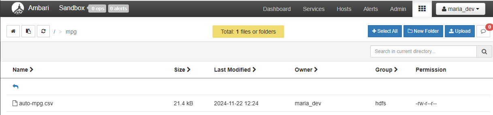

= lab 02: Hive를 이용한 테이블 형식 데이터 처리

== 데이터 준비

1. 웹 브라우저에서 HDP 클러스터의 Ambari에 엑세스합니다.
+
----
http://localhost:8080
----
+
2. FileView로 이동합니다.
3. New Folder 버튼을 클릭하고, mpg 폴더를 생성합니다.
4. mpg 디렉토리로 이동합니다.
5. Upload 버튼을 클릭하여 auto-mpg.csv 파일을 mpg 디렉토리로 업로드합니다.
+

== hive 콘솔에 액세스

1. 터미널에서 아래 명령을 실행하여 Hadoop 클러스터에 접속합니다.
+
----
ssh root@localhost -p 2222
----
+
2. 아래 명령을 실행하여 hive 콘솔을 시작합니다.
+
----
hive
log4j:WARN No such property [maxFileSize] in org.apache.log4j.DailyRollingFileAppender.

Logging initialized using configuration in file:/etc/hive/2.6.5.0-292/0/hive-log4j.properties
hive>
----
+
3. hive 콘솔에서 아래 명령을 실행하여 hive의 테이블을 확인합니다.
+
----
show tables;
----
4. hive 콘솔에서 아래 명령을 실행하여 데이터베이스를 확인합니다.
+
----
show databases;
----
+
5, 아래 명령을 실행하여 프롬프트에 현재 데이터베이스가 표시되도록 설정합니다.
+
----
set hive.cli.print.current.db = true;
hive (default)
----

== 외부 테이블 생성

1. hive 콘솔에서 아래 쿼리를 실행하여 외부 테이블을 생성합니다.
+
[source, sql]
----
CREATE TABLE mpg (
  mpg float,
  cyinders int,
  displacement float,
  horsepower float,
  weight float,
  acceleration float,
  modelyear int,
  origin int,
  name string
)
ROW FORMAT DELIMITED
FIELDS TERMINATED BY ','
LINES TERMINATED BY'\n'
STORED AS TEXTFILE
LOCATION '/mpg';
----
+
----
OK
Time taken: 2.808 seconds
----
+
2. hive 콘솔에서 아래 쿼리를 실행하여 결과를 확인합니다.
+
[source, sql]
----
SELECT * FROM mpg
----