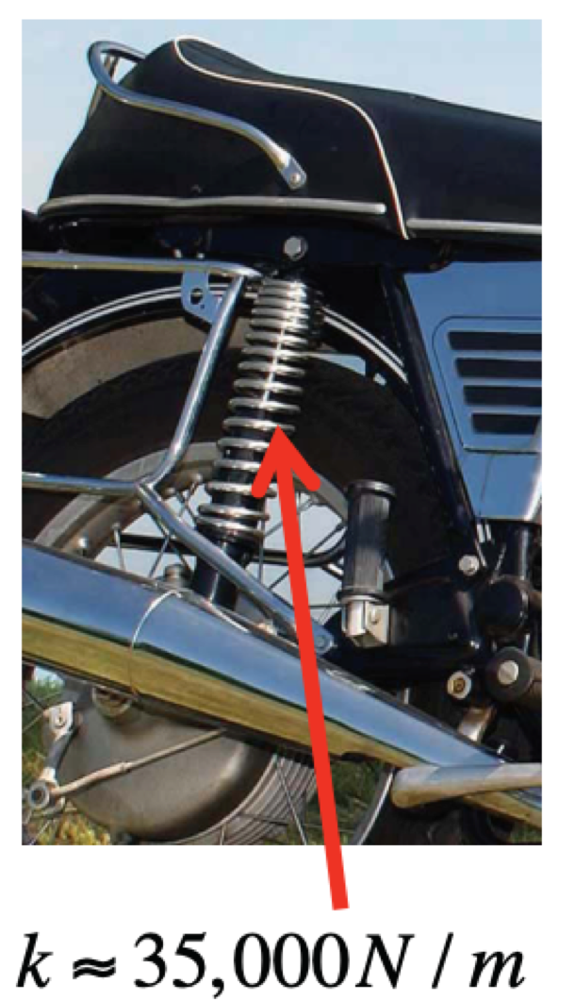
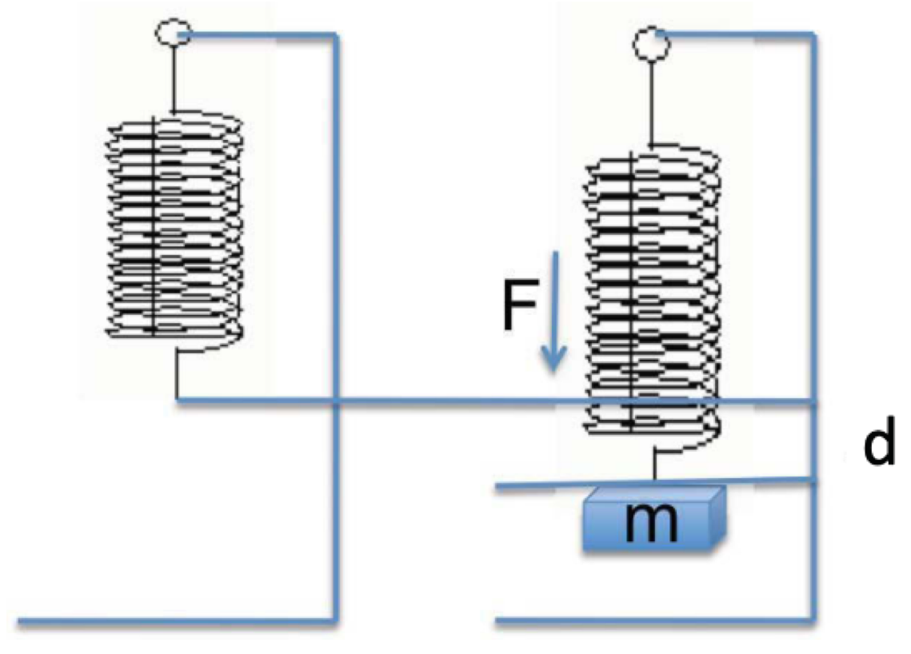
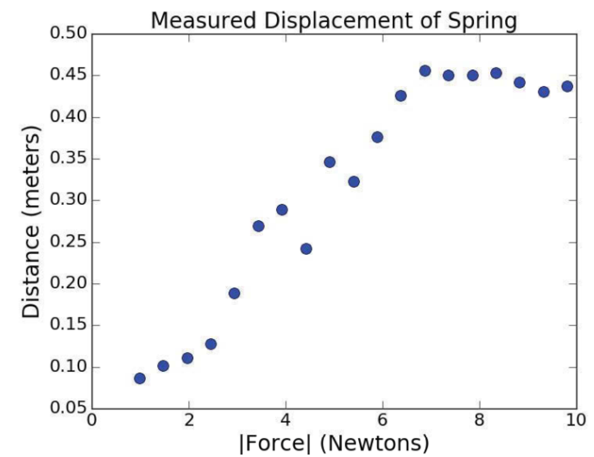

= Understanding Experimental Data

== 통계와 Expermental Science의 만남

* 데이터를 수집하기 위한 실험을 수행
** 물리적인 데이터(예: biology lab)
** 소셜 (예: 설문조사)

* 이론을 사용하여 데이터에ㄴ 대한 몇 가지 질문 생성
** 물리적 (예: 중력장)
** 소셜 (예: 사람의 일관적이지 않은 대답)

* 데이터에 대한 질문에 답하는데 도움이 되는 computation 설계
* 심사 숙고

== 스프링의 종류

image:./images/image02.png[]

선형 스프링: 스프링을 늘이거나 압축하는데 필요한 힘의 양은 스프링이 늘어나거나 압축되는 거리에 따라 선형으로 계산됨
각 스프링은 얼마나 많은 힘이 필요한지를 나타내는 스프링 상수 `k` 를 가짐

> Newton: 1kg 의 질랑을 1초에 1미터씩 가속 시키는 힘

== 후크의 법칙(Hooke's Law)

* 고체에 힘을 가해 변형시킬 때, 힘이 어떤 크기를 넘지 않으면 고체의 변현된 정도는 힘의 크기에 정비례한다
* 고체 역학의 기본 법칙

:stem: asciimath

* stem:[F = -kd]
* 스프링이 1cm 압축되려면 라이더의 체중이 얼마나 되어야 할까?

stem:[F = 0.01m * 35,000M \/ m] +
stem:[F = 350N] +

stem:[F = mass ** "acc"] +
stem:[F = mass = 9.8m \/ suarr2] +

stem:[mass * 9.8m \/ suarr2=350N] +
stem:[mass = 350k \/ 9.81] +

stem:[mass approx 35.68k]

== k 찾기

* stem:[F = -kd]
* stem:[k = -F \/ d]
* stem:[k = 9.81 ** m \/ d]

== 어떤 데이터

[%header cols="1, 2" width=40%]
|===
|Distance(m) | Mass(kg)
|0,08655 | 0.1
|0.1015 | 0.15
|0.1106 | 0.2
|0.1279 | 0.25
|0.1892 | 0.25
|0.2695 | 0.45
|0.2888 | 0.4
|0.2425 | 0.45
|0.3465 | 0.5
|0.3225 | 0.55
|0.3764 | 0.6
|0.4263 | 0.65
|0.4652 | 0.7
|===

== 데이터를 살펴보면

[source, python]
----
def plotData(fileName):
    xVals, yvals = getData(fileName)
    xVals = pylab.array(xVals)
    yVals = pylab.array(yVals)
    xVals = xVals * 9.81    # acc. 중력으로 인함
    pylab.plot(xVals, yVals, 'bo', label = 'Measured displacements')
    labelPlot()
----

== 데이터를 살펴보면

== 데이터에 곡선 맞추기

